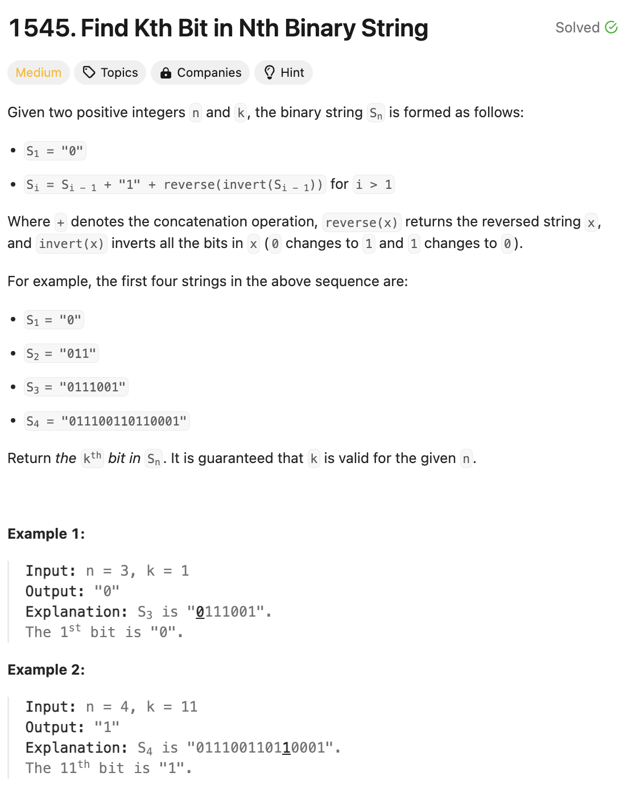

# 문제 설명
이 문제는 다음과 같다.
s가 0으로 시작하는 이진 문자열이다. 다음과 같은 규칙을 따른다.
- n번째 문자열은 n-1번째 문자열 + '1' + n-1번째 문자열의 반전이다.



## 풀이 및 해설

## 풀이
```python
class Solution:
    def findKthBit(self, n: int, k: int) -> str:
        # base case: for s1 return '0'
        if n == 1:
            return "0"

        # calculate length of Sn
        length = 1 << n

        # if k is in the first half of the string, recurse with n-1
        if k < length // 2:
            return self.findKthBit(n-1, k)
        
        # if k is exactly in the middle, return '1'
        elif k == length // 2:
            return "1"
        
        # if k is in the second half of the string
        else:
            # find the corresponding bit in the first half and invert it
            corresponding_bit = self.findKthBit(n-1, length-k)
            return "1" if corresponding_bit == "0" else "0"
```
- base case: n이 1일 때, '0'을 반환한다.
- Sn의 길이를 계산한다.
- k가 문자열의 절반보다 작으면, n-1로 재귀한다.
- k가 정확히 중간에 있으면, '1'을 반환한다.
- k가 문자열의 절반보다 크면, 첫 번째 절반에서 해당하는 비트를 찾아 반전시킨다.
- 반전된 비트가 '0'이면 '1'을 반환하고, '1'이면 '0'을 반환한다.
- 위의 과정을 반복한다.
- 최종적으로 k번째 비트를 반환한다.

## Complexity Analysis


시간 복잡도가 너무 안나와서 editorial 참고해서 제출했더니 처음으로 100% 나왔다.

### 시간 복잡도
- O(n)

### 공간 복잡도
- O(n)

## Constraint Analysis
```
Constraints:
1 <= n <= 20
1 <= k <= 2^n - 1
```

# References
- [1545. Find Kth Bit in Nth Binary String](https://leetcode.com/problems/find-kth-bit-in-nth-binary-string/)