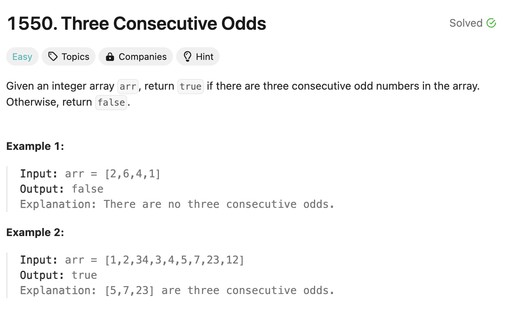
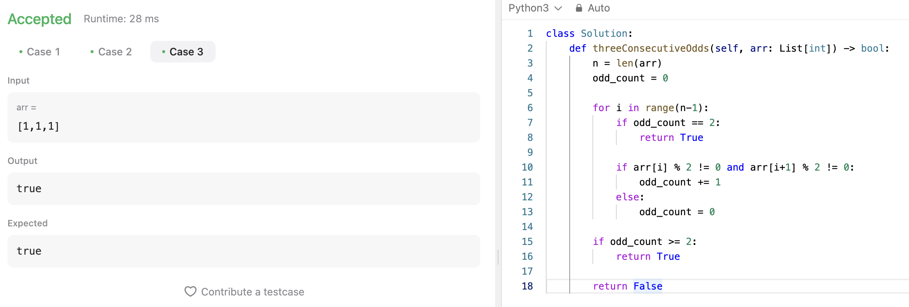

# 문제 설명
3개의 연속된 홀수가 있는지 확인하는 문제다.



## 풀이 및 해설

이 문제를 풀기 위해서는 순회하면서 현재 값과 다음 값이 홀수인지 확인하면서 카운트를 셌다. 순회하는 도중 카운트가 2가 되면 연속적인 3개의 수가 홀수인 것이므로 나머지를 무시하고 바로 True를 반환하도록 했고, 그러지 않을 경우에는 카운트를 초기화 시켰다.

또한, 순회가 배열의 길이 -1 만큼만 순회하기 때문에 마지막 값에 대해서는 카운트를 for loop 안에서 확인하지 못하기 때문에 마지막에 한번 더 확인해주었다.

이럼에도 불구하고 True가 반환되지 않았다면, 3개의 연속된 홀수가 없다는 것이므로 False를 반환하도록 했다.

## 풀이
```python
class Solution:
    def threeConsecutiveOdds(self, arr: List[int]) -> bool:
        n = len(arr)
        odd_count = 0

        for i in range(n-1):
            if odd_count == 2:
                return True
            
            if arr[i] % 2 != 0 and arr[i+1] % 2 != 0:
                odd_count += 1
            else:
                odd_count = 0

        if odd_count >= 2:
            return True
        
        return False
```

너무 번잡해서 다시 한번 다듬어봤다.
```python
class Solution:
    def threeConsecutiveOdds(self, arr: List[int]) -> bool:
        count = 0

        for num in arr:
            if num % 2 == 1:
                count += 1
                if count == 3:
                    return True
            else:
                count = 0

        return False
```

## Complexity Analysis


### 시간 복잡도
- for loop을 통해 배열을 순회하므로 O(n)이다.

### 공간 복잡도
- 추가적인 공간을 사용하지 않으므로 O(1)이다.

## Constraint Analysis
```
Constraints:
1 <= arr.length <= 1000
1 <= arr[i] <= 1000
```

# References
- [1550. Three Consecutive Odds](https://leetcode.com/problems/three-consecutive-odds/)
