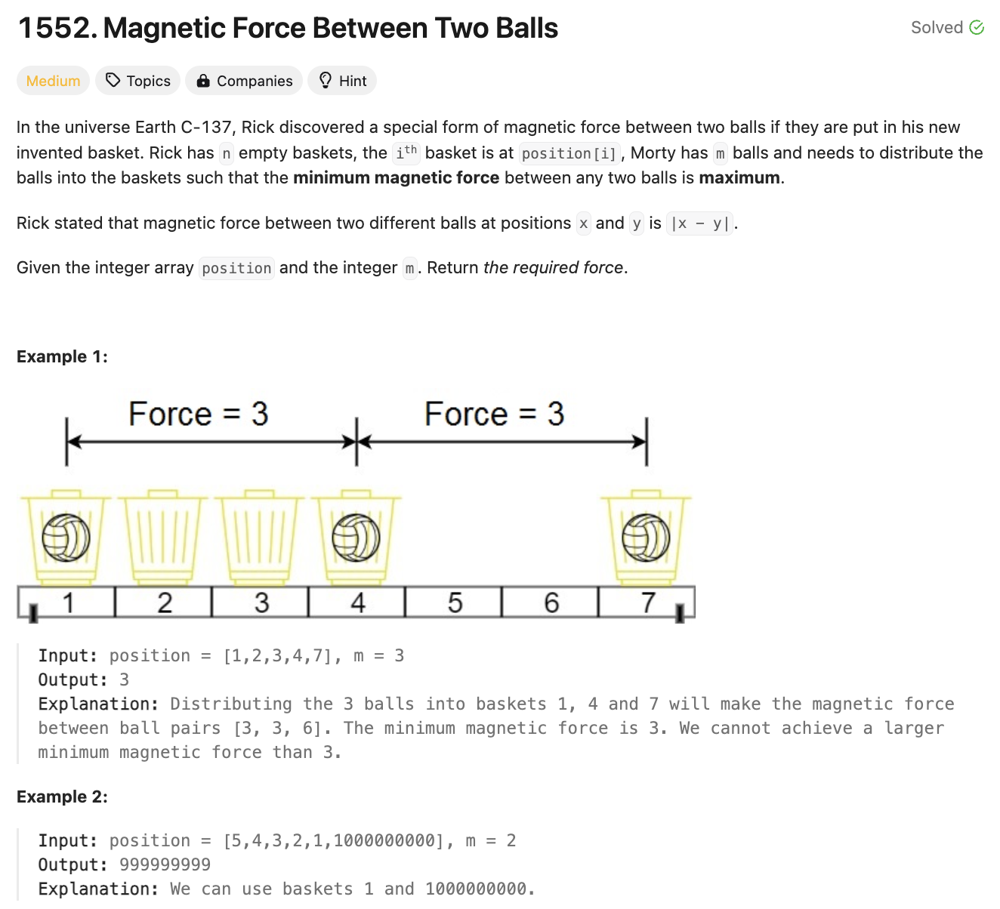
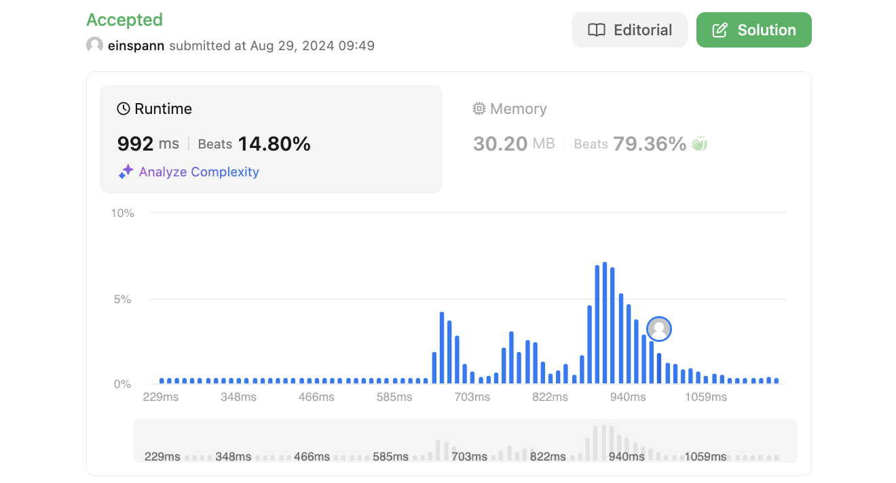

# 문제 설명
N개의 공을 M개의 위치에 배치하여 인접한 두 공 사이의 거리가 최대가 되도록 하는 문제이다.  
2024-06-20에 출제된 문제로, 시간 돌리기 쿠폰으로 풀어봤다.



## 풀이 및 해설

## 풀이
```python
def maxDistance(self, position: List[int], m: int) -> int:
        position.sort()
        def can_place(distance):
            """
            check if distances between positions are large enough
            """
            count = 1
            last_position = position[0]
            for i in range(1, len(position)):
                if position[i] - last_position >= distance:
                    count += 1
                    last_position = position[i]
                if count >= m:
                    return True
            return False


        # binary search for ideal distance
        result = 0
        lo, hi = 1,position[-1]-position[0]
        while lo <= hi:
            mid = (lo+hi)//2
            if can_place(mid):
                result = mid
                lo = mid+1
            else:
                hi = mid-1
        
        return result
```
- def can_place(distance):  
    - check if distances between positions are large enough  
    - 주어진 거리가 충분히 큰지 확인한다.  
    - count를 1로 초기화하고, 마지막 위치를 position[0]으로 설정한다.  
    - position을 순회하면서, 현재 위치와 마지막 위치의 거리가 주어진 거리보다 크거나 같다면 count를 1 증가시키고, 마지막 위치를 현재 위치로 설정한다.  
    - count가 m보다 크거나 같다면 True를 반환한다.
- binary search for ideal distance  
    - 이상적인 거리를 찾기 위해 이진 탐색을 사용한다.  
    - lo와 hi를 1과 position[-1]-position[0]으로 설정한다.  
    - lo가 hi보다 작거나 같을 때까지 다음을 반복한다:  
        - mid를 (lo+hi)//2로 설정한다.  
        - can_place(mid)가 True라면 result를 mid로 설정하고, lo를 mid+1로 설정한다.  
        - 그렇지 않다면 hi를 mid-1로 설정한다.

## Complexity Analysis


### 시간 복잡도
- O(Nlog(range))
    - sort: O(NlogN)
    - binary search: O(Nlog(range))
        - can_place: O(N) ; search할때마다 can_place을 호출하므로 O(N)이 곱해진다.

### 공간 복잡도
- O(1)

## Constraint Analysis
```
Constraints:
n == position.length
2 <= n <= 10^5
1 <= position[i] <= 10^9
All integers in position are distinct.
2 <= m <= position.length
```

# References
- [1552. Magnetic Force Between Two Balls](https://leetcode.com/problems/magnetic-force-between-two-balls)