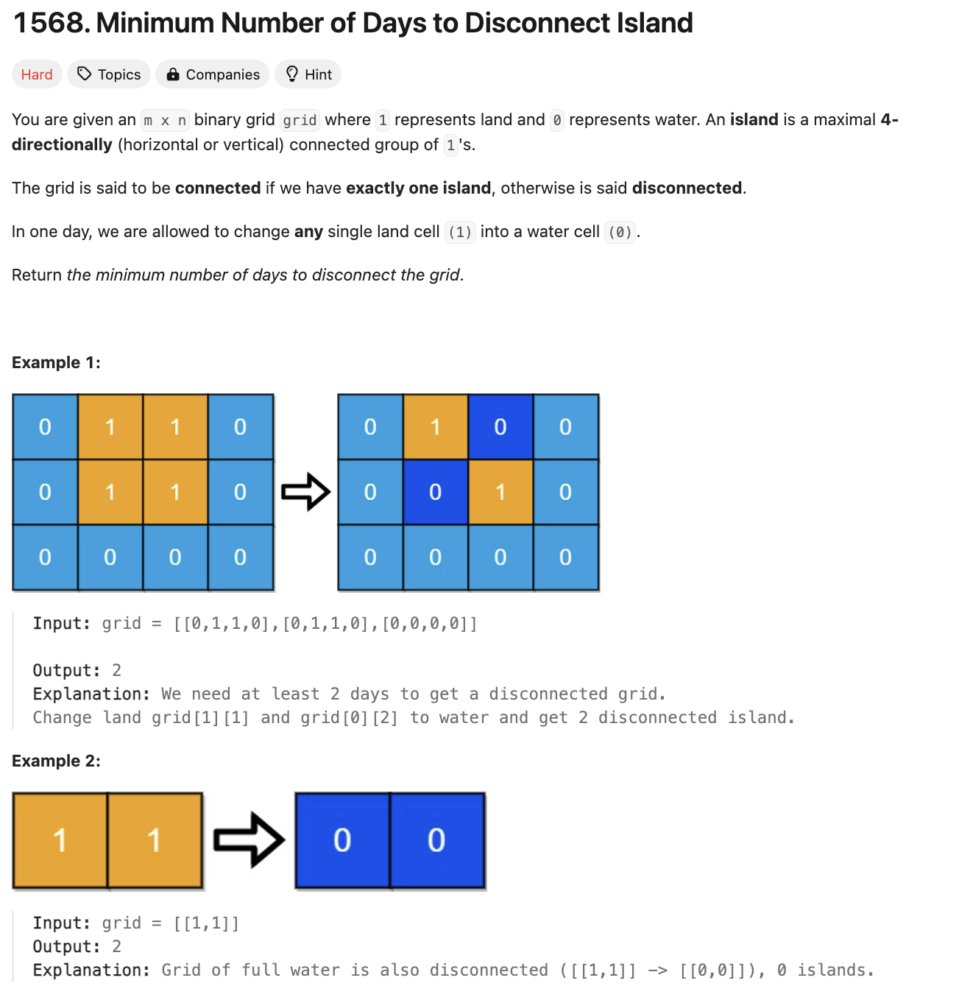

# 문제 설명
grid로 나타낸 섬과 바다가 주어진다. 이때, 섬은 1로, 바다는 0으로 표현된다. 섬은 새로 또는 가로로 붙어있는 경우를 하나의 섬으로 간주한다. 이때, 섬을 두 개로 나누기 위해 필요한 최소 일 수를 찾는 문제다.




## 풀이 및 해설
1. 애초에 섬이 연결되어 있지 않은 경우, 0을 반환한다. 즉, 연결 유무를 확인한다.
2. 한번의 변화로 섬을 두개로 나눌 수 있는지 확인하고, 가능하다면 1을 반환한다.
3. 두번의 변화로 섬을 두개로 나눌 수 있는지 확인하고, 가능하다면 2를 반환한다.

해당 풀이가 가능한 이유는 섬의 크기는 최대 4개의 섬으로 나눌 수 있기 때문이다.

이를 코드로 바꾸면 다음과 같다.

```python
def minDays(self, grid: List[List[int]]) -> int:
        m, n = len(grid), len(grid[0])

        # 1. check if it the island is not connected from the start
        if count_islands() != 1:
            return 0
        
        # 2. check if one change disconnects the island
        for i in range(m):
            for j in range(n):
                if grid[i][j] == 1:
                    grid[i][j] = 0 
                    if count_islands != 1:
                        return 1
                    grid[i][j] = 1
        
        # 3. requires at least two changes
        return 2
```

이제 count_islands 함수를 구현해보자.

```python
def count_islands():
            def dfs(x, y):
                if x < 0 or x >= m or y < 0 or y >= n or grid[x][y] == 0 or visited[x][y]:
                    return
                # mark current as visited if unvisited island, then check all adjacent spaces
                visited[x][y] = True
                for dx,dy in [(-1,0), (1,0), (0,-1), (0,1)]:
                    dfs(x+dx, y+dy)
            
            # for all spaces in the grid, search connected islands
            visited = [[False] * n for _ in range(m)]
            islands = 0
            for i in range(m):
                for j in range(n):
                    if grid[i][j] == 1 and not visited[i][j]:
                        dfs(i,j)
                        islands += 1
            return islands
```


## 풀이

전체 코드는 다음과 같다.
```python
def minDays(self, grid: List[List[int]]) -> int:
        def count_islands():
            def dfs(x, y):
                if x < 0 or x >= m or y < 0 or y >= n or grid[x][y] == 0 or visited[x][y]:
                    return
                # mark current as visited if unvisited island, then check all adjacent spaces
                visited[x][y] = True
                for dx,dy in [(-1,0), (1,0), (0,-1), (0,1)]:
                    dfs(x+dx, y+dy)
            
            # for all spaces in the grid, search connected islands
            visited = [[False] * n for _ in range(m)]
            islands = 0
            for i in range(m):
                for j in range(n):
                    if grid[i][j] == 1 and not visited[i][j]:
                        dfs(i,j)
                        islands += 1
            return islands
        
        m, n = len(grid), len(grid[0])

        # 1. check if it the island is not connected from the start
        if count_islands() != 1:
            return 0
        
        # 2. check if one change disconnects the island
        for i in range(m):
            for j in range(n):
                if grid[i][j] == 1:
                    grid[i][j] = 0 
                    if count_islands() != 1:
                        return 1
                    grid[i][j] = 1
        
        # 3. requires at least two changes
        return 2
```

## Complexity Analysis


### 시간 복잡도
- DFS를 이용해 섬의 개수를 찾는데 O(mn)이 소요된다. 이때, m은 grid의 행의 개수, n은 grid의 열의 개수이다.
- 섬을 두개로 나누기 위해 최대 2번의 변화가 필요하므로 O(2mn)이 소요된다.
- 따라서, 총 시간 복잡도는 O(mn)이다.

### 공간 복잡도
- 방문 여부를 확인하기 위해 O(mn)의 공간이 필요하다.
- 따라서, 총 공간 복잡도는 O(mn)이다.

## Constraint Analysis
```
Constraints:
m == grid.length
n == grid[i].length
1 <= m, n <= 30
grid[i][j] is either 0 or 1.
```

# References
- [1568. Minimum Number of Days to Disconnect Island](https://leetcode.com/problems/minimum-number-of-days-to-disconnect-island/)