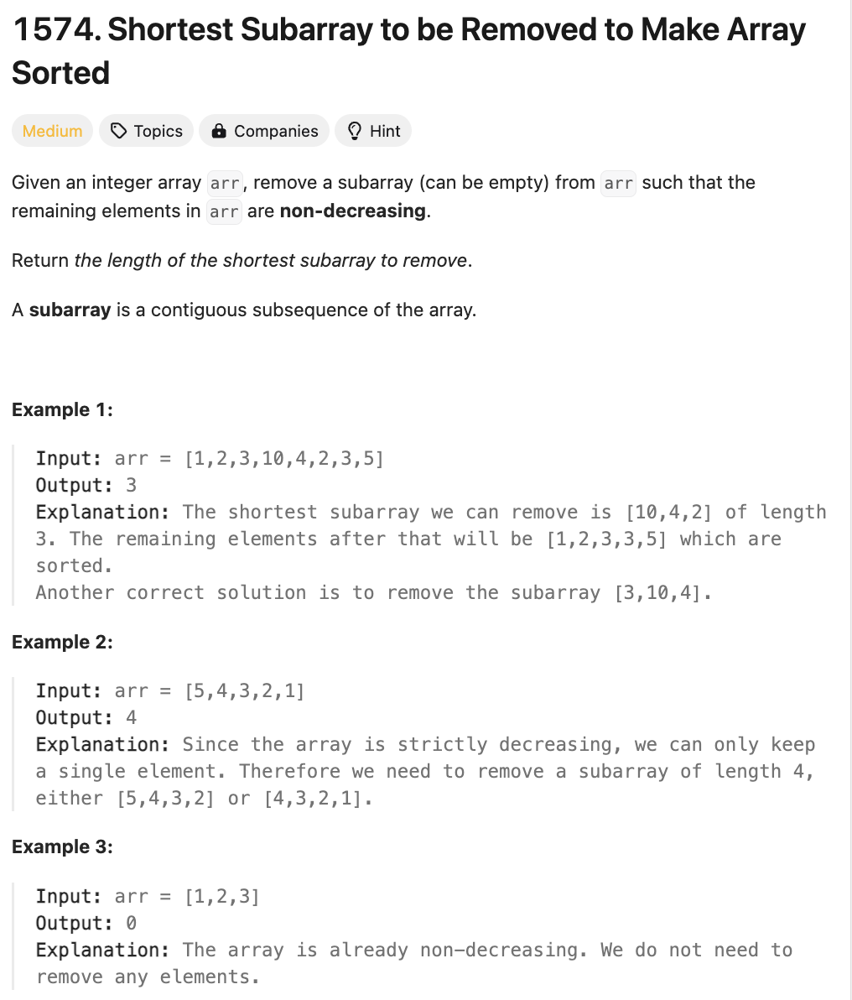

# 문제 설명
숫자 배열이 주어졌을 때, 부분수열을 제거하여 남은 배열이 정렬된 배열이 되도록 하는 가장 짧은 부분수열의 길이를 구하라.



## 풀이 및 해설

## 풀이
```python
class Solution:
    def findLengthOfShortestSubarray(self, arr: List[int]) -> int:
        n = len(arr)
        left = 0
        right = n-1

        # find longest nondecreasing prefix
        while left < right and arr[left] <= arr[left+1]:
            left += 1

        # if the entire array is nondecreasing return 0
        if left == right:
            return 0
        
        # find longest nondecreasing suffix
        while right > left and arr[right-1] <= arr[right]:
            right -= 1
        
        # initialize result as minimum of removing either prefix or suffix
        result = min(n-left-1, right)

        # try to merge suffix and prefix
        i = 0
        j = right

        while i <= left and j < n:
            if arr[i] <= arr[j]:
                result = min(result, j-i-1)
                i += 1
            else:
                j += 1
        
        return result
```
- 주어진 배열에서 가장 긴 증가하는 부분수열 prefix를 찾는다.
    - prefix의 마지막 인덱스를 left에 저장한다.
    - prefix가 전체 배열이라면 0을 반환한다.
- 가장 긴 증가하는 부분수열 suffix를 찾는다.
    - suffix의 첫 인덱스를 right에 저장한다.
    - suffix가 전체 배열이라면 0을 반환한다.
- prefix와 suffix를 합친 가장 짧은 부분수열을 찾는다.
    - prefix의 마지막 인덱스와 suffix의 첫 인덱스를 i, j에 저장한다.
    - i와 j가 각각 prefix와 suffix의 마지막 인덱스를 넘어가지 않을 때까지 반복한다.
    - arr[i]와 arr[j]를 비교하여 더 작은 값을 result에 저장한다.
    - i와 j를 각각 1씩 증가시킨다.
- result를 반환한다.

## Complexity Analysis


### 시간 복잡도
- O(N) ; 풀이에서 배열을 한 번 순회하므로 O(N)

### 공간 복잡도
- O(1)

## Constraint Analysis
```
Constraints:
1 <= arr.length <= 10^5
0 <= arr[i] <= 10^9
```

# References
- [1574. Shortest Subarray to be Removed to Make Array Sorted](https://leetcode.com/problems/shortest-subarray-to-be-removed-to-make-array-sorted/)