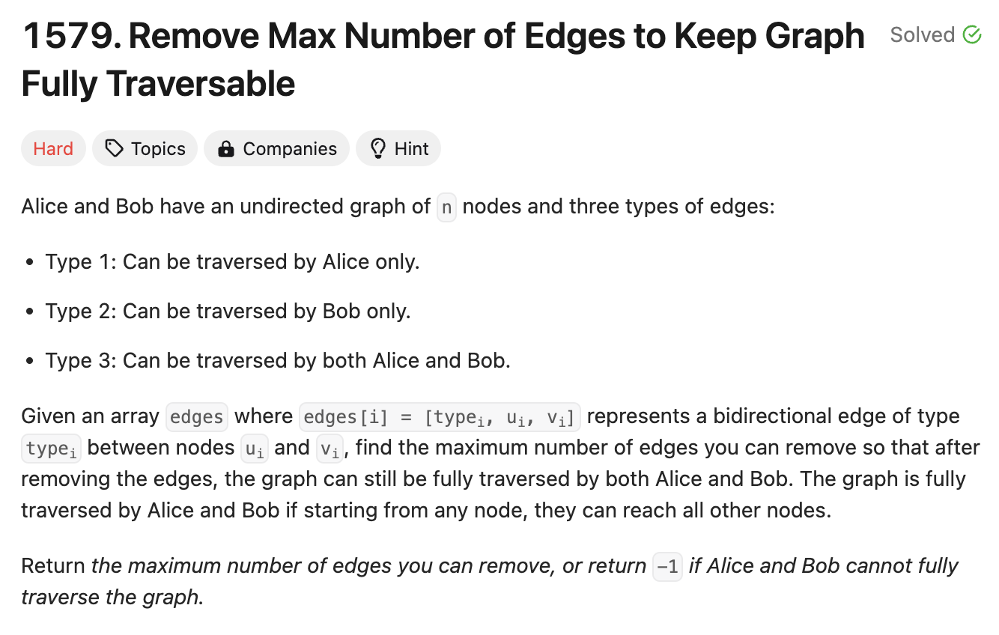

# 문제 설명


## 문제
이 문제는 Union-Find 알고리즘을 사용하여 그래프를 완전히 탐색할 수 있도록 최대한 많은 간선을 제거하는 문제다.


## 문제 소개: Union-Find
UnionFind (Disjoint Set)를 사용해야 해서 조금 생소한 문제다. Union Find는 그래프에서 연결되어 있는 노드들을 찾는 자료구조의 일종이다. 

해당 클래스에서 `union` 함수는 두개의 노드 x와 y를 연결하려고 시도한다. `self.find(x)`와 `self.find(y)`는 각각 x와 y의 루트 노드를 찾는다. 만약 두 노드의 루트 노드가 같다면, 이미 연결되어 있는 노드이므로 `False`를 반환한다. 그렇지 않다면, 두 노드를 연결하고 `True`를 반환한다.

이때, if-elif 블록에서는 Union-by-rank라는 Optimization 기법을 사용한다. rank는 트리의 높이를 나타내는데, 두 트리를 합칠 때 높이가 더 낮은 트리를 높이가 더 높은 트리에 붙이는 방식이다. 이렇게 하면 트리의 높이가 줄어들어 find 함수의 시간 복잡도를 줄일 수 있다.

`self.parent[px] = py` 또는 `self.parent[py] = px`은 두 트리를 합칠 때, 높이가 더 낮은 트리를 높이가 더 높은 트리에 붙이는 과정이다. `self.components -= 1`은 연결된 컴포넌트의 개수를 1 감소시킨다.

## 어째서 Union-Find를 사용하는가?
- UnionFind는 노드들이 연결되어 있는지 여부와 병합을 거의 상수 시간에 수행할 수 있다.
- 동적 연결성이 보장되기 때문에, 연결성에 대한 쿼리를 빨리 수행하고 그래프 구조를 효율적으로 업데이트할 수 있다.
- 공간 효율적이다. 모든 간선을 저장할 필요가 없다.

# 풀이 및 해설

## 풀이
```python
class UnionFind:
    def __init__(self, n):
        self.parent = list(range(n))
        self.rank = [0] * n
        self.components = n
    
    def find(self, x):
        if self.parent[x] != x:
            self.parent[x] = self.find(self.parent[x])
        return self.parent[x]
    
    def union(self, x, y):
        px, py = self.find(x), self.find(y)
        if px == py:
            return False
        if self.rank[px] < self.rank[py]:
            self.parent[px] = py
        elif self.rank[px] > self.rank[py]:
            self.parent[py] = px
        else:
            self.parent[py] = px
            self.rank[px] += 1
        self.components -= 1
        return True

class Solution:
    def maxNumEdgesToRemove(self, n: int, edges: List[List[int]]) -> int:
        alice = UnionFind(n)
        bob = UnionFind(n)

        edges_used = 0

        # Process type 3 edges
        for edge_type, u, v in edges:
            if edge_type == 3:
                if alice.union(u-1, v-1):
                    bob.union(u-1, v-1)
                    edges_used += 1
        
        # Process type 1 edges (alice)
        for edge_type, u, v in edges:
            if edge_type == 1:
                if alice.union(u-1, v-1):
                    edges_used += 1
        
        # Process type 2 edges (bob)
        for edge_type, u, v in edges:
            if edge_type == 2:
                if bob.union(u-1, v-1):
                    edges_used += 1
        
        # Check if the graph is fully traversable
        if alice.components != 1 or bob.components != 1:
            return -1
        
        return len(edges) - edges_used
```
- 가장 먼저 UnionFind 클래스를 정의한다.
- UnionFind 클래스는 다음과 같은 메소드를 가진다.
    - `__init__(self, n)`: n개의 노드를 가진 UnionFind 클래스를 초기화한다.
    - `find(self, x)`: x의 루트 노드를 찾는다.
    - `union(self, x, y)`: x와 y를 합친다.

- `maxNumEdgesToRemove` 메소드는 다음과 같이 동작한다.
    - `alice`와 `bob` 두 UnionFind 클래스를 초기화한다.
    - `edges_used` 변수를 초기화한다.
    - type 3 간선을 처리한다.
        - type 3 간선은 alice와 bob 모두에게 속하므로, 두 클래스 모두에게 합친다.
        - `edges_used`를 1 증가시킨다.
    - type 1 간선을 처리한다.
        - alice에게 속하는 간선이므로, alice에게 합친다.
        - `edges_used`를 1 증가시킨다.
    - type 2 간선을 처리한다.
        - bob에게 속하는 간선이므로, bob에게 합친다.
        - `edges_used`를 1 증가시킨다.
    - alice와 bob의 components가 1이 아니라면, 그래프가 완전히 탐색할 수 없는 그래프이므로 -1을 반환한다.
    - 그렇지 않다면, `edges`의 길이에서 `edges_used`를 뺀 값을 반환한다.

## Complexity Analysis


### 시간 복잡도
- O(n): Alice와 Bob에 대한 UnionFind 클래스를 초기화하는 데 O(n)이 걸린다.
- O(m): m개의 간선을 처리하는 데 O(m)이 걸린다.
- 모든 간선에 대하여 union 함수를 호출한다.
    - 이때, find 함수는 O(alpha(n))이 걸리며, alpha(n)은 Ackermann 함수의 역함수이다.
    - alpha(n)은 매우 느리게 증가하므로, O(m * alpha(n))은 O(m)이 된다.
- Bob과 Alice의 components를 확인하는 데 O(1)이 걸린다. 즉, Traverse하는 데 O(1)이 걸린다.

따라서, 총 O(n + m)의 시간 복잡도가 소요된다.

이때 m은 최대 3 * n * (n - 1) / 2이므로, O(n^2)이 된다.   
그렇다면, 총 시간 복잡도는 O(n + n^2)이다.


### 공간 복잡도
- O(n): Alice와 Bob에 대한 UnionFind 클래스를 초기화하는 데 O(n)이 소요된다.
- O(m): m개의 간선을 처리하는 데 O(m)이 소요된다.

즉, 총 O(n + m)의 공간 복잡도가 소요된다.

## Constraint Analysis
```
Constraints:
1 <= n <= 10^5
1 <= edges.length <= min(10^5, 3 * n * (n - 1) / 2)
edges[i].length == 3
1 <= type_i <= 3
1 <= u_i < v_i <= n
All tuples (type_i, u_i, v_i) are distinct.
```

# References
- [LeetCode](https://leetcode.com/problems/remove-max-number-of-edges-to-keep-graph-fully-traversable/)
- [Wikipedia - Union-Find](https://en.wikipedia.org/wiki/Disjoint-set_data_structure)
- [Ackermann Function](https://en.wikipedia.org/wiki/Ackermann_function)