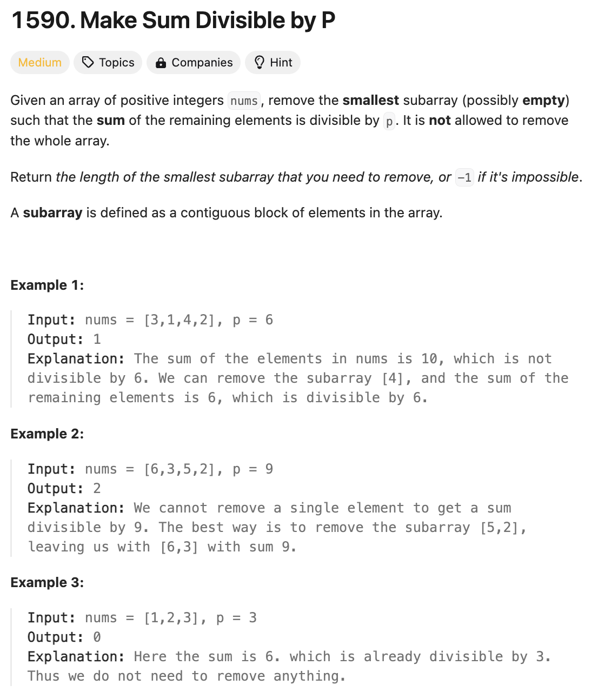

# 문제 설명
숫자 배열이 주어졌을 때, 배열의 부분합 중 하나를 제거하여 배열의 합이 `p`로 나누어 떨어지도록 하는 문제이다.



## 풀이 및 해설
이 문제를 푸는데 핵심 아이디어는 `prefix_sum`을 이용하여 부분합을 계산하고, `complement`를 이용하여 `target`을 만족하는 부분합을 찾는 것이다.

## 풀이
```python
class Solution:
    def minSubarray(self, nums: List[int], p: int) -> int:
        target = sum(nums) % p
        if target == 0:
            return 0

        prefix_sum = 0
        seen = {0: -1}
        min_length = len(nums)

        for i, num in enumerate(nums):
            prefix_sum = (prefix_sum + num) % p
            complement = (prefix_sum - target) % p

            if complement in seen:
                min_length = min(min_length, i - seen[complement])
            
            seen[prefix_sum] = i
        
        return min_length if min_length < len(nums) else -1
```
- `target`은 배열의 합을 `p`로 나눈 나머지이다.
- `prefix_sum`은 배열의 부분합을 나타내며, `seen`은 `prefix_sum`이 나타난 인덱스를 저장한다.
- `complement`는 `prefix_sum`에서 `target`을 뺀 값이다.
- `complement`가 `seen`에 있다면, `min_length`를 갱신한다.
- `min_length`가 배열의 길이보다 작다면, `min_length`를 반환하고, 그렇지 않다면 `-1`을 반환한다.


## Complexity Analysis


### 시간 복잡도
- 시간 복잡도는 `O(N)`이다.

### 공간 복잡도
- 공간 복잡도는 `O(N)`이다.

## Constraint Analysis
```
Constraints:
1 <= nums.length <= 10^5
1 <= nums[i] <= 10^9
1 <= p <= 10^9
```

# References
- [1590. Make Sum Divisible by P](https://leetcode.com/problems/make-sum-divisible-by-p/)