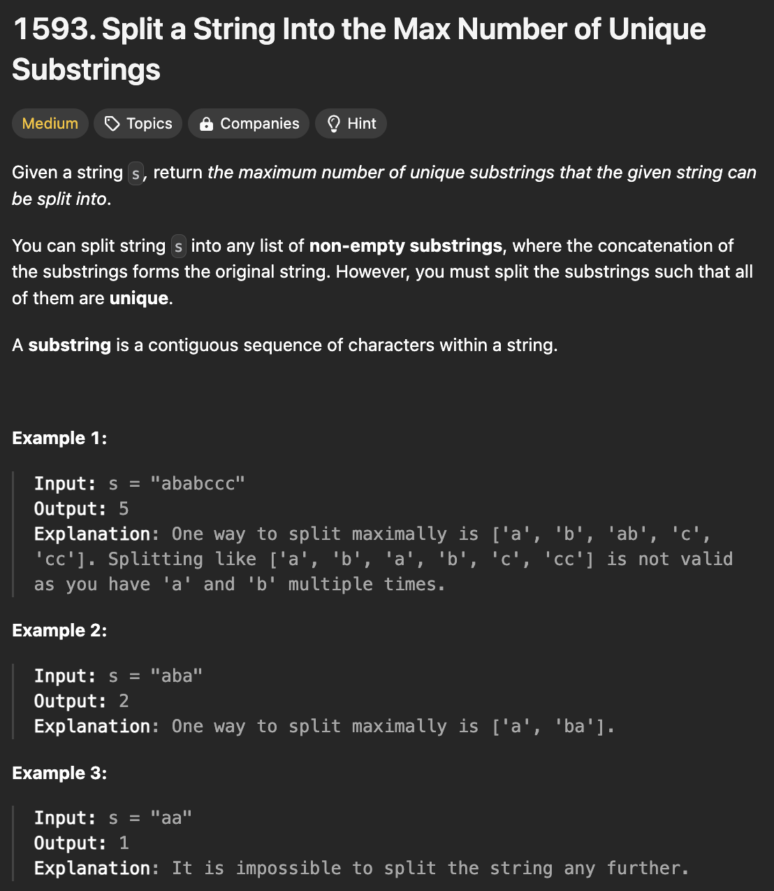

# 문제 설명
s라는 문자열이 주어졌을 때, s를 가장 많은 수의 유일한 부분 문자열로 나누어라. 이때, s의 부분 문자열은 s의 연속된 문자들의 부분집합이다.



## 풀이 및 해설

## 풀이
```python
class Solution:
    def maxUniqueSplit(self, s: str) -> int:
        def backtrack(start, seen):
            if start == len(s):
                return 0
            
            max_splits = 0
            for end in range(start+1, len(s)+1):
                substring = s[start:end]
                if substring not in seen:
                    seen.add(substring)
                    splits = 1+backtrack(end, seen)
                    max_splits = max(max_splits, splits)
                    seen.remove(substring)
            
            return max_splits
        
        return backtrack(0,set())
```
- `backtrack` 함수는 `start` 인덱스부터 시작하여 `s`를 나누는 최대 수를 반환한다.
- `seen`은 이미 나눈 문자열을 저장하는 집합이다.
- `start`가 `s`의 길이와 같다면, 나눈 문자열의 수를 반환한다.
- `end`는 `start`부터 `s`의 길이까지 반복한다.
- `substring`은 `s[start:end]`로 나눈 문자열이다.
- 만약 `substring`이 `seen`에 없다면, `seen`에 추가하고 `splits`를 1 증가시킨다.
- `max_splits`는 `max(max_splits, splits)`로 갱신한다.
- `seen`에서 `substring`을 제거한다.
- 최종적으로 `max_splits`를 반환한다.
- `backtrack(0,set())`으로 시작하여 최대 나눈 문자열의 수를 반환한다.

## Complexity Analysis


### 시간 복잡도
- 시간 복잡도는 `O(2^N)`이다.

### 공간 복잡도
- 공간 복잡도는 `O(N)`이다.

## Constraint Analysis
```
Constraints:
1 <= s.length <= 16
s contains only lower case English letters.
```

# References
- [1593. Split a String Into the Max Number of Unique Substrings](https://leetcode.com/problems/split-a-string-into-the-max-number-of-unique-substrings/)