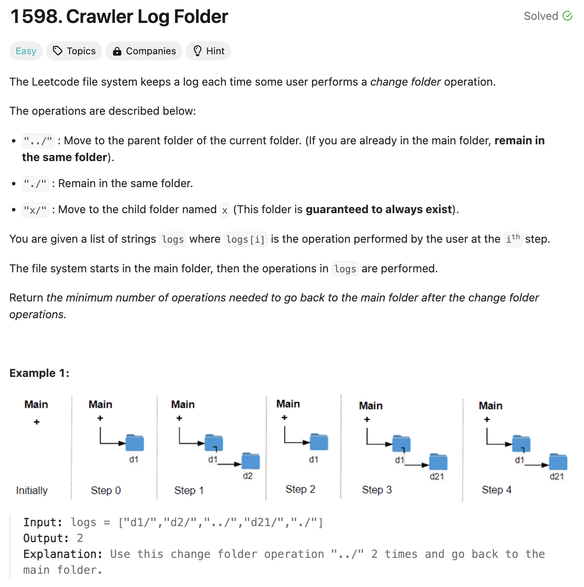

# 문제 설명
폴더를 조작하는 여러 커맨드가 주어졌을때, 다시 root로 돌아가기 위해 필요한 '../'의 개수를 구하는 문제이다.



## 풀이 및 해설
해당 문제는 모든 폴더들이 제대로 주어진다는 가정이 존재하기 때문에, 어떤 폴더에서 어디로 가는지 알 필요는 없고, 지금 어느 깊이에 있는지만 알면 된다. 따라서, depth를 이용해서 풀면 된다.

## 풀이
```python
class Solution:
    def minOperations(self, logs: List[str]) -> int:
        depth = 0
        for log in logs:
            if log == "./":
                continue
            elif log == "../":
                if depth > 0:
                    depth -= 1
            else:
                depth += 1
        
        return depth
```
- log에 따라서 depth를 조절하면 된다.
- depth가 0보다 작아지지 않도록 주의한다.
- depth가 0보다 작아지면 root로 돌아가는 것이므로, depth를 0으로 맞춰준다.
- log가 './'이면 아무것도 하지 않고, '../'이면 depth를 줄이고, 나머지는 depth를 늘린다. 모든 폴더는 존재한다고 문제에 정의되어 있기 때문이다.
- 마지막에 depth를 반환하면 된다.

## Complexity Analysis


### 시간 복잡도
- logs의 길이만큼 loop를 돌기 때문에 O(n)이다.

따라서 시간 복잡도는 O(n)이다.

### 공간 복잡도
- depth 변수 하나만 사용하므로 O(1)이다.

## Constraint Analysis
```
Constraints:
1 <= logs.length <= 103
2 <= logs[i].length <= 10
logs[i] contains lowercase English letters, digits, '.', and '/'.
logs[i] follows the format described in the statement.
Folder names consist of lowercase English letters and digits.
```

# References
- [Leet](https://leetcode.com/problems/crawler-log-folder/)
