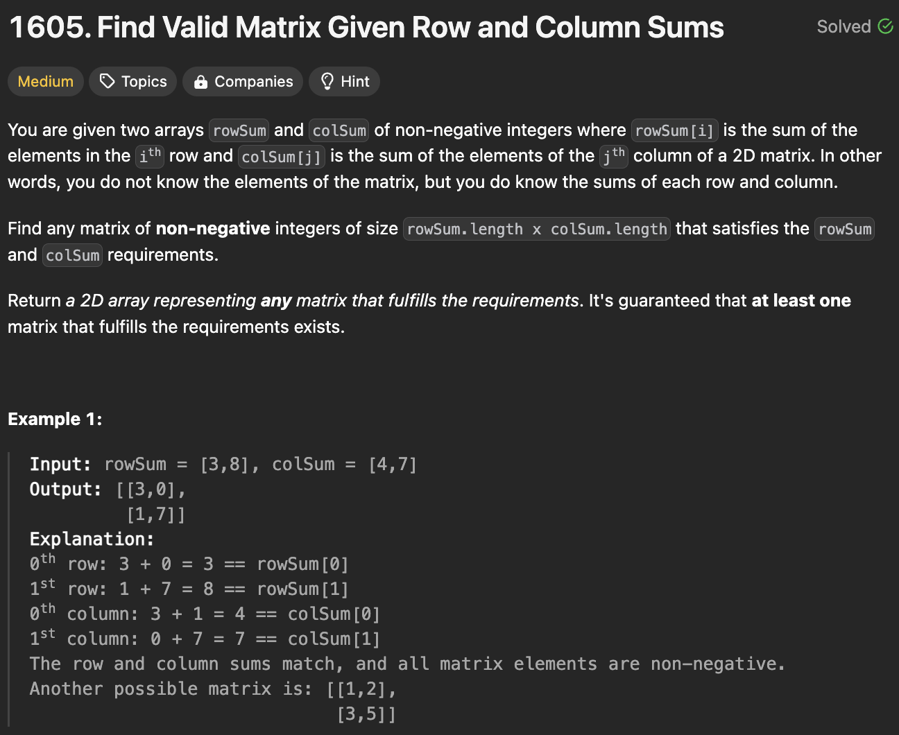

# 문제 설명
행과 열의 합이 주어졌을 때, 가능한 행렬을 찾는 문제이다.




## 풀이 및 해설

## 풀이
```python
def restoreMatrix(self, rowSum: List[int], colSum: List[int]) -> List[List[int]]:
        m, n = len(rowSum), len(colSum)
        matrix = [[0 for _ in range(n)] for _ in range(m)]

        for i in range(m):
            for j in range(n):
                value = min(rowSum[i], colSum[j])
                matrix[i][j] = value
                rowSum[i] -= value
                colSum[j] -= value

        return matrix
```
- 행렬을 만들기 위해 rowSum과 colSum을 이용한다.
- rowSum과 colSum의 값 중 작은 값을 찾아서 matrix에 저장한다.
- matrix에 저장한 값만큼 rowSum과 colSum에서 빼준다.
- 모든 행과 열을 순회하면서 matrix를 완성한다.
- matrix를 반환한다.

## Complexity Analysis


### 시간 복잡도
- 행의 길이를 m, 열의 길이를 n이라고 할 때, O(mn)의 시간 복잡도를 가진다.

### 공간 복잡도
- O(mn)의 공간 복잡도를 가진다.

## Constraint Analysis
```
Constraints:
1 <= rowSum.length, colSum.length <= 500
0 <= rowSum[i], colSum[i] <= 10^8
sum(rowSum) == sum(colSum)
```

# References
- [1605. Find Valid Matrix Given Row and Column Sums](https://leetcode.com/problems/find-valid-matrix-given-row-and-column-sums/)