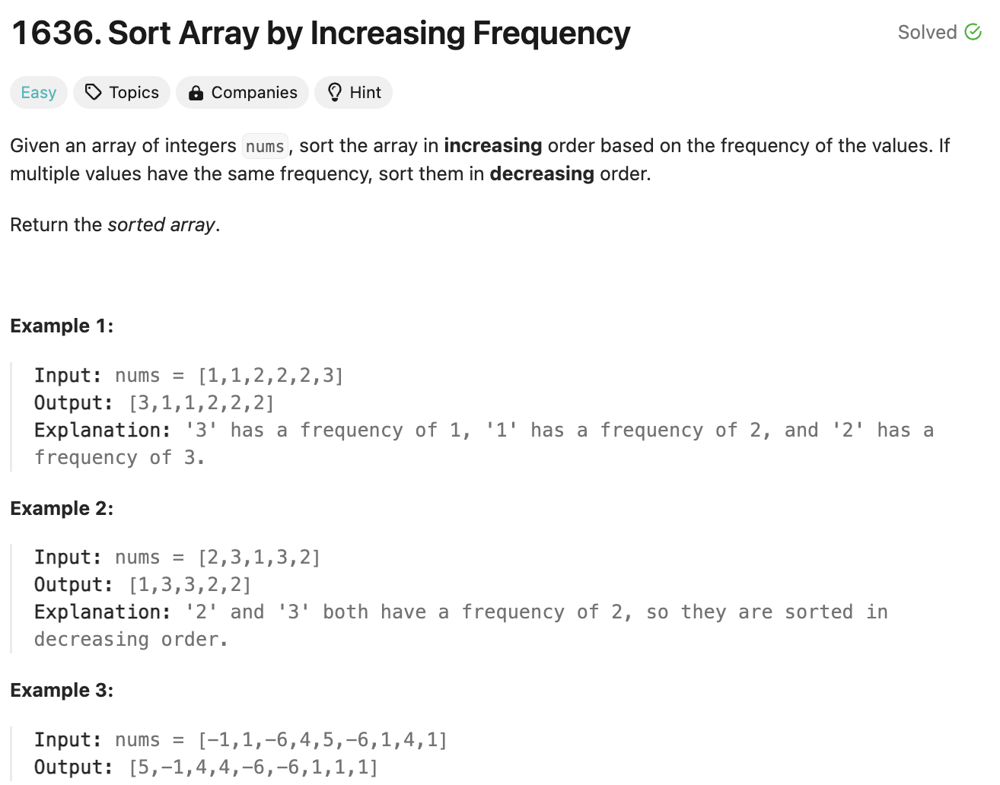
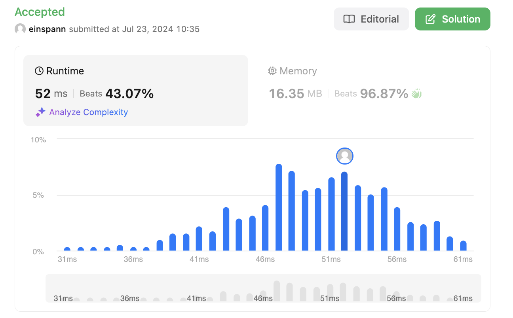
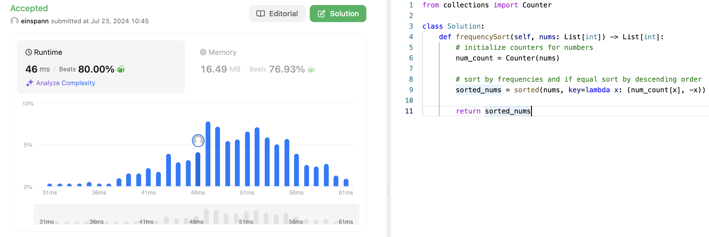

# 문제 설명
배열이 주어졌을 때, 빈도 오름차순으로 정렬하는 문제다.




## 풀이 및 해설
해당 문제에서는 Counter를 사용해서 쉽게 풀 수 있지만, 1) Counter를 부르는 오버헤드 발생과 2) 대용량 데이터의 경우에 느려질 수 있는 점을 감안하여, Hash/Dictionary를 직접 구현하는게 더 빠르다. 따라서, 해당 풀이에서는 Dictionary를 직접 구현했다.

참고: https://sunghj1118.github.io/algorithm/theory/dictionaryvscounter/

## 풀이
```python
def frequencySort(self, nums: List[int]) -> List[int]:
        # initialize counters for numbers
        num_count = {}
        for n in nums:
            num_count[n] = num_count.get(n,0) + 1

        # sort by frequencies and if equal sort by descending order
        sorted_nums = sorted(nums, key=lambda x: (num_count[x], -x))
        
        return sorted_nums
```
- 숫자 배열의 빈도를 세준다.
- 빈도에 맞게 정렬하고 새로운 배열에 저장.
- 저장된 배열을 반환

## Complexity Analysis
**Time Complexity of Dictionary**


**Time Complexity of Counter**


Counter를 사용하는 풀이가 Dictionary를 사용하는 풀이보다 빠르게 나왔다. 이는 아마 데이터 양이 적은것과, Dictionary를 구현하는 코드가 Counter의 처리보다 더 많은 시간이 걸린것으로 추정된다. 

즉, Counter과 Dictionary의 속도 차이는 사실 경미하지만, 데이터가 많은 경우에 Dictionary가 더 유리하다. 그러나, 데이터가 적은 경우에는 Counter가 잡아먹는 실행속도가 더 적기 때문에 유리한것을 볼 수 있다.

### 시간 복잡도
- O(n); n은 배열의 길이

### 공간 복잡도
- O(n); dictionary의 공간

## Constraint Analysis
```
Constraints:
1 <= nums.length <= 100
-100 <= nums[i] <= 100
```

# References
- [Leet](https://leetcode.com/problems/sort-array-by-increasing-frequency/?envType=daily-question&envId=2024-07-23)