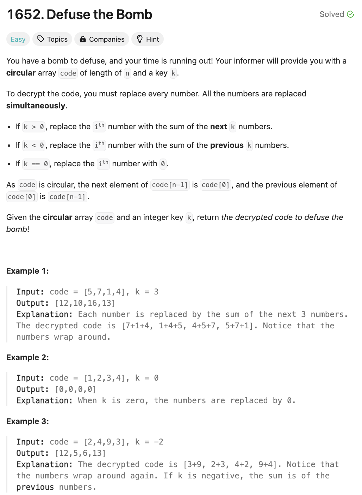

# 문제 설명
이 문제는 배열과 k라는 정수가 주어지면 다음 조건에 맞게 배열을 변환하는 문제이다.

- k>0이면, i번째 요소는 i+1부터 i+k까지의 요소의 합이다.
- k<0이면, i번째 요소는 i+k부터 i-k까지의 요소의 합이다.
- k=0이면, 모든 요소는 0이다.





## 풀이 및 해설

## 풀이
```python
class Solution:
    def decrypt(self, code: List[int], k: int) -> List[int]:
        n = len(code)
        result = [0] * n

        if k == 0:
            return result

        # double array to wrap around
        extended_code = code + code

        # determine direction and range
        start = 1 if k > 0 else n+k
        end = k+1 if k > 0 else n

        # calculate initial sum
        current_sum = sum(extended_code[start:end])
        
        for i in range(n):
            result[i] = current_sum
            current_sum -= extended_code[start+i]
            current_sum += extended_code[end+i]

        return result
```
- k가 0인 경우에는 모든 요소가 0이므로 바로 반환한다.
- k가 양수인 경우에는 i번째 요소는 i+1부터 i+k까지의 요소의 합이다.
- k가 음수인 경우에는 i번째 요소는 i+k부터 i-k까지의 요소의 합이다.
- k가 0이 아닌 경우에는 배열을 두 번 반복하여 원형 배열을 만든다.
- start와 end를 정의하여 k의 방향과 범위를 결정한다.
- 초기 합을 계산한다.
- 각 요소에 대해 현재 합을 계산하고 결과 배열에 저장한다.
- 현재 합을 업데이트한다.
- 결과 배열을 반환한다.

## Complexity Analysis


### 시간 복잡도
- O(n) : 배열을 두 번 반복하므로 O(n)이다.

### 공간 복잡도
- O(n) : 결과 배열을 저장하기 위해 O(n)이다.

## Constraint Analysis
```
Constraints:
n == code.length
1 <= n <= 100
1 <= code[i] <= 100
-(n - 1) <= k <= n - 1
```

# References
- [1652. Defuse the Bomb](https://leetcode.com/problems/defuse-the-bomb/)