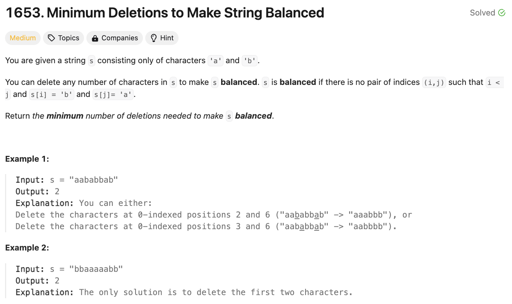

# 문제 설명
문장에서 균형을 맞추기 위해 삭제해야 하는 최소 문자 수를 찾는 문제다.



## 풀이 및 해설
문장을 한번 훑으면서 'a'를 만나면 'b'의 개수와 비교하여 최소값을 찾는다. 'b'를 만나면 'b'의 개수를 증가시킨다.

## 풀이
```python
def minimumDeletions(self, s: str) -> int:
        b_count = 0
        deletions = 0
        
        for char in s:
            if char == 'a':
                deletions = min(deletions + 1, b_count)
            else:  # char == 'b'
                b_count += 1
        
        return deletions
```

## Complexity Analysis


### 시간 복잡도
- O(N); N은 문자열의 길이

### 공간 복잡도
- O(1); 상수만큼의 공간 사용

## Constraint Analysis
```
Constraints:
1 <= s.length <= 10^5
s[i] is 'a' or 'b'​​.
```

# References
- [1653. Minimum Deletions to Make String Balanced](https://leetcode.com/problems/minimum-deletions-to-make-string-balanced/)