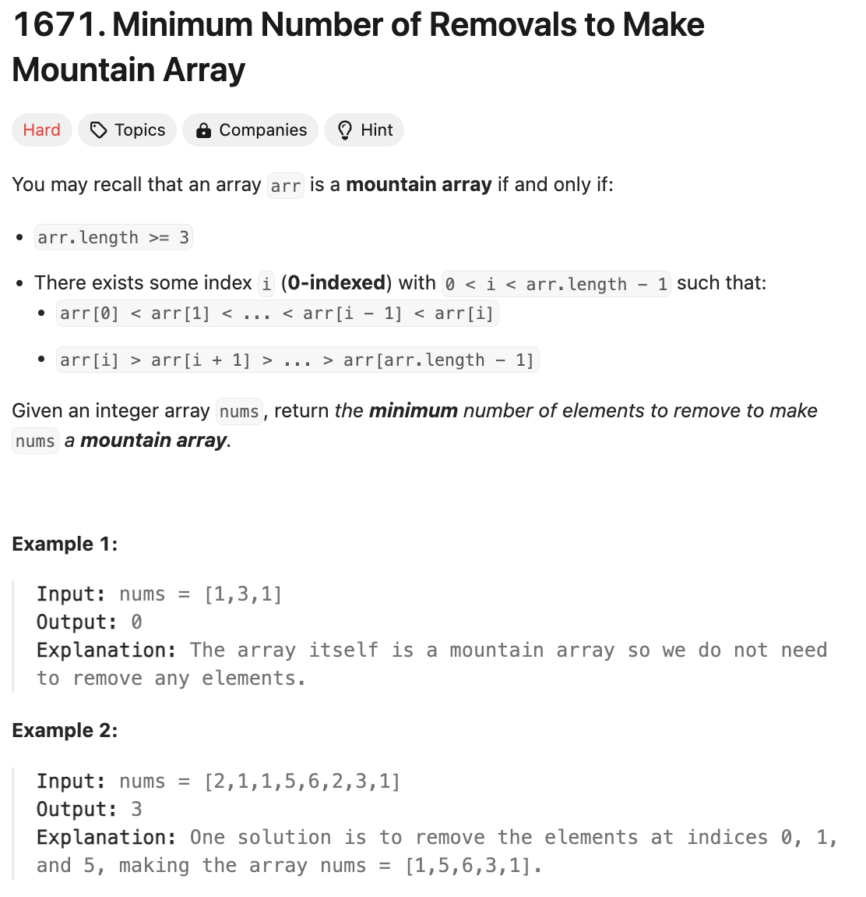

# 문제 설명
이 문제는 주어진 배열이 mountain array가 되도록 만들기 위해 제거해야 하는 최소 숫자를 구하는 문제이다.



## 풀이 및 해설
이 문제를 풀기 위해서는 다음과 같은 방법을 사용할 수 있다.
1. 왼쪽에서 오른쪽으로 LIS를 구한다.
2. 오른쪽에서 왼쪽으로 LDS를 구한다.
3. LIS[i] + LDS[i] - 1의 최대값을 찾는다.
4. n - (LIS[i] + LDS[i] - 1)을 반환한다.

## 풀이
```python
class Solution:
    def minimumMountainRemovals(self, nums: List[int]) -> int:
        n = len(nums)

        # calculate LIS from left to right
        lis = [1]*n
        for i in range(1,n):
            for j in range(i):
                if nums[i] > nums[j]:
                    lis[i] = max(lis[i], lis[j]+1)
        
        # calculate LDS from right to left
        lds = [1]*n
        for i in range(n-2,-1,-1):
            for j in range(n-1,i,-1):
                if nums[i] > nums[j]:
                    lds[i] = max(lds[i], lds[j]+1)
        
        # find max sum of LIS[i] + LDS[i] -1
        max_length = 0
        for i in range(n):
            if lis[i] > 1 and lds[i] > 1:
                max_length = max(max_length, lis[i]+lds[i]-1)
        

        # return the min num of removals
        return n-max_length
```

## Complexity Analysis


### 시간 복잡도
- O(n^2)의 시간이 걸린다.
  - LIS를 구하는데 O(n^2)의 시간이 걸린다.
  - LDS를 구하는데 O(n^2)의 시간이 걸린다.

### 공간 복잡도
- O(n)의 공간이 필요하다.
  - LIS를 저장하는데 O(n)의 공간이 필요하다.
  - LDS를 저장하는데 O(n)의 공간이 필요하다.

## Constraint Analysis
```
Constraints:
3 <= nums.length <= 1000
1 <= nums[i] <= 10^9
It is guaranteed that you can make a mountain array out of nums.
```

# References
- [1671. Minimum Number of Removals to Make Mountain Array](https://leetcode.com/problems/minimum-number-of-removals-to-make-mountain-array/)