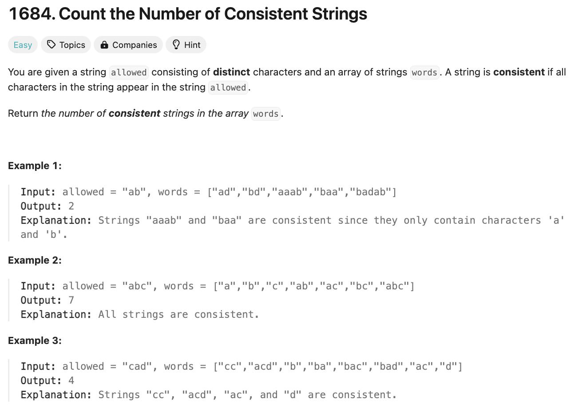

# 문제 설명
배열에 여러 단어들이 주어지고, 사용 가능한 문자열이 주어질 때, 사용 가능한 문자열로만 이루어진 단어의 개수를 구하는 문제다.



## 풀이 및 해설

## 풀이
```python
from typing import Counter, List


class Solution:
    def countConsistentStrings(self, allowed: str, words: List[str]) -> int:
        word_count = []
        for word in words:
            c = Counter(word)
            word_count.append(c)

        count = 0
        for word in word_count:
            check = True
            for letter in word:
                if letter not in allowed:
                    check = False
            if check:
                count += 1
        
        return count
```

## Complexity Analysis


### 시간 복잡도
- O(N * M) : N은 words의 길이, M은 word의 길이

### 공간 복잡도
- O(N) : word_count에 N개의 Counter 객체를 저장

## Constraint Analysis
```
Constraints:
1 <= words.length <= 10^4
1 <= allowed.length <= 26
1 <= words[i].length <= 10
The characters in allowed are distinct.
words[i] and allowed contain only lowercase English letters.
```

# References
- [1684. Count the Number of Consistent Strings](https://leetcode.com/problems/count-the-number-of-consistent-strings/)