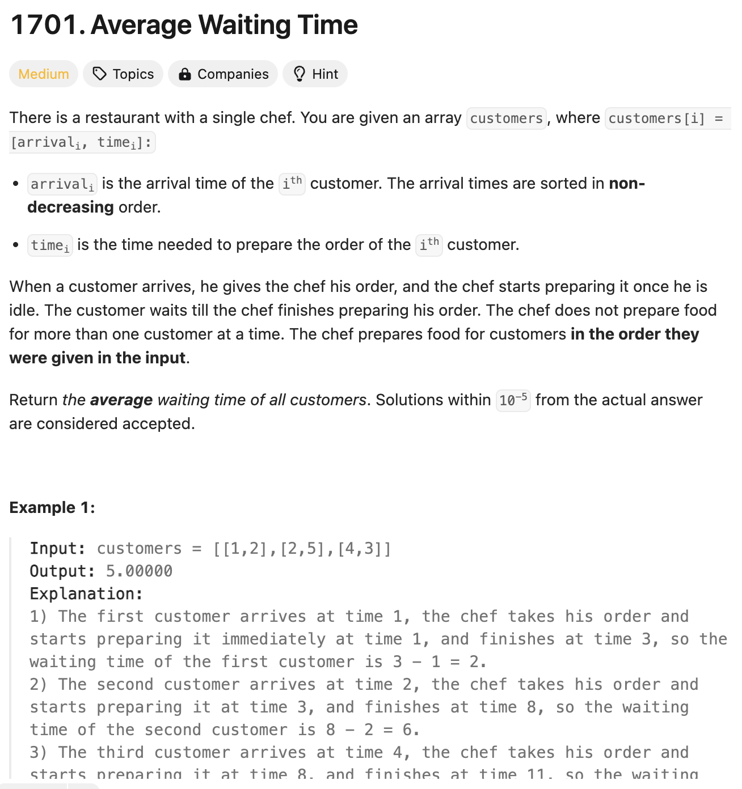
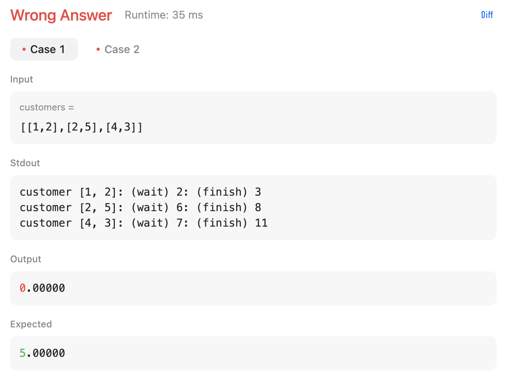
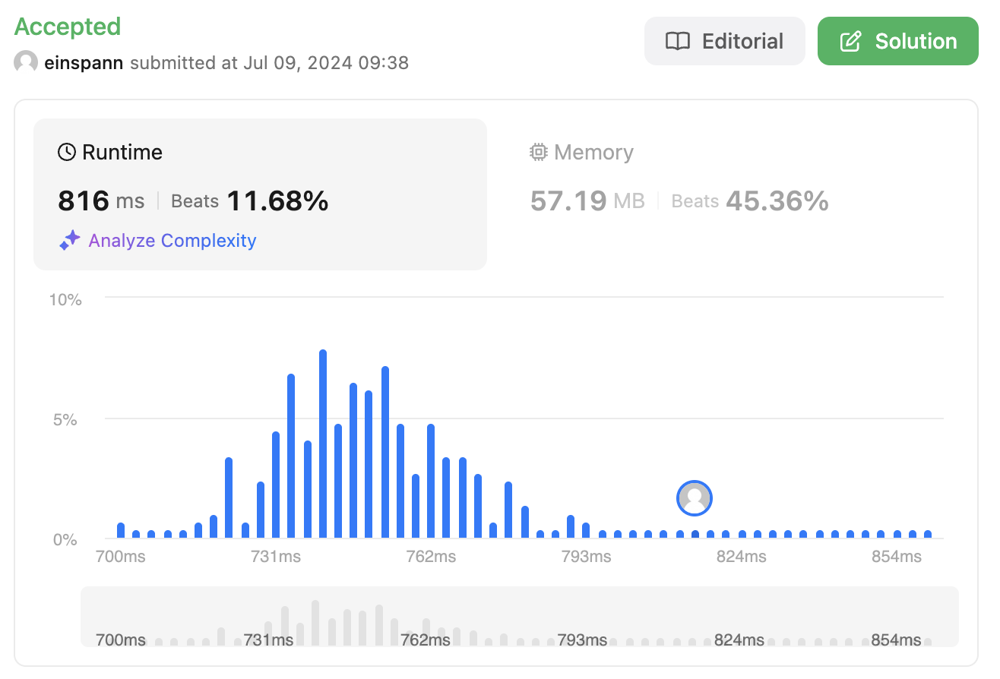
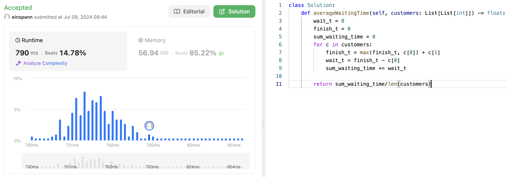
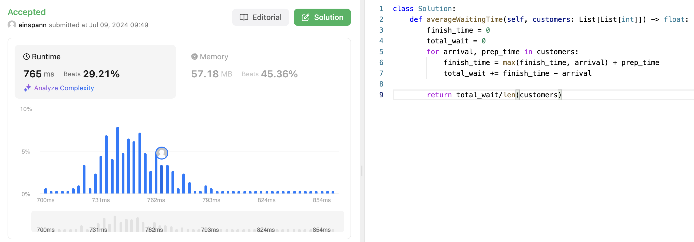
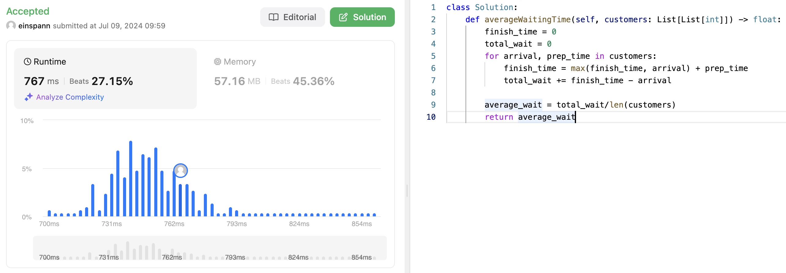

# 문제 설명
주문이 들어온 시간과 요리가 끝나는 시간을 이용해서 평균 대기 시간을 구하는 문제이다.



## 풀이 및 해설

위와 같이 평균 대기 시간을 모두 구한 뒤, 평균을 구하면 된다.

## 풀이
```python
class Solution:
    def averageWaitingTime(self, customers: List[List[int]]) -> float:
        wait_t = 0
        finish_t = 0
        sum_waiting_time = 0
        for c in customers:
            finish_t = max(finish_t, c[0]) + c[1]
            wait_t = max(finish_t - c[0], 0)
            sum_waiting_time += wait_t

        return sum_waiting_time/len(customers)
```

## Complexity Analysis
첫 제출 기준으로는 시간복잡도가 다음과 같이 느려서, 조금 더 최적화 해보기로 했다.


일단, 두번째 `max` 함수를 쓸 이유가 전혀 없고 중복되는 연산이라 없앴더니 조금 빨라졌다.


변수를 조금 다듬고, loop에 한번씩만 쓰이는 wait_t를 없애니 더 빨라졌다.


total_wait에 평균 값을 계산해서 바로 반환하는 것보다 새로운 변수에 할당하여 반환하는 것이 더 빠르다.


### 시간 복잡도
사실 기존 코드랑 새로운 코드 모두 O(n)이라, 크게 차이가 없다.

### 공간 복잡도
새로운 공간을 할당하지 않아 O(1)이다.

## Constraint Analysis
```
Constraints:
1 <= customers.length <= 10^5
1 <= arrival_i, timei <= 10^4
arrival_i <= arrival_i+1
```

# References
- [Leet](https://leetcode.com/problems/average-waiting-time/)