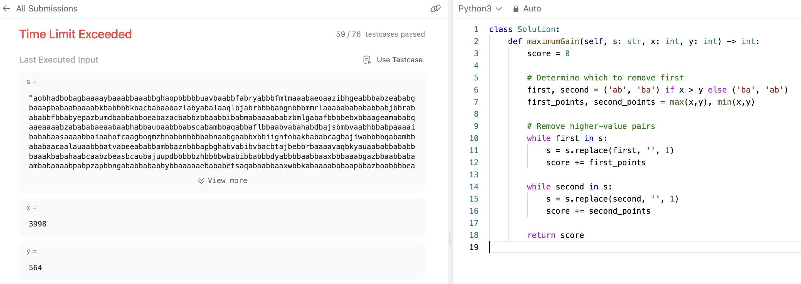

# 문제 설명
하나의 문자열 s에서 'ab' 또는 'ba'를 계속해서 없애는 문제다.


## 풀이 및 해설

### 시도 1

Time Limit Exceeded Error으로 실패했다. 아마 시간복잡도가 너무 느려서 그런거라 더 빠른 방법을 사용해야 풀릴 것 같다.



```python
class Solution:
    def maximumGain(self, s: str, x: int, y: int) -> int:
        score = 0

        # Determine which to remove first
        first, second = ('ab', 'ba') if x > y else ('ba', 'ab')
        first_points, second_points = max(x,y), min(x,y)

        # Remove higher-value pairs
        while first in s:
            s = s.replace(first, '', 1)
            score += first_points

        while second in s:
            s = s.replace(second, '', 1)
            score += second_points

        return score
```
- 시간복잡도: O(n^2)
- 공간복잡도: O(1)

- 어느 문자열을 먼저 제거할지 결정하기 위해 x, y를 비교하여 더 큰 값을 가지는 문자열을 먼저 제거했다.
- first가 s에 존재하는 동안 계속하여 제거하고, second가 s에 존재하는 동안 계속하여 제거했다.

## 풀이

해당 문제를 풀기 위해서는 더 빠른 방법이 필요하기 때문에 스택을 사용했다. 스택을 사용하여 문자열을 순회하면서 'ab' 또는 'ba'를 제거하고, 그에 따른 점수를 계산했다.

```python
class Solution:
    def maximumGain(self, s: str, x: int, y: int) -> int:
        def remove_pairs(s, first, second, points):
            stack = []
            score = 0
            for char in s:
                if stack and stack[-1] == first and char == second:
                    stack.pop()
                    score += points
                else:
                    stack.append(char)
            return ''.join(stack), score

        total_score = 0
        if x >= y:
            s, score = remove_pairs(s, 'a', 'b', x)
            total_score += score
            s, score = remove_pairs(s, 'b', 'a', y)
        else:
            s, score = remove_pairs(s, 'b', 'a', y)
            total_score += score
            s, score = remove_pairs(s, 'a', 'b', x)

        total_score += score
        return total_score
```
- remove_pairs 함수를 만든다.
    - s에 있는 문자들 char에 대하여 순회한다.
    - 이때, stack에 있는 마지막 문자가 first이고, char가 second인 경우, stack에서 pop하고 점수를 추가한다.
    - 이렇게 했을 시, 아무리 가운데 'ab'가 삭제가 되어 후순번의 문자가 앞문자랑 합쳐져도, 항상 'ab'가 존재하는지 확인을 하기 때문에 제대로 된 결과를 얻을 수 있다.
    - 마지막에 stack을 join하여 문자열로 만들어 반환한다.
- x가 y보다 크거나 같은 경우, 'ab'를 먼저 제거하고 'ba'를 제거한다.
- x가 y보다 작은 경우, 'ba'를 먼저 제거하고 'ab'를 제거한다.
- 마지막에 total_score를 반환한다.


### 후기
해당 문제는 처음 읽었을 때, 뭔가 'ab'를 먼저 지웠다가 'ba'를 그 다음에 지우고, 그 다음에 'ab'를 지울 수 있게 되는 경우에 대해서 어떻게 풀 수 있는지 이해가 안되고 직관적으로 아직도 좀 헷갈린다. 두번만 순회해서 풀린다는게 신기하다.

## Complexity Analysis


### 시간 복잡도
- 시간복잡도: O(n) ; 한번씩만 순회하면 되기 때문에 n에 비례한다.
- string.replace보다 스택을 사용하여 문자열을 순회하는 것이 더 빠르다.

### 공간 복잡도
- 공간복잡도: O(n) ; 스택을 사용하여 문자열을 저장하기 때문에 n에 비례한다.

## Constraint Analysis
```
Constraints:
1 <= s.length <= 105
1 <= x, y <= 104
s consists of lowercase English letters.
```

# References
- [1717. Maximum Score From Removing Substrings](https://leetcode.com/problems/maximum-score-from-removing-substrings/)