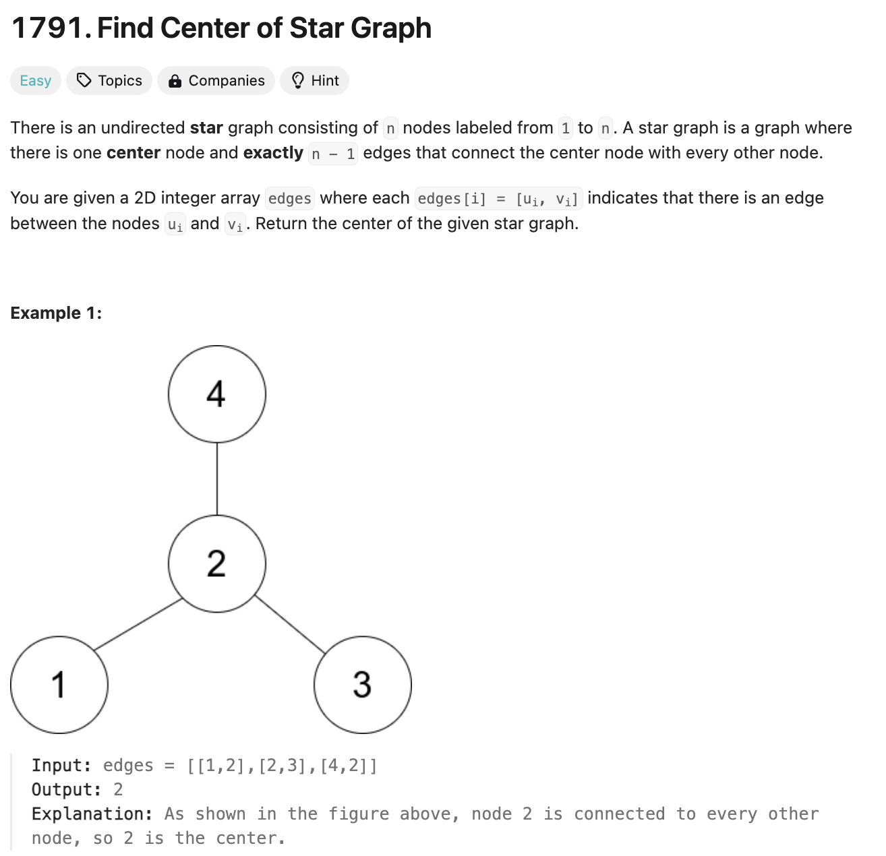
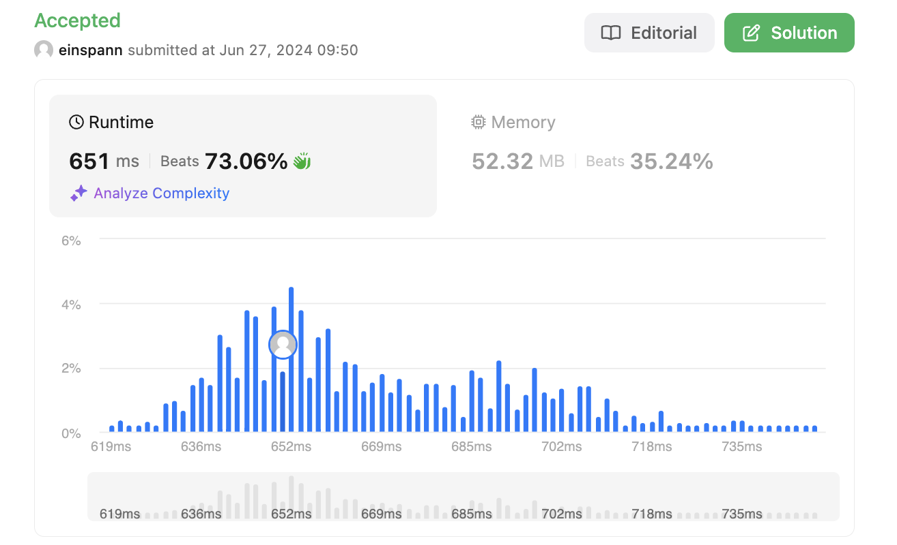

# 문제 설명
이 문제는 Star graph의 중심을 찾는 문제다. Star graph는 한 점을 중심으로 여러 점이 연결된 그래프를 의미한다. 이때, 주어진 그래프에서 중심을 찾아라.

Star graph의 중심은 모든 점들이 연결이 되어 있는 곳을 의미하기 때문에, 모든 점들이 연결이 되어 있는 점을 찾으면 된다.




## 풀이 및 해설
- 모든 노드에 대해서 공유하는 노드가 있다면 그 노드가 중심이다.

구현 아이디어:
- 첫 번째 edge에 대해서 두 노드를 두고, 나머지 edge에 대해서 두 노드 중 하나가 공유되는 노드가 있는지 확인한다.


## 풀이
생각보다 바로 돼서 놀랐다.

```python
class Solution:
    def findCenter(self, edges: List[List[int]]) -> int:
        first = edges[0][0]
        second = edges[0][1]

        # When there is only one edge
        if len(edges) < 2:
            return edges[0][0]
        
        # Search for shared node
        # If neither are shared, there must be no center
        if first in edges[1]:
            shared = first
        elif second in edges[1]:
            shared = second
        else:
            shared = None

        # Check if shared is present everywhere
        for i in range(2, len(edges)):
            if shared in edges[i]:
                continue
            else:
                return None
        
        return shared
```
- 첫 번째 edge에 대해서 두 노드를 둔다.
- 두 번째 edge랑 비교해서 공유되는 노드가 있는지 확인한다.
- 공유되는 노드가 없다면, None을 반환한다.
- 공유되는 노드가 있다면, 모든 edge에 대해서 공유되는 노드가 있는지 확인한다.
- 공유되는 노드가 없다면, None을 반환한다.
- 끝까지 공유되는 노드가 있다면, 공유되는 노드를 반환한다.


## Complexity Analysis


### 시간 복잡도
O(N) ; N은 edge의 개수
- O(1) : 첫 번째 edge에 대해서 두 노드를 둔다.
- O(1) : 두 번째 edge랑 비교해서 공유되는 노드가 있는지 확인한다.
- O(N-3) : 모든 edge에 대해서 공유되는 노드가 있는지 확인한다.

### 공간 복잡도
- O(1) : 상수만 사용한다. first, second, shared 변수.

추가적인 공간을 사용하지 않는다.

## Constraint Analysis
```
Constraints:
3 <= n <= 10^5
edges.length == n - 1
edges[i].length == 2
1 <= ui, vi <= n
ui != vi
The given edges represent a valid star graph.
```
주어진 제약 조건에 대해서는 문제가 없다. 10^5까지의 edge를 처리할 수 있다.

# References
- [LeetCode](https://leetcode.com/problems/find-center-of-star-graph/)