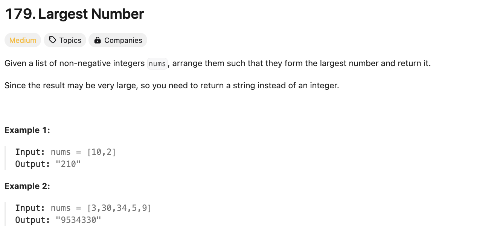
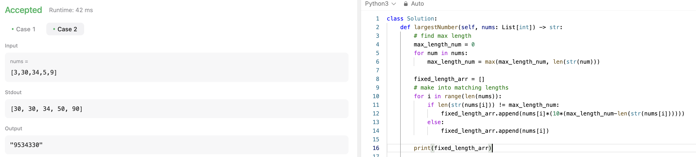
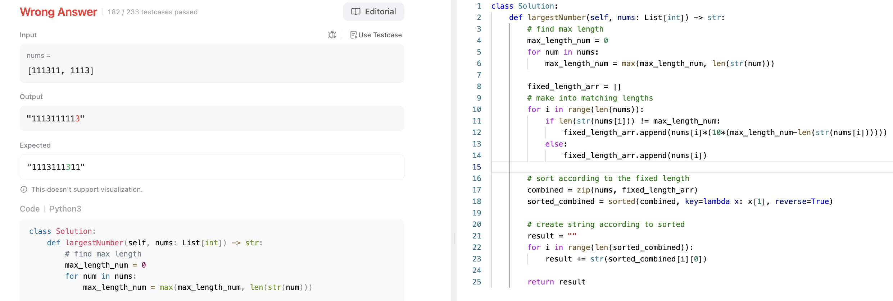

# 문제 설명
배열의 숫자를 조합하여 가장 큰 수를 만드는 문제다.



## 풀이 및 해설
이 문제를 풀려면, 일단 매 자리에 가장 큰 수가 오도록 정렬을 해야 한다. 그러나, 숫자의 자릿수가 다르기 때문에 무작정 큰 수를 앞에 놓는 것이 아니라, 숫자를 조합하여 가장 큰 수를 만들어야 한다.

일단 생각해보고 만든 방법으로는, 가장 긴 숫자의 크기를 알아내고 이를 다 통일하는 방법이다.
예를 들어, 가장 큰 숫자가 34인데 3인 숫자도 있으면, 3을 30으로 바꾸는 것이다.
- 가장 긴 숫자의 길이를 구한다.
- 기본 숫자들의 길이 통일한다.
- 통일된 숫자들을 기준으로 기존 숫자들을 정렬한다.

이렇게 하니 일단 되긴 했는데, 이게 최선인지는 모르겠다.



보니까 중간의 값의 순서가 중요한 경우 틀렸다.



## 풀이
보니까 패딩을 추가해서 비교하는 것이 아니라, 두개씩 비교해서 어떻게 합치는지에 따라서 정렬을 하는 것이다.

```python
def largestNumber(self, nums: List[int]) -> str:
    # convert to strings
    nums = [str(num) for num in nums]

    # compares concatanated nums
    def compare(n1, n2):
        if n1+n2 > n2+n1:
            return -1
        elif n2+n1 > n1+n2:
            return 1
        else:
            return 0
    
    # sort using custom func
    nums.sort(key=functools.cmp_to_key(compare))

    # join sorted
    result = ''.join(nums)

    return '0' if result[0] == '0' else result
```

## Complexity Analysis


### 시간 복잡도
- O(NlogN) ; Quick Sort

### 공간 복잡도
- O(N) ; nums

## Constraint Analysis
```
Constraints:
1 <= nums.length <= 10^0
0 <= nums[i] <= 10^9
```

# References
- [179. Largest Number](https://leetcode.com/problems/largest-number/)