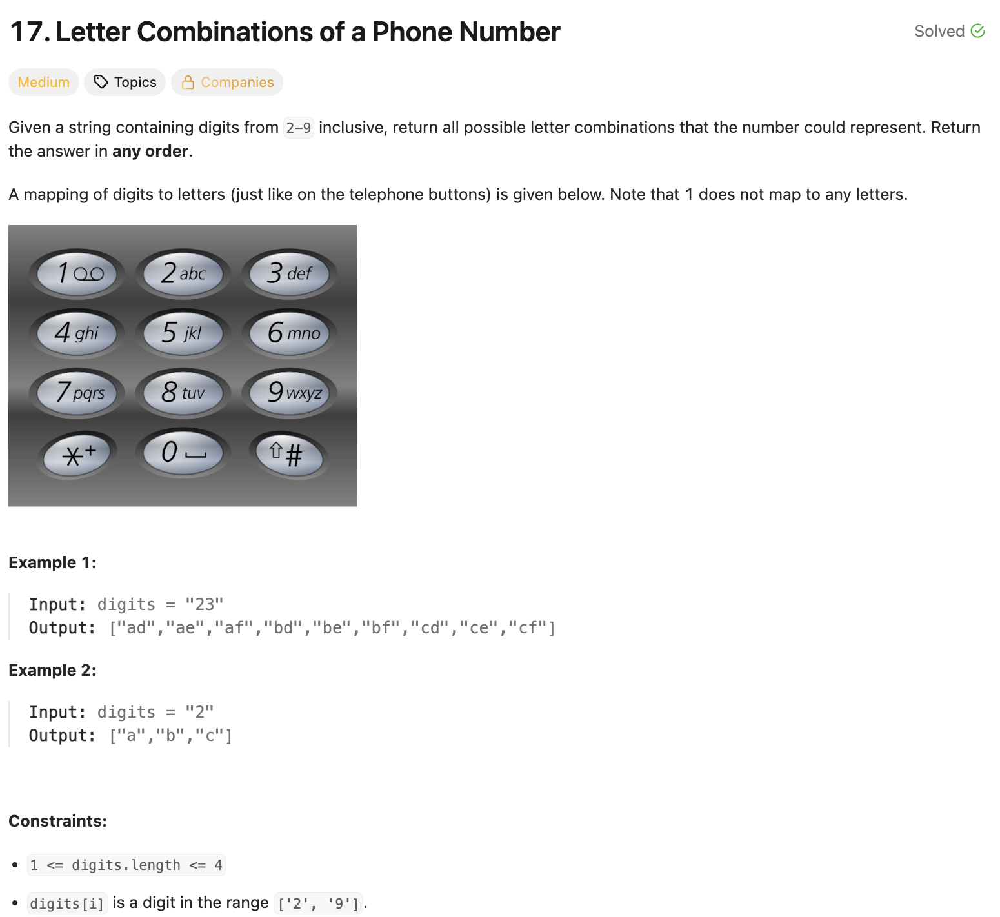

# 문제 설명
숫자 문자열이 주어지면 해당 숫자에 매핑된 모든 가능한 문자 조합을 반환합니다.




## 풀이 및 해설
이 문제는 백트래킹(Backtracking) 기법을 사용하여 해결할 수 있습니다. 각 숫자에 해당하는 문자들을 매핑한 후, 재귀적으로 가능한 모든 조합을 생성합니다.

## 풀이
```python
class Solution:
    def letterCombinations(self, digits: str) -> List[str]:
        if not digits:
            return []
        
        graph = {
            '2' : "abc",
            '3' : "def",
            '4' : "ghi",
            '5' : "jkl",
            '6' : "mno",
            '7' : "pqrs",
            '8' : "tuv",
            '9' : "wxyz",
        }

        res = []

        def backtrack(i,path):
            # basecase: built one letter per digit
            if i == len(digits):
                res.append(path)
                return
            
            # recursive step: expand current digit
            cur_digit = digits[i]
            for ch in graph[cur_digit]:
                backtrack(i+1, path+ch)
        
        backtrack(0,"")
        return res
```
- 먼저, 숫자에 해당하는 문자들을 매핑한 딕셔너리를 생성합니다.
- 백트래킹 함수를 정의하여 재귀적으로 가능한 모든 조합을 생성합니다.
- 기본 사례로, 현재 인덱스가 입력 숫자의 길이와 같아지면 현재 경로를 결과 리스트에 추가합니다.
- 재귀 단계에서는 현재 숫자에 해당하는 문자들을 순회하며, 각 문자를 경로에 추가하고 다음 인덱스로 이동합니다.
- 최종적으로 모든 가능한 조합을 반환합니다.

## Complexity Analysis


### 시간 복잡도
- O(3^N * 4^M); N은 3개의 문자를 매핑하는 숫자의 수, M은 4개의 문자를 매핑하는 숫자의 수입니다. 각 조합을 생성하는 데 걸리는 시간은 조합의 총 수에 비례합니다.

### 공간 복잡도
- O(N); 재귀 호출 스택의 최대 깊이는 입력 숫자의 길이에 비례합니다.

## Constraint Analysis
```
Constraints:
1 <= digits.length <= 4
digits[i] is a digit in the range ['2', '9'].
```


# References
- [17. Letter Combinations of a Phone Number - LeetCode](https://leetcode.com/problems/letter-combinations-of-a-phone-number/)