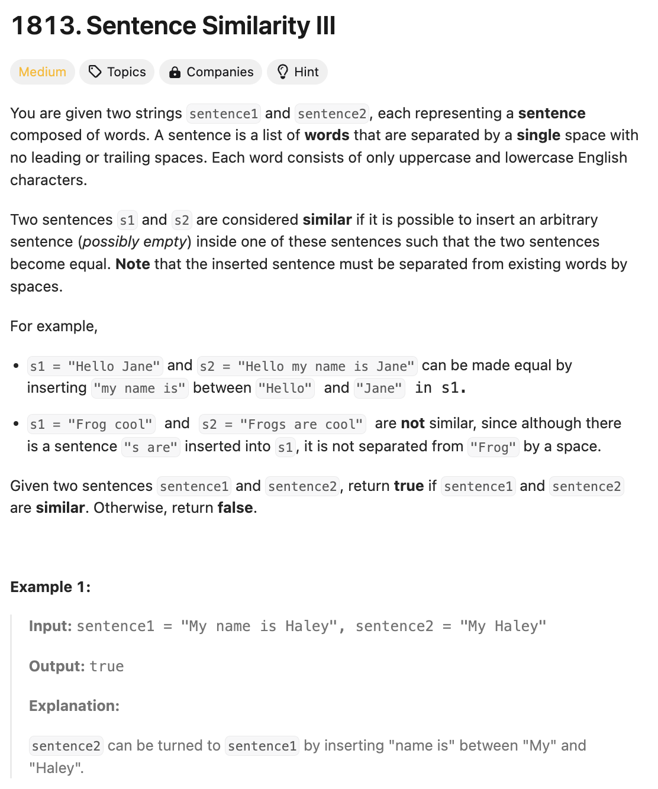

# 문제 설명
이 문제는 두 문장이 주어졌을 때, 하나의 문장 사이에 다른 문장을 삽입하여 두 문장을 같게 만들 수 있는지 판단하는 문제이다.



## 풀이 및 해설

## 풀이
```python
class Solution:
    def areSentencesSimilar(self, sentence1: str, sentence2: str) -> bool:
        words1 = sentence1.split()
        words2 = sentence2.split()

        if len(words1) > len(words2):
            words1, words2 = words2, words1

        i=0
        j=len(words1)-1
        k=0
        l=len(words2)-1

        while i <= j and words1[i] == words2[k]:
            i+=1
            k+=1
        
        while j >= i and words1[j] == words2[l]:
            j-=1
            l-=1
        
        return i > j
```
- 이 풀이의 핵심 아이디어는 두 문장의 앞과 뒤에서부터 비교를 해나가는 것이다.
- 즉, 앞에서 똑같은 단어들만큰 줄이고, 뒤에서도 똑같은 단어들만큼 줄이는 방식으로 문장의 유사성을 판단한다.

## Complexity Analysis


### 시간 복잡도
- O(N) ; N은 두 문장의 단어의 개수

### 공간 복잡도
- O(1)

## Constraint Analysis
```
Constraints:
1 <= sentence1.length, sentence2.length <= 100
sentence1 and sentence2 consist of lowercase and uppercase English letters and spaces.
The words in sentence1 and sentence2 are separated by a single space.
```

# References
- [1813. Sentence Similarity III](https://leetcode.com/problems/sentence-similarity-iii/)