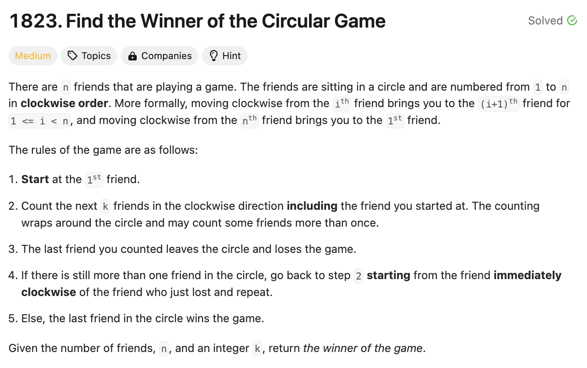
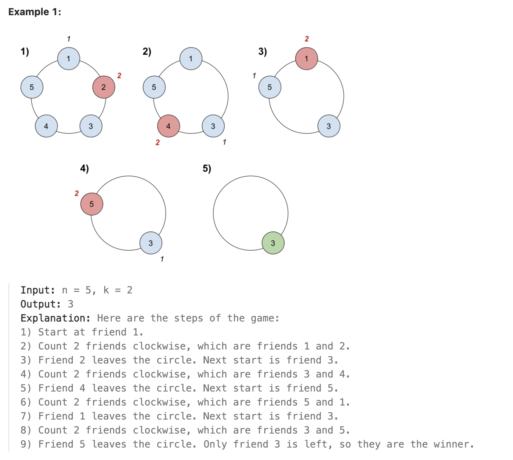
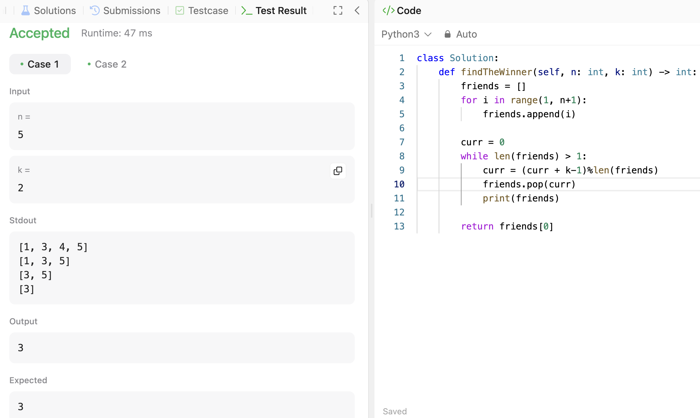

# 문제 설명
동그랗게 모여있는 사람들이 순서대로 숫자 k만큼 건너뛰며 제거되는데, 마지막에 남는 사람을 찾는 문제이다.





## 풀이 및 해설
해당 문제에서는 배열을 사용해서 풀었다. 계속해서 놀이의 사람 수가 1보다 큰 경우에는 k만큼 건너뛰며 제거하는 방식으로 풀었다.



## 풀이
```python
class Solution:
    def findTheWinner(self, n: int, k: int) -> int:
        friends = []
        for i in range(1, n+1):
            friends.append(i)
        
        curr = 0
        while len(friends) > 1: 
            curr = (curr + k-1)%len(friends)
            friends.pop(curr)
            print(friends)
        
        return friends[0]
```
- `friends` 배열에 1부터 n까지의 숫자를 넣어준다.
- `curr` 변수를 0으로 초기화하고, `friends` 배열의 길이가 1보다 큰 경우에는 계속해서 반복한다.
    - `curr`에 `(curr + k-1)%len(friends)`로 계산한 값을 넣어준다. 나머지 연산을 하는 이유는 k배열보다 큰 경우에 대비한 것이다.
    - `friends` 배열에서 `curr`번째 인덱스를 제거한다.
- `friends` 배열의 0번째 인덱스를 반환한다.

## Complexity Analysis


### 시간 복잡도
- `friends` 배열에 1부터 n까지의 숫자를 넣어주는데 O(n)이 걸린다.
- `while`문에서 `friends` 배열의 길이가 1보다 큰 경우에는 계속해서 반복하므로 최대 O(n)이 걸린다.

따라서 총 시간 복잡도는 O(n)이다.

### 공간 복잡도
- friends 배열에 n개의 숫자를 넣어주므로 O(n)이다.

## Constraint Analysis
```
Constraints:
1 <= k <= n <= 500
```

# References
- [1823. Find the Winner of the Circular Game](https://leetcode.com/problems/find-the-winner-of-the-circular-game/)