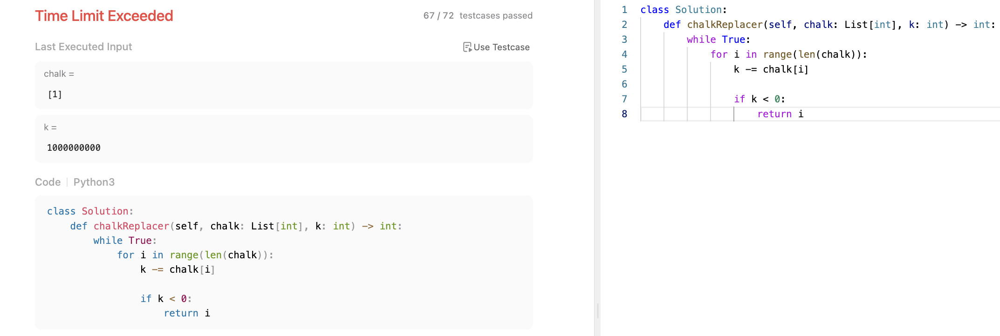
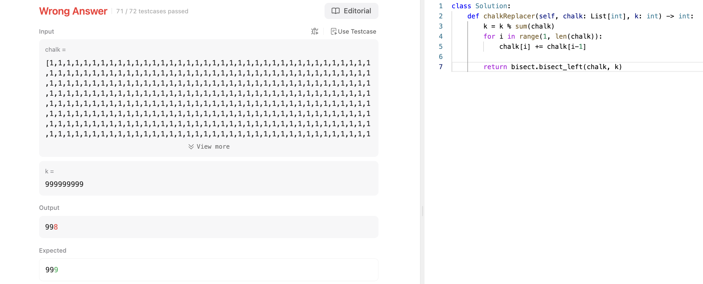
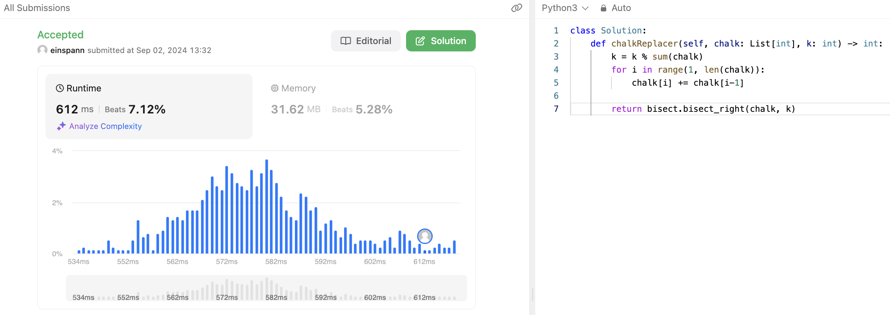

# 문제 설명
학생들이 문제를 푸는데 필요한 분필의 양이 배열에 주어지고, 갖고 있는 분필이 제공되었을 때, 몇 번째 학생이 분필을 다시 구매해야 하는지 찾는 문제다.


## 풀이 및 해설
일단 보자마자 브루트포스로는 아마 시간 초과가 날 것 같았고 적중했다.



따라서, 이진 탐색을 이용해서 풀어봤는데 한가지 테케를 제외하고는 모두 통과했다.



bisect_left가 아니라 bisect_right로 하니 통과를 하긴 했지만, 성능이 매우 안 좋다.



## 풀이
오히려 처음에 생각했던 브루트포스가 더 빠르다.

```python
def chalkReplacer(self, chalk: List[int], k: int) -> int:
        k = k % sum(chalk)
        for i, chalk_needed in enumerate(chalk):
            if k < chalk_needed:
                return i
            k -= chalk_needed
        
        return -1
```
- `k`를 `sum(chalk)`으로 나눈 나머지를 구한다.
- `enumerate`를 이용해서 `chalk`의 인덱스와 값을 가져온다.
- `k`가 `chalk_needed`보다 작으면 해당 인덱스를 반환한다.
- 그렇지 않으면 `k`에서 `chalk_needed`를 빼준다.
- 모든 학생이 분필을 다 사용했는데도 `k`가 남아있으면 `-1`을 반환한다.

## Complexity Analysis


### 시간 복잡도
`chalk`의 길이만큼 반복하므로 `O(n)`이다.

### 공간 복잡도
`O(1)`이다.

## Constraint Analysis
```
Constraints:
chalk.length == n
1 <= n <= 10^5
1 <= chalk[i] <= 10^5
1 <= k <= 10^9
```

# References
- [1894. Find the Student that Will Replace the Chalk](https://leetcode.com/problems/find-the-student-that-will-replace-the-chalk/)