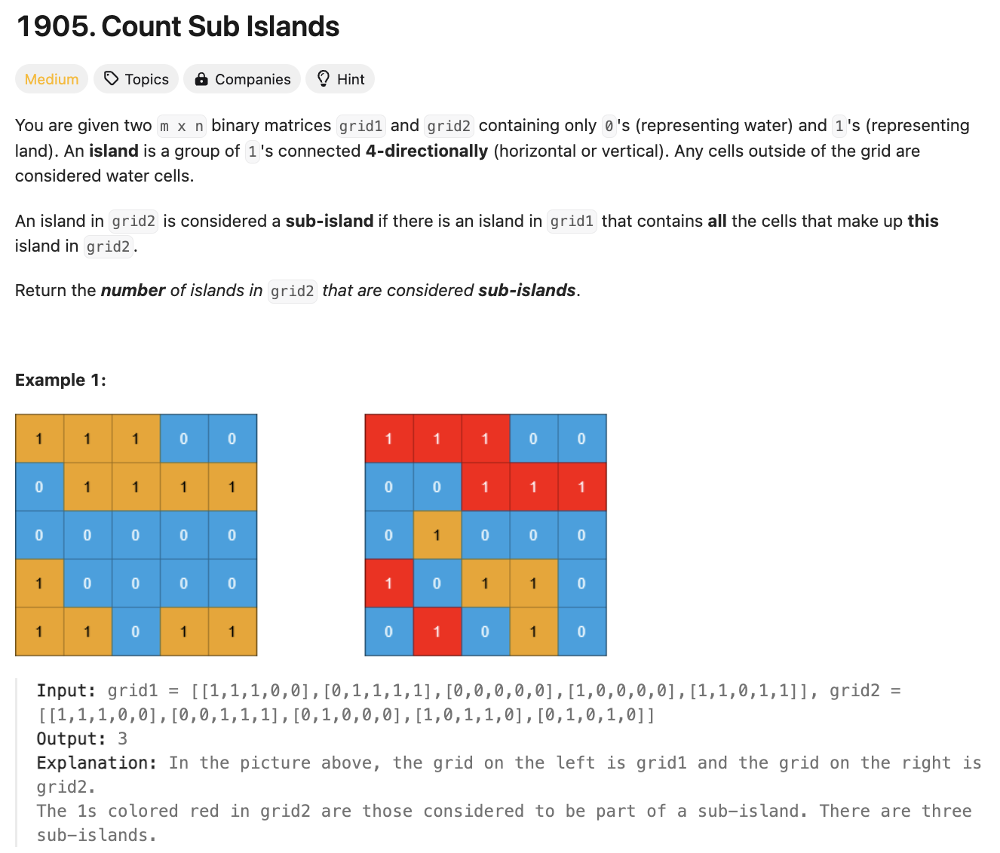

# 문제 설명
grid가 두개 주어졌을 때, 두번째 grid가 첫번째 grid의 subisland인 경우를 찾아 개수를 세는 문제이다.



## 풀이 및 해설

## 풀이
```python
def countSubIslands(self, grid1: List[List[int]], grid2: List[List[int]]) -> int:
        m,n = len(grid1), len(grid1[0])

        def dfs(i,j):
            stack = [(i,j)]
            is_subisland = True

            while stack:
                i,j = stack.pop()
                if grid2[i][j] == 0:
                    continue
                grid2[i][j] = 0  # mark as visited

                if grid1[i][j] == 0:
                    is_subisland = False
            
                # check 4 directions
                for di,dj in [(1,0), (-1,0), (0,1), (0,-1)]:
                    ni,nj = i+di, j+dj
                    if 0<=ni<m and 0<=nj<n and grid2[ni][nj] == 1: 
                        stack.append((ni, nj))
            
            return is_subisland
        
        count = 0
        for i in range(m):
            for j in range(n):
                if grid2[i][j] == 1 and dfs(i,j):
                    count += 1
        
        return count
```

## Complexity Analysis


### 시간 복잡도
- O(m*n) ; m은 grid의 row, n은 grid의 column

### 공간 복잡도
- O(m*n) ; m은 grid의 row, n은 grid의 column

## Constraint Analysis
```
Constraints:
m == grid1.length == grid2.length
n == grid1[i].length == grid2[i].length
1 <= m, n <= 500
grid1[i][j] and grid2[i][j] are either 0 or 1.
```

# References
- [1905. Count Sub Islands](https://leetcode.com/problems/count-sub-islands/)