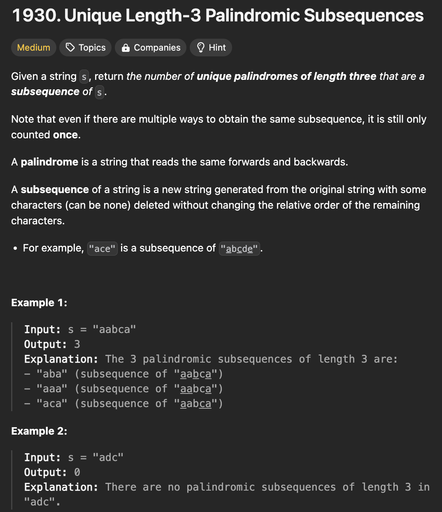

# 문제 설명
이 문제는 주어진 문자열에서 길이가 3인 Palindromic Subsequences의 개수를 구하는 문제다. 2025년 첫 문제다. 



## 풀이 및 해설
- 투 포인터와 딕셔너리를 이용해서 풀 수 있는 문제다.

## 풀이
```python
class Solution:
    def countPalindromicSubsequence(self, s: str) -> int:
        first = {}
        last = {}

        for i, char in enumerate(s):
            if char not in first:
                first[char] = i
            last[char] = i
        
        result = 0

        for char in set(s):
            if first[char] < last[char]:
                unique = len(set(s[first[char] + 1:last[char]]))
                result += unique
        
        return result
```

## Complexity Analysis


### 시간 복잡도
- O(N)

### 공간 복잡도
- O(1)

## Constraint Analysis
```
Constraints:
- 3 <= s.length <= 10^5
- s consists of only lowercase English letters.
```

# References
- [1930. Unique Length-3 Palindromic Subsequences](https://leetcode.com/problems/unique-length-3-palindromic-subsequences/)