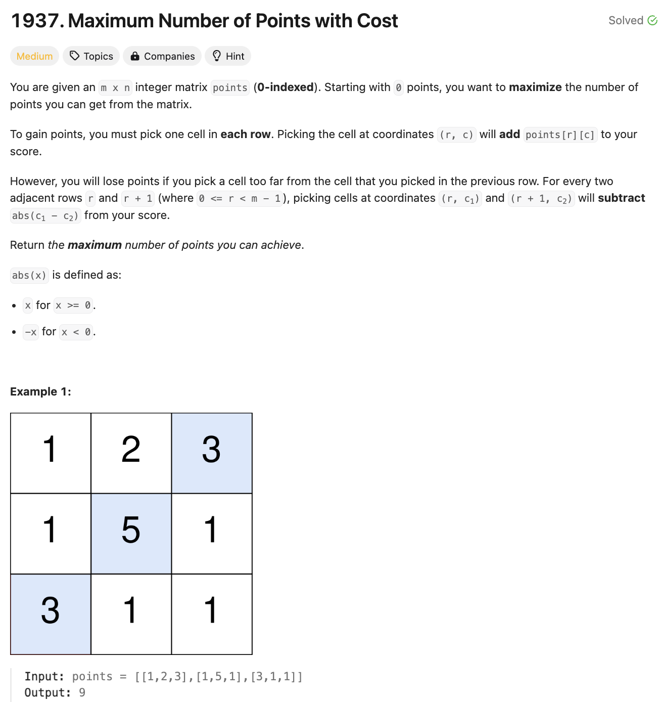
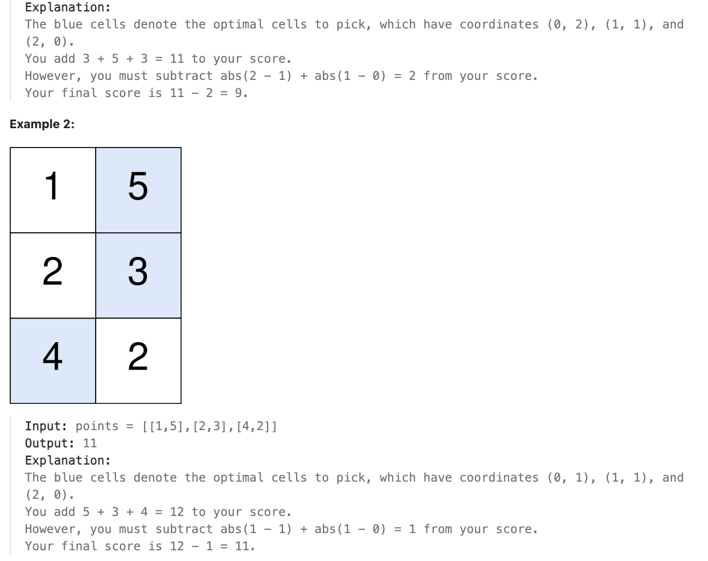

# 문제 설명
2차원 배열 `points`가 주어진다. `points[i][j]`는 `i`번째 행의 `j`번째 열의 점수를 나타낸다. 당신은 아래와 같은 규칙을 따라서 점수를 얻을 수 있다.

 


## 풀이 및 해설

## 풀이
```python
def maxPoints(self, points: List[List[int]]) -> int:
        m, n = len(points), len(points[0])
        dp = points[0]

        for i in range(1,m):
            new_dp = [0]*n
            left_max = [0]*n
            right_max = [0]*n

            left_max[0] = dp[0]
            for j in range(1,n):
                left_max[j] = max(left_max[j-1]-1, dp[j])
            
            right_max[n-1] = dp[n-1]
            for j in range(n-2, -1, -1):
                right_max[j] = max(right_max[j+1]-1, dp[j])
            
            for j in range(n):
                new_dp[j] = points[i][j] + max(left_max[j], right_max[j])
            
            dp = new_dp
        
        return max(dp)
```
- `dp`는 현재 행까지의 최대 점수를 저장하는 배열이다.
- `new_dp`는 다음 행까지의 최대 점수를 저장하는 배열이다.
- `left_max`는 현재 행까지의 왼쪽에서의 최대 점수를 저장하는 배열이다.
- `right_max`는 현재 행까지의 오른쪽에서의 최대 점수를 저장하는 배열이다.
- `left_max`와 `right_max`를 각각 구한 후, `new_dp`에 `points[i][j]`와 `left_max[j]`, `right_max[j]` 중 큰 값을 더해준다.
- `dp`를 `new_dp`로 업데이트하고, 마지막 행까지 반복한 후, `dp`의 최대값을 반환한다.

## Complexity Analysis


### 시간 복잡도
- O(mn); m은 행의 개수, n은 열의 개수
- 각 행마다 열을 순회하므로 O(mn)의 시간 복잡도를 가진다.

### 공간 복잡도
- O(n); n은 열의 개수
- `dp`, `new_dp`, `left_max`, `right_max` 배열의 크기가 n이므로 O(n)의 공간 복잡도를 가진다.

## Constraint Analysis
```
Constraints:
m == points.length
n == points[r].length
1 <= m, n <= 10^5
1 <= m * n <= 10^5
0 <= points[r][c] <= 10^5
```

# References
- [1937. Maximum Number of Points with Cost](https://leetcode.com/problems/maximum-number-of-points-with-cost/)