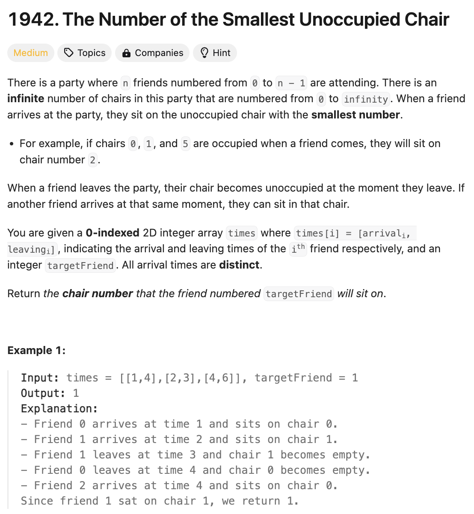

# 문제 설명
해당 문제는 친구들이 도착하는 시간과 떠나는 시간이 주어졌을 때, 특정 친구가 도착하는 시간에 가장 빠른 빈 의자를 찾는 문제이다.



## 풀이 및 해설
이 문제를 해결하기 위해서는 minheapq와 priority queue를 사용하여 해결할 수 있다.

## 풀이
```python
import heapq
from typing import List

class Solution:
    def smallestChair(self, times: List[List[int]], targetFriend: int) -> int:
        n = len(times)

        # add index to each time entry and sort by arrival time
        times_with_index = sorted((time + [i] for i, time in enumerate(times)))

        available_chairs = list(range(n)) # minheap of available chairs
        occupied_chairs = [] # priority queue of [leaving_time, chair]

        for arrival, leaving, friend_index in times_with_index:
            # free up chairs for friends who have left
            while occupied_chairs and occupied_chairs[0][0] <= arrival:
                _, chair = heapq.heappop(occupied_chairs)
                heapq.heappush(available_chairs, chair)

            # if this is the target friend, return the smallest available chair
            if friend_index == targetFriend:
                return available_chairs[0]
            
            # assign the smallest available chair to the current friend
            chair = heapq.heappop(available_chairs)
            heapq.heappush(occupied_chairs, [leaving, chair])

        return -1
```
- times_with_index는 times에 인덱스를 추가하여 arrival time으로 정렬한다.
- available_chairs는 빈 의자의 minheap이다.
- occupied_chairs는 [leaving_time, chair]의 priority queue이다.
- times_with_index를 순회하면서 occupied_chairs에 빈 의자를 할당하고, targetFriend가 도착하는 시간에 가장 빠른 빈 의자를 반환한다.
- targetFriend가 도착하는 시간에 가장 빠른 빈 의자를 반환한다.
- heapq.heappop(occupied_chairs)를 통해 빈 의자를 할당하고, heapq.heappush(occupied_chairs, [leaving, chair])를 통해 빈 의자를 반환한다.
- targetFriend가 도착하는 시간에 가장 빠른 빈 의자를 반환한다.
- available_chairs[0]을 반환한다.
- 위 풀이를 통해 문제 해답이 나오지 않는다면 -1을 반환한다.

## Complexity Analysis


### 시간 복잡도
- 시간 복잡도는 O(NlogN)이다.

### 공간 복잡도
- 공간 복잡도는 O(N)이다.

## Constraint Analysis
```
Constraints:
n == times.length
2 <= n <= 10^4
times[i].length == 2
1 <= arrivali < leavingi <= 10^5
0 <= targetFriend <= n - 1
Each arrivali time is distinct.

```

# References
- [1942. The Number of the Smallest Unoccupied Chair](https://leetcode.com/problems/the-number-of-the-smallest-unoccupied-chair/)