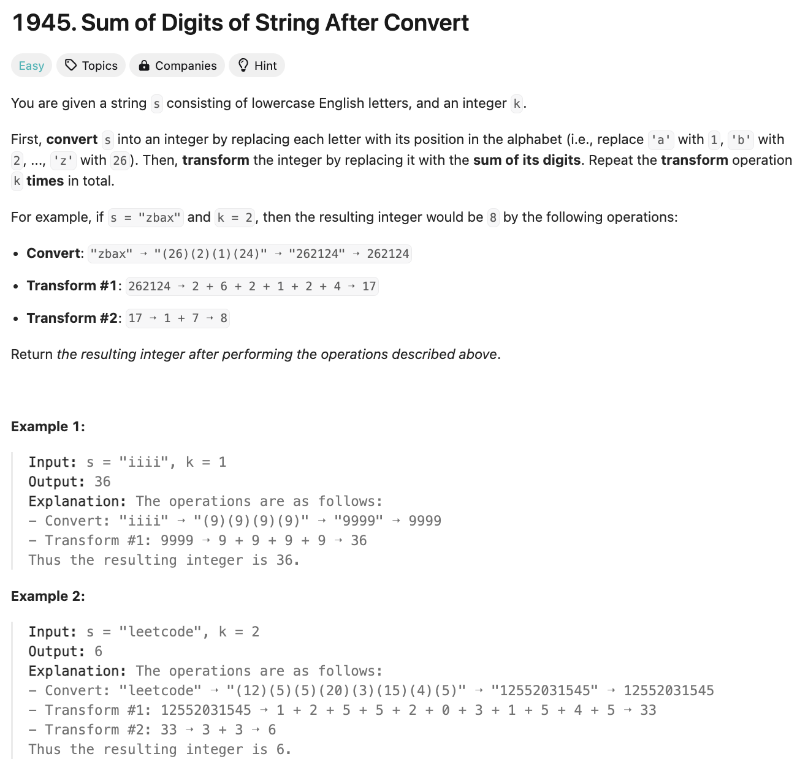
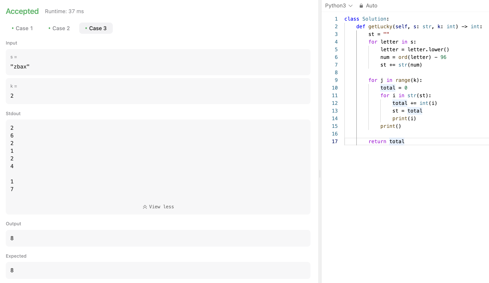

# 문제 설명
이 문제는 하나의 문자열을 받아서 각 문자를 숫자로 변환한 후, 그 숫자들의 합을 구하는 문제다. 이때, k만큼 반복해서 합을 구하는 문제다.



## 풀이 및 해설



## 풀이
```python
def getLucky(self, s: str, k: int) -> int:
    st = ""
    for letter in s:
        letter = letter.lower()
        num = ord(letter) - 96
        st += str(num)
    
    for j in range(k):
        total = 0
        for i in str(st):
            total += int(i)
            st = total
    
    return total
```

## Complexity Analysis


### 시간 복잡도
- O(kn) ; k는 k, n은 s의 길이다.

### 공간 복잡도
- O(n) ; n은 s의 길이다.

## Constraint Analysis
```
Constraints:
1 <= s.length <= 100
1 <= k <= 10
s consists of lowercase English letters.
```

# References
- [1945. Sum of Digits of String After Convert](https://leetcode.com/problems/sum-of-digits-of-string-after-convert/)