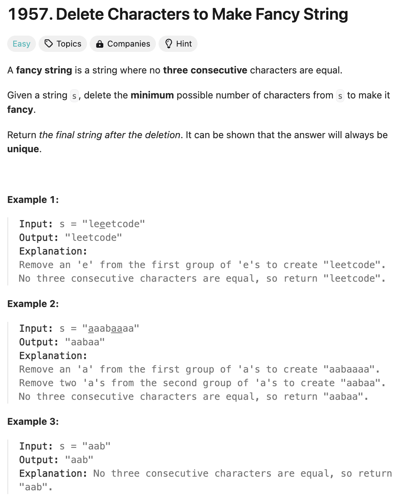

# 문제 설명
이 문제는 3개 연속 같은 문자가 나오지 않게 바꿔주는 문제이다.



## 풀이 및 해설
이 문제는 일단 3보다 길이가 짧으면 그대로 반환하면 된다. 

만약에 더 큰 경우에는 다음과 같다.
- 3개 연속 같은 문자가 나오면 그 문자를 제외하고 다음 문자로 넘어간다.
- 3개 연속 같은 문자가 나오지 않으면 첫번째 문자를 결과에 추가한다.
- 마지막 2개 문자는 무조건 추가한다.
- 결과를 반환한다.

## 풀이
```python
class Solution:
    def makeFancyString(self, s: str) -> str:
        if len(s) < 3:
            return s
        
        result = ""
        for i in range(len(s)-2):
            if s[i] == s[i+1] == s[i+2]:
                continue
            else:
                result += s[i]
        result += s[-2]
        result += s[-1]
        return result
```

## Complexity Analysis


### 시간 복잡도
- O(N)

### 공간 복잡도
- O(1)

## Constraint Analysis
```
Constraints:
1 <= s.length <= 10^5
s consists only of lowercase English letters.
```

# References
- [1957. Delete Characters to Make Fancy String](https://leetcode.com/problems/delete-characters-to-make-fancy-string/)