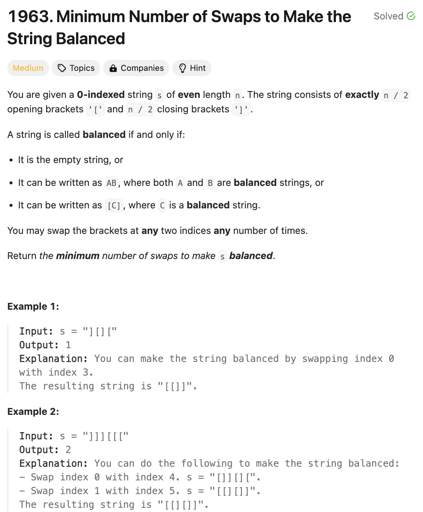

# 문제 설명
문자열 s가 주어졌을 때, 문자열 s를 균형잡힌 문자열로 만들기 위해 필요한 최소한의 스왑 횟수를 반환하라.



## 풀이 및 해설
해당 문제는 하나씩 스택에 넣어가면서 짝이 맞는지 확인하면 된다. 만약 짝이 맞지 않는다면 스왑이 필요하고, 이를 나타내기 위해 mismatches 변수를 하나 두고 짝이 맞지 않을 때마다 1씩 증가시킨다. 최종적으로, mismatches를 2로 나눈 몫을 반환하면 된다.

## 풀이
```python
def minSwaps(self, s: str) -> int:
    stack = []
    mismatches = 0

    for bracket in s:
        if bracket == '[':
            stack.append(bracket)
        else:
            if stack:
                stack.pop()
            else:
                mismatches += 1
        
    return (mismatches + 1) // 2
```

## Complexity Analysis


### 시간 복잡도
- O(N): 문자열 s를 순회하면서 스택에 넣고 빼는 과정을 반복한다.

### 공간 복잡도
- O(1): 추가적인 공간이 필요하지 않다.

## Constraint Analysis
```
Constraints:
n == s.length
2 <= n <= 10^6
n is even.
s[i] is either '[' or ']'.
The number of opening brackets '[' equals n / 2, and the number of closing brackets ']' equals n / 2.
```

# References
- [1963. Minimum Number of Swaps to Make the String Balanced](https://leetcode.com/problems/minimum-number-of-swaps-to-make-the-string-balanced/)