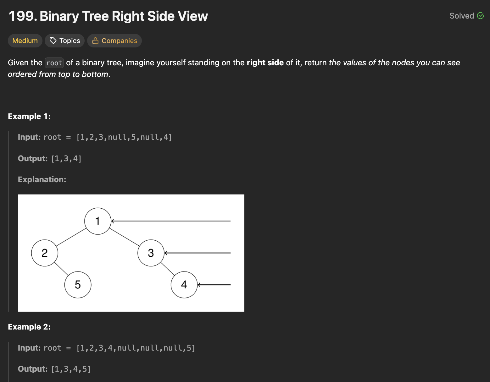
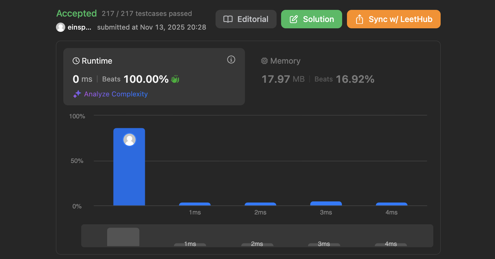

## 문제 설명
이진 트리의 오른쪽에서 보이는 노드들을 반환하는 문제다.



## 풀이 및 해설
이 문제는 보자마자 BFS로 풀 수 있는 것을 알 수 있다. 각 층마다 계산하고 맨 오른쪽에 있는 노드에 대해서만 배열에 저장하면 된다. BFS를 구현하려면 우리가 잘 알듯이 큐(Queue)를 사용하면 된다.

```python
# Definition for a binary tree node.
# class TreeNode:
#     def __init__(self, val=0, left=None, right=None):
#         self.val = val
#         self.left = left
#         self.right = right
class Solution:
    def rightSideView(self, root: Optional[TreeNode]) -> List[int]:
        if not root:
            return []
        
        queue = deque([root])
        res = []

        while queue:
            level_size = len(queue)

            for i in range(level_size):
                node = queue.popleft()
                
                if i == level_size-1:
                    res.append(node.val)

                if node.left:
                    queue.append(node.left)
                if node.right:
                    queue.append(node.right)
                
        
        return res
```


### 시간복잡도
`O(N)` ; N은 트리의 노드 개수

### 공간복잡도
`O(N)` ; 큐에 저장되는 노드의 최대 개수는 트리의 최대 너비에 비례



## Constraint Analysis
```
Constraints:  
The number of nodes in the tree is in the range [0, 100].
-100 <= Node.val <= 100
```

# References
- [Leetcode 199. Binary Tree Right Side View](https://leetcode.com/problems/binary-tree-right-side-view/)

