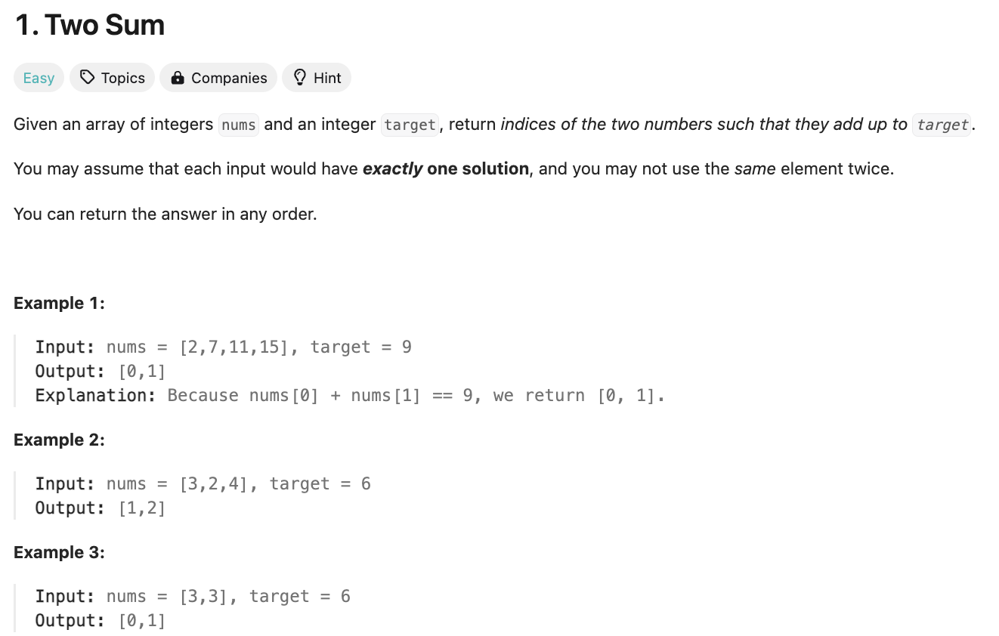
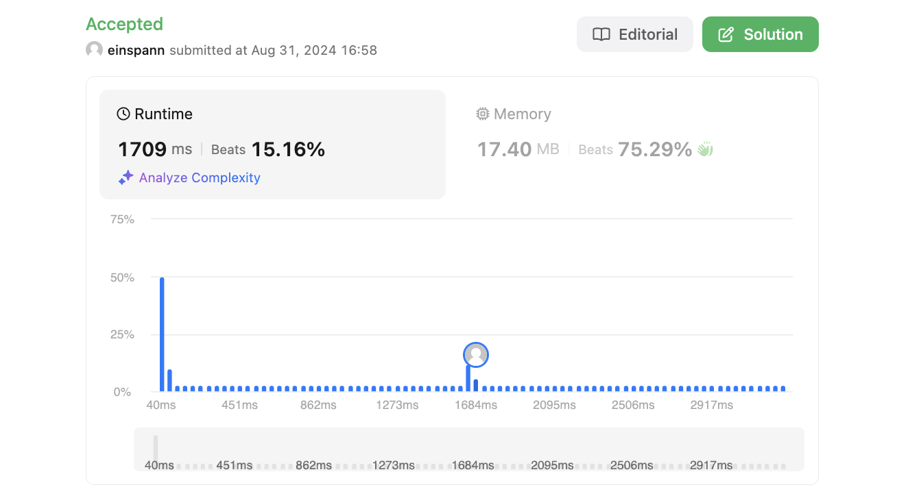
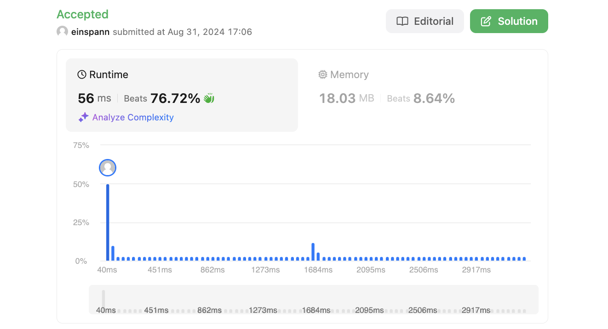
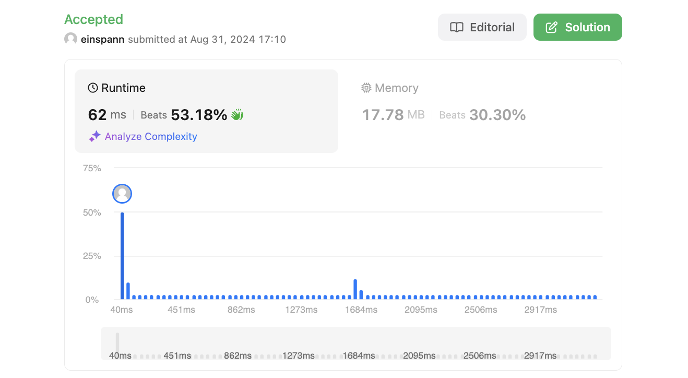

# 문제 설명
정수 배열 nums와 정수 target이 주어졌을 때, 배열에서 두 수를 더하여 target이 되는 두 수의 index를 찾는 문제다.



## 풀이 및 해설
이 문제 같은 경우에는 여러 풀이 방법들이 존재할것 같다. 딱 보면 일단 모든 숫자들을 비교해가면서 찾는 방법도 있을것 같고, 다른 방법으로는 정렬을 해서 투포인터로 찾는 방법도 있을것 같다. 또는 해시맵을 이용해서 풀 수도 있을것 같다.

일단 하나씩 해보려 한다.

## 풀이 방법 1. 브루트 포스
```python
def twoSum(self, nums: List[int], target: int) -> List[int]:
    for i in range(len(nums)):
        for j in range(i+1, len(nums)):
            if nums[i] + nums[j] == target:
                return [i,j]
```

for loop을 두번 돌면서 모든 경우의 수를 비교해가면서 찾는 방법이다.
이렇게 했을 경우에는 시간 복잡도가 O(n^2)이 된다.



## 풀이 방법 2. 투포인터
```python
def twoSum(self, nums: List[int], target: int) -> List[int]:
    nums = [(v, i) for i, v in enumerate(nums)]
    nums.sort()
    left, right = 0, len(nums) - 1
    while not left == right:
        if nums[left][0] + nums[right][0] < target:
            left += 1
        elif nums[left][0] + nums[right][0] > target:
            right -= 1
        else:
            return [nums[left][1], nums[right][1]]
```
투 포인터를 사용할 경우에는 정렬을 먼저 해주고, 양 끝에서 시작해서 target보다 작으면 left를 증가시키고, 크면 right를 감소시키는 방법으로 찾아가면 된다.
이때 시간 복잡도는 O(nlogn)이 된다.



## 풀이 방법 3. 해시맵
```python
def twoSum(self, nums: List[int], target: int) -> List[int]:
    nums_map = {}
    for i, num in enumerate(nums):
        if target - num in nums_map:
            return [nums_map[target - num], i]
        nums_map[num] = i
```
해시맵을 사용할 경우에는 target - num이 해시맵에 존재하는지 확인하고, 존재하면 그 index와 현재 index를 반환하면 된다.
이렇게 했을 경우에는 시간 복잡도가 O(n)이 된다. 

시간 복잡도는 더 낮지만, 실제로는 더 오래 걸리는 이유로는 다음 가설이 있다.  
1. 해시맵에 넣고 생성하는데 오버헤드가 더 크다.
2. 데이터 크기가 작아서 투포인터가 더 빠르다.



## Constraint Analysis
```
Constraints:
2 <= nums.length <= 10^4
-10^9 <= nums[i] <= 10^9
-10^9 <= target <= 10^9
Only one valid answer exists.
```

### 추가 주석
특이하다. 며칠 전에 출제됐던 문제가 오늘 2024-08-31 다시 출제됐다 (1514). 이 문제는 2024-08-27에 출제됐다. 그래서 다시 들어가서 확인해보니까, 2024-08-27일에는 1번 문제가 출제됐다고 한다. 아마 리트코드 오류 같다.

# References
- [1. Two Sum](https://leetcode.com/problems/two-sum/)