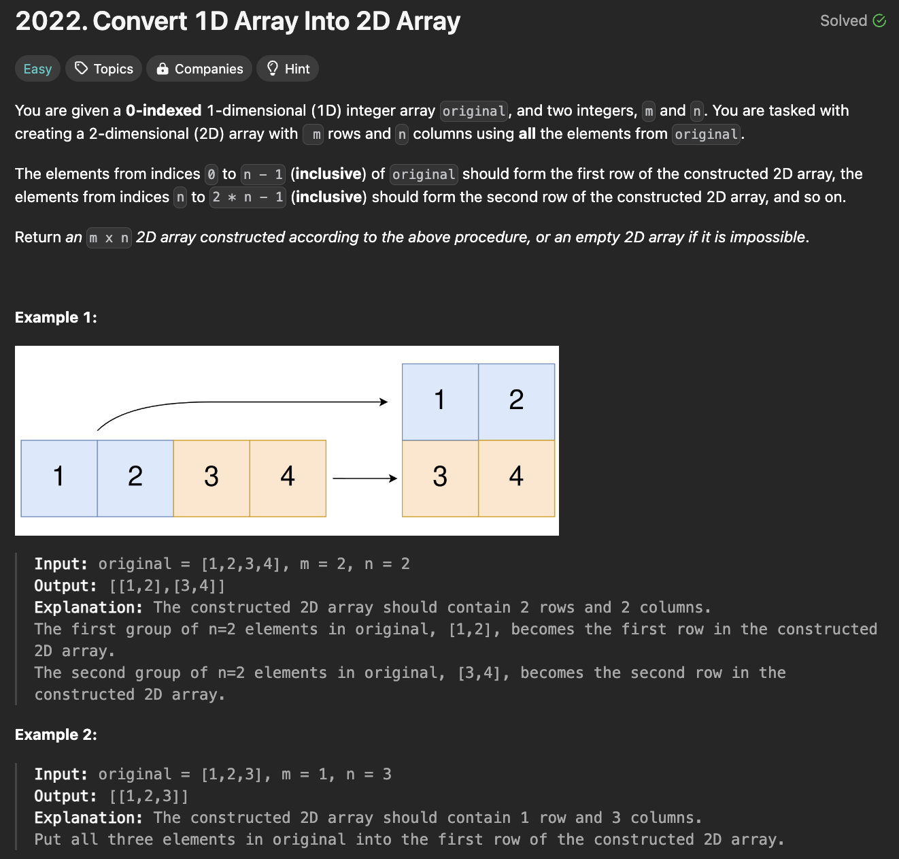
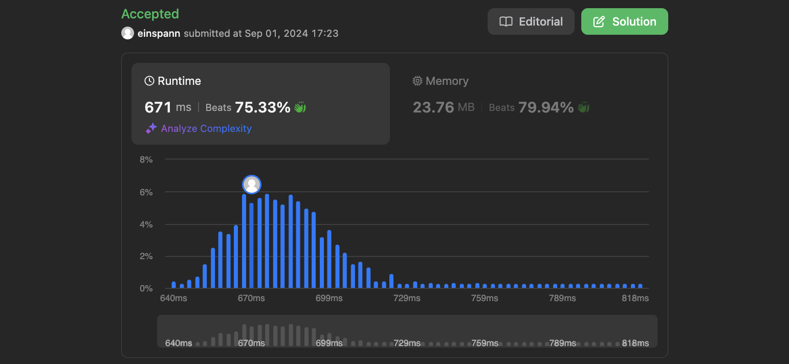

# 문제 설명
하나의 긴 배열을 m x n 크기의 2D 배열로 변환하는 문제다.



## 풀이 및 해설

## 풀이
```python
def construct2DArray(self, original: List[int], m: int, n: int) -> List[List[int]]:
    if len(original) != m*n:
        return []
    
    return [original[i*n:(i+1)*n] for i in range(m)]
```
- original의 길이가 m x n과 같지 않으면 빈 배열을 반환한다.
- m개의 원소를 가진 리스트를 n개씩 묶어서 2D 배열로 만들어 반환한다.

## Complexity Analysis


### 시간 복잡도
- O(m*n) ; m x n 크기의 2D 배열을 만들기 위해 m x n번 반복한다.

### 공간 복잡도
- O(m*n) ; m x n 크기의 2D 배열을 만들기 위해 m x n개의 공간을 사용한다.

## Constraint Analysis
```
Constraints:
1 <= original.length <= 5 * 10^4
1 <= original[i] <= 10^5
1 <= m, n <= 4 * 10^4
```

# References
- [2022. Convert 1D Array Into 2D Array](https://leetcode.com/problems/convert-1d-array-into-2d-array/)