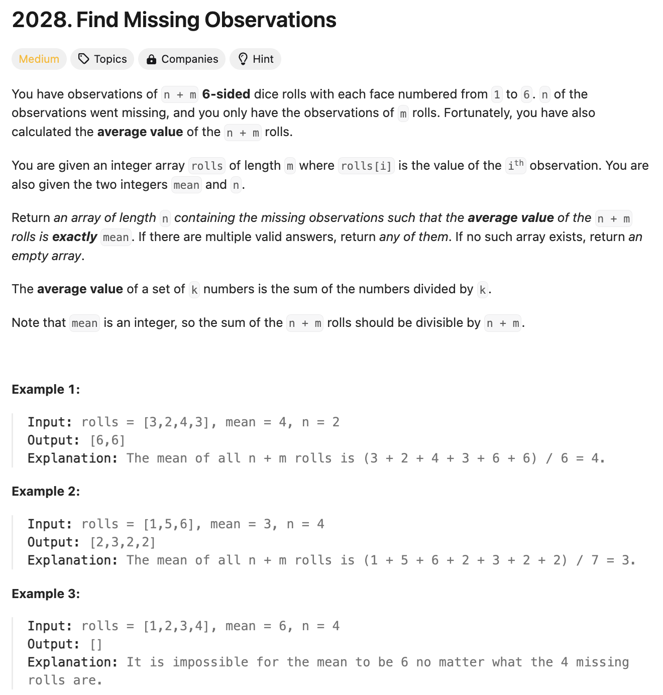
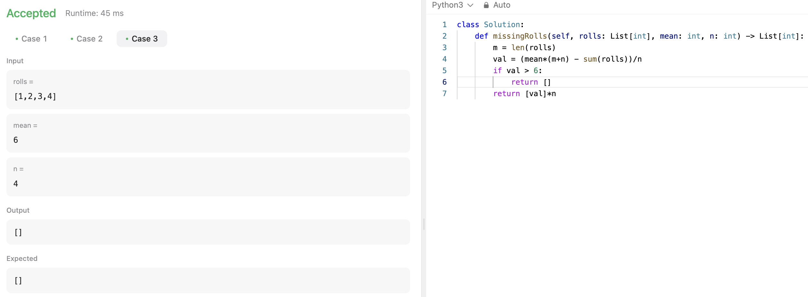
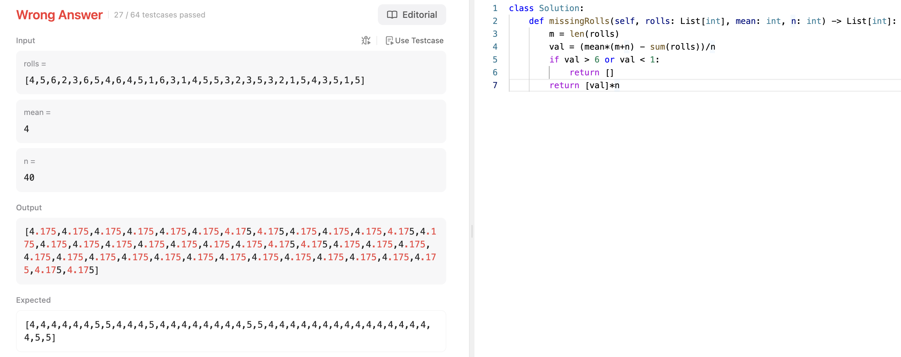
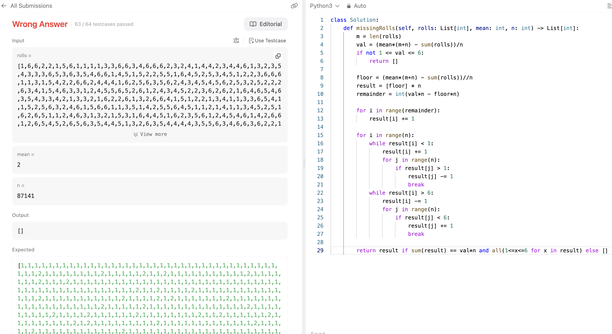

# 문제 설명
1에서 6사이의 숫자가 나온 주사위 값들과 평균값이 주어졌을 때, 누락된 값들을 찾는 문제이다.



## 풀이 및 해설
처음에 풀었을 때 이렇게 했는데 문제가 생길 수 있다. 이렇게 할 경우, val 값이 1-6 값이 아니라 소수점이 나올 수 있기 때문이다.




역시나 소수점이 나오면서 틀렸다. 딕셔너리를 사용해서 풀어야 하는걸까?

이 처리를 해주기 위해서 일단 n크기의 배열을 n들의 floor으로 초기화 시키고, 나머지만큼 1을 더해주는 방식으로 처리해줬다. 그러나, 이때 딱 하나의 테케를 통과하지 못했다. 이유는 무엇일까?



## 풀이
```python
def missingRolls(self, rolls: List[int], mean: int, n: int) -> List[int]:
    m = len(rolls)
    total_sum = mean*(n+m)
    missing_sum = total_sum - sum(rolls)

    if not n<=missing_sum<=6*n:
        return []
    
    base_value, remainder = divmod(missing_sum, n)

    result = [base_value] * n 
    for i in range(remainder):
        result[i] += 1
    
    return result
```

## Complexity Analysis


예전 방식은 불필요하게 복잡하게 했었는데, 이 방식에서는 전체적인 합을 먼저 구하고 균등하게 분배한 뒤, 나머지를 배분한다.

### 시간 복잡도
- O(n) ; n은 missing_sum

### 공간 복잡도
- O(n)

## Constraint Analysis
```
Constraints:
m == rolls.length
1 <= n, m <= 10^5
1 <= rolls[i], mean <= 6
```

# References
- [2028. Find Missing Observations](https://leetcode.com/problems/find-missing-observations/)