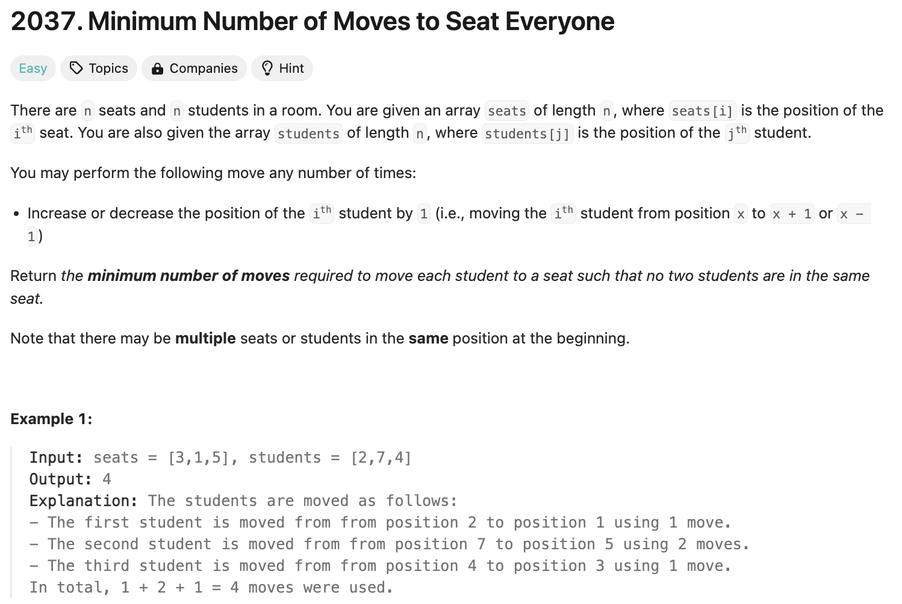
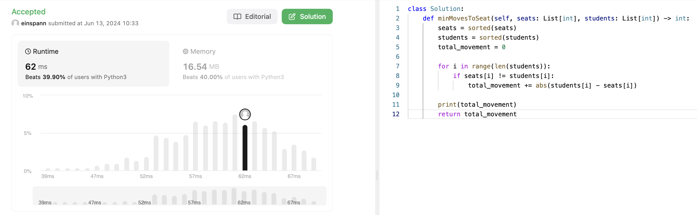

## 문제 설명
설명이 조금 헷갈리는 문제다.   

핵심만 말하자면, 의자 자리 배열이 주어지고, 사람의 초기 위치 배열이 주어진다.

사람이 앉을 때, 겹쳐서 앉으면 불편하기 때문에, 사람들이 모두 서로 다른 의자에 앉기 위해 필요한 최소 이동 횟수를 구하는 문제다.

즉, 의자 배열이 [3,1,5]가  주어지면 1번 3번 5번 자리에 의자가 있다는 뜻이다. 또한, 사람의 초기 위치 배열이 [2,7,4]가 주어지면, 2번 7번 4번 자리에 사람이 있다는 뜻이다.

그렇다면, 최소 거리를 찾으려면 아마 가장 가까운 의자들에 앉혀야 할 것이다. 그러나, 그리디하게 가장 가까운 위치 앉히다가, 갑자기 마지막 사람이 가장 먼 위치에 앉아야 하는 경우가 생길 수 있다. 이런 경우를 대비해서 정렬을 한번 거쳐야 할수도 있다.  



## 풀이 및 해설
엄청 러프하게 풀어봤을때는, 두 배열 모두 정렬을 한 후, 각 위치의 차이를 구하고, 그 차이의 합을 구해봤다. 사실 이 풀이에는 단점이 많지만, 두 배열의 길이가 같다는 조건이 있기 때문에 가능한 풀이다.




```python
class Solution:
    def minMovesToSeat(self, seats: List[int], students: List[int]) -> int:
        seats = sorted(seats)
        students = sorted(students)
        total_movement = 0

        for i in range(len(students)):
            if seats[i] != students[i]:
                total_movement += abs(students[i] - seats[i])
        
        return total_movement
```


### 시간복잡도
`O(nlogn)` ; 정렬을 사용했기 때문에

### 공간복잡도
`O(1)` ; 추가적인 공간을 사용하지 않았기 때문에

## Constraint Analysis
```
Constraints:

n == seats.length == students.length
1 <= n <= 100
1 <= seats[i], students[j] <= 100
```

# References
- [LeetCode](https://leetcode.com/problems/minimum-number-of-moves-to-seat-everyone)

