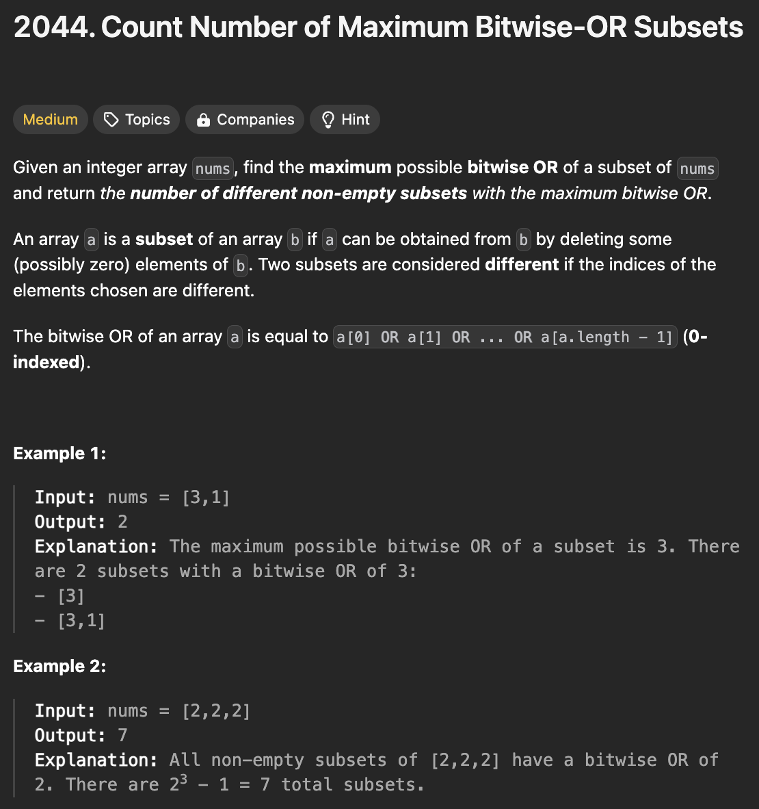
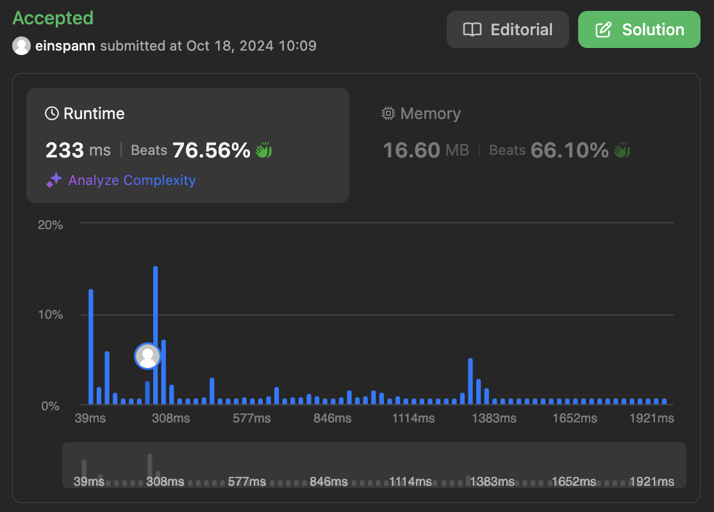

# 문제 설명
최대 비트 OR 부분 집합을 포함하는 부분 집합의 수를 반환합니다.



## 풀이 및 해설
이 문제 풀이의 핵심 아이디어는 각 숫자를 포함하거나 포함하지 않는 경우를 모두 탐색하는 백트래킹 알고리즘을 사용하는 것이다. 이때, 최대 비트 OR 부분 집합을 찾아야 하므로, 각 경우의 비트 OR 값을 계산하여 최대값을 갱신하고, 최대값과 같은 경우의 수를 세어야 한다.

## 풀이
```python
class Solution:
    def countMaxOrSubsets(self, nums: List[int]) -> int:
        max_or = 0
        count = 0

        def backtrack(index: int, current_or: int):
            nonlocal max_or, count

            if index == len(nums):
                if current_or > max_or:
                    max_or = current_or
                    count = 1
                elif current_or == max_or:
                    count += 1
                return

            # include the current number
            backtrack(index+1, current_or | nums[index])

            # exclude the current number
            backtrack(index+1, current_or)
        
        backtrack(0,0)
        return count
```
- `backtrack` 함수를 정의하고, `index`와 `current_or`를 인자로 받는다.
- `index`가 `nums`의 길이와 같아지면, `current_or`를 `max_or`와 비교하여 최대값을 갱신하고, `count`를 증가시킨다.
- `index`가 `nums`의 길이와 같아지지 않았다면, 현재 숫자를 포함하거나 포함하지 않는 경우를 각각 재귀적으로 호출한다.
- `backtrack` 함수를 호출하고, `count`를 반환한다.

## Complexity Analysis


### 시간 복잡도
- 시간 복잡도는 `O(2^N)`이다.

### 공간 복잡도
- 공간 복잡도는 `O(N)`이다.

## Constraint Analysis
```
Constraints:
1 <= nums.length <= 16
1 <= nums[i] <= 10^5
```

# References
- [2044. Count Number of Maximum Bitwise-OR Subsets](https://leetcode.com/problems/count-number-of-maximum-bitwise-or-subsets/)