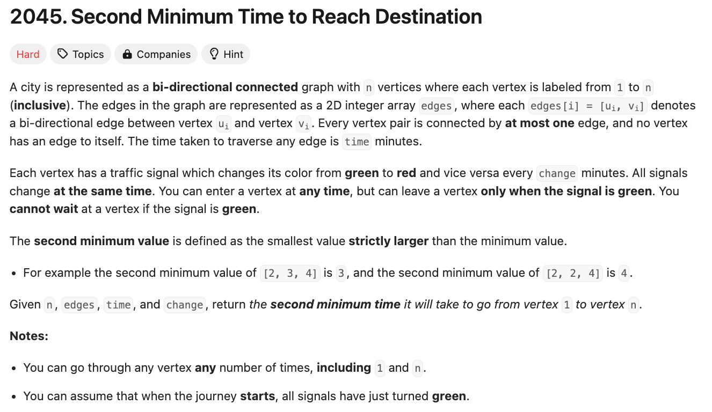
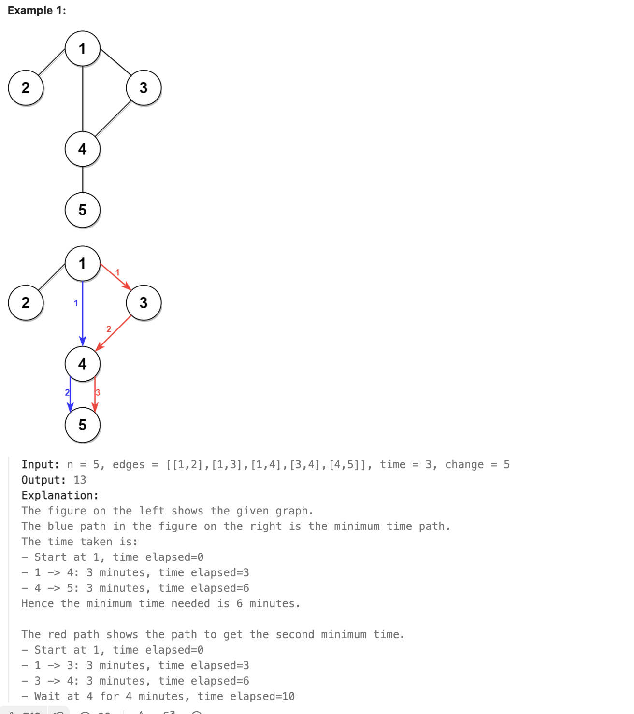
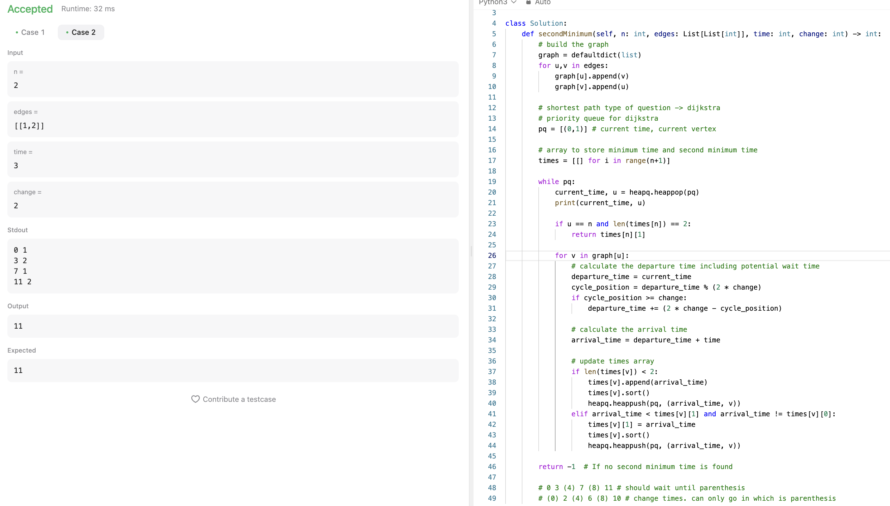
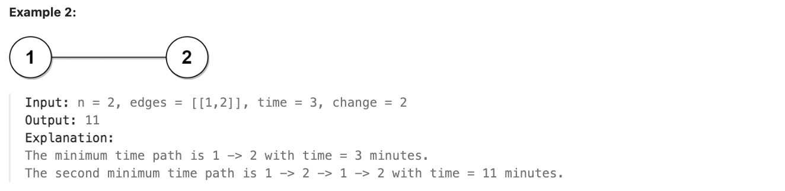
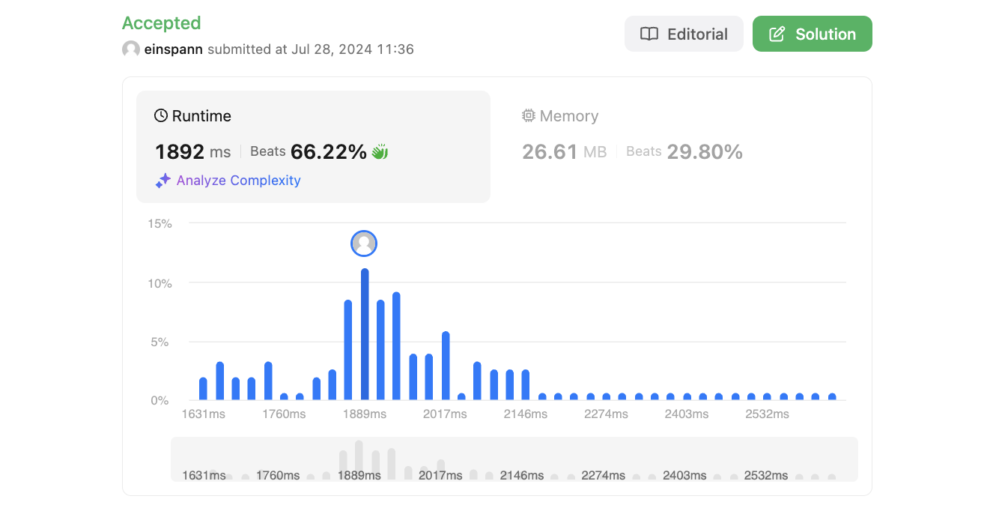

# 문제 설명
여러 길이 주어졌을 때, 목적지에 도착하는 데 걸리는 시간 중 두 번째로 짧은 시간을 찾는 문제다.




## 풀이 및 해설
다익스트라 알고리즘을 사용해 풀 수 있다. current_time과 current_vertex를 priority queue에 넣어서 계산한다.

**Attempt 1**




    # should wait until parenthesis
    0 3 (4) 7 (8) 11   
    # change times. can only go in which is parenthesis
    (0) 2 (4) 6 (8) 10 

## 풀이
```python
import heapq
from collections import defaultdict, deque

class Solution:
    def secondMinimum(self, n: int, edges: List[List[int]], time: int, change: int) -> int:
        # build the graph
        graph = defaultdict(list)
        for u,v in edges:
            graph[u].append(v)
            graph[v].append(u)

        # shortest path type of question -> dijkstra
        # priority queue for dijkstra
        pq = [(0, 1)]  # (time_taken, node)

        # arrays to store minimum time and second minimum time
        dist1 = [float('inf')] * (n + 1)
        dist2 = [float('inf')] * (n + 1)
        freq = [0] * (n + 1)

        dist1[1] = 0
        
        while pq:
            time_taken, node = heapq.heappop(pq)
            
            freq[node] += 1
            
            # if the node is being visited for the second time and is 'n', return the answer
            if freq[node] == 2 and node == n:
                return time_taken
            
            # if the current light is red, wait until the path turns green
            if (time_taken // change) % 2 == 1:
                time_taken = change * (time_taken // change + 1)
            
            time_taken += time
            
            for neighbor in graph[node]:
                # ignore nodes that have already popped out twice
                if freq[neighbor] == 2:
                    continue
                
                # update dist1 if it's more than the current time_taken
                if dist1[neighbor] > time_taken:
                    dist2[neighbor] = dist1[neighbor]
                    dist1[neighbor] = time_taken
                    heapq.heappush(pq, (time_taken, neighbor))
                elif dist2[neighbor] > time_taken and dist1[neighbor] != time_taken:
                    dist2[neighbor] = time_taken
                    heapq.heappush(pq, (time_taken, neighbor))
        
        return -1  # if no second minimum time is found
```
- 그래프를 만들기 위해 defaultdict를 사용한다.
- 모든 엣징을 순회하며 그래프를 만든다.
- 다익스트라 알고리즘을 사용하기 위해 우선순위 큐를 사용한다. 이때, 현재 시간과 현재 정점을 넣는다.
- 최소 시간과 두 번째 최소 시간을 저장할 시간 배열을 만든다.
- 방문한 노드의 빈도를 저장할 배열을 만든다.
- 우선순위 큐를 초기화한다.
- 우선순위 큐가 비어있지 않을 때까지 반복한다.
- 시간과 노드를 꺼낸다.
- 노드를 방문한 횟수를 증가시킨다.
- 노드가 두 번째 방문이고, 목적지인 경우 시간을 반환한다.
- 현재 노드가 빨간 불인 경우, 초록 불이 될 때까지 기다린다.
- 시간을 증가시킨다.
- 이웃 노드를 순회하며 다음을 수행한다.
    - 이미 두 번 방문한 노드인 경우 무시한다.
    - 현재 시간보다 더 큰 경우 dist1을 업데이트한다.
    - dist1이 현재 시간보다 큰 경우 dist2를 업데이트한다.
    - 우선순위 큐에 넣는다.
- 두 번째 최소 시간을 찾지 못한 경우 -1을 반환한다.


## Complexity Analysis


### 시간 복잡도
- 그래프를 만들기 위해 O(E)이 필요하다. E는 엣지의 개수다.
- 다익스트라 알고리즘을 사용하고, 두번째로 짧은 시간을 구해야 하기 때문에 최악의 경우 O(2VlogV)이 필요하다. V는 정점의 개수다.
- 따라서 총 시간 복잡도는 O(E + VlogV)이다.


### 공간 복잡도
- 그래프를 만들기 위해 O(E)가 필요하다.
- dist1, dist2, freq 배열을 만들기 위해 O(V)가 필요하다.
- 따라서 총 공간 복잡도는 O(E + V)이다.

## Constraint Analysis
```
Constraints:
2 <= n <= 10^4
n - 1 <= edges.length <= min(2 * 10^4, n * (n - 1) / 2)
edges[i].length == 2
1 <= ui, vi <= n
ui != vi
There are no duplicate edges.
Each vertex can be reached directly or indirectly from every other vertex.
1 <= time, change <= 10^3
```

## Discussion
**Approximate Difficulty Level**: Gold II to Platinum V

**Factors:**

- Complexity of the modified Dijkstra's algorithm.
- Handling of periodic traffic signals.
- Management of multiple paths and ensuring correct second minimum time.

# References
- [2045. Second Minimum Time to Reach Destination](https://leetcode.com/problems/second-minimum-time-to-reach-destination/)
- [Dijkstra's Algorithm](https://en.wikipedia.org/wiki/Dijkstra%27s_algorithm)