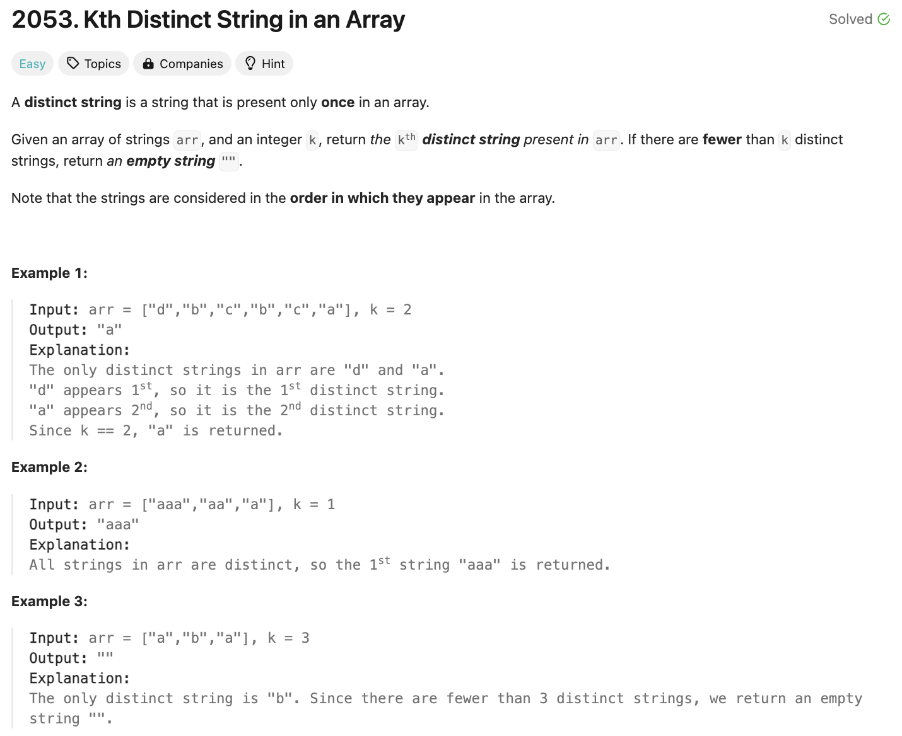

# 문제 설명
문자열 배열이 주어지면, k번째로 유일한 문자열을 찾아라.



## 풀이 및 해설

## 풀이
```python
def kthDistinct(self, arr: List[str], k: int) -> str:
        # count frequencies of strings
        dic = defaultdict(int)

        for st in arr:
            dic[st] += 1
        
        # if count is 1, append to unique
        count = 0
        for i, st in enumerate(dic):
            if dic[st] == 1:
                count += 1
                if count == k:
                    return st
        
        # return "" if less than k
        return ""
```
- defaultdict를 사용하여 문자열의 빈도수를 계산한다.
- 빈도수가 1인 문자열을 찾아 k번째 문자열을 반환한다.
- k번째 문자열이 없으면 빈 문자열을 반환한다.

## Complexity Analysis


### 시간 복잡도
- O(N) : 문자열 배열을 순회하며 각 문자열의 빈도수를 계산한다.

### 공간 복잡도
- O(N) : 문자열 배열의 길이만큼의 공간이 필요하다.

## Constraint Analysis
```
Constraints:
1 <= k <= arr.length <= 1000
1 <= arr[i].length <= 5
arr[i] consists of lowercase English letters.
```

# 개선 방안
다른 제출자들의 풀이보다 다소 느려서 개선해보기로 했으며, 다음과 같은 방법을 생각해냈다.
- 배열을 한번만 순회한다.
- defaultdict가 아닌 일반 dictionary를 사용한다.
- 순서를 유지하며 단어들을 저장한다.


## defaultdict는 dict보다 빠를까?
- defaultdict는 dict를 상속받아 기본값을 설정할 수 있는 기능을 제공한다.
- dict는 기본값을 설정할 수 없으므로, key가 없을 때 예외가 발생한다.
- defaultdict는 key가 없을 때 기본값을 반환한다.
- defaultdict는 dict를 상속받아 구현되어 있으므로, dict보다 느릴 수 있다.
- 다만, defaultdict의 이런 예외처리 기능으로 인해 코드가 간결해지며, 가독성이 높아지며, 대용량 데이터를 다룰 때 더 빠를 수 있다.
- 이유는 key가 없을 때 예외가 발생하는 것보다 기본값을 반환하는 것이 더 빠르기 때문이다.

# References
- [2053. Kth Distinct String in an Array](https://leetcode.com/problems/kth-distinct-string-in-an-array/)