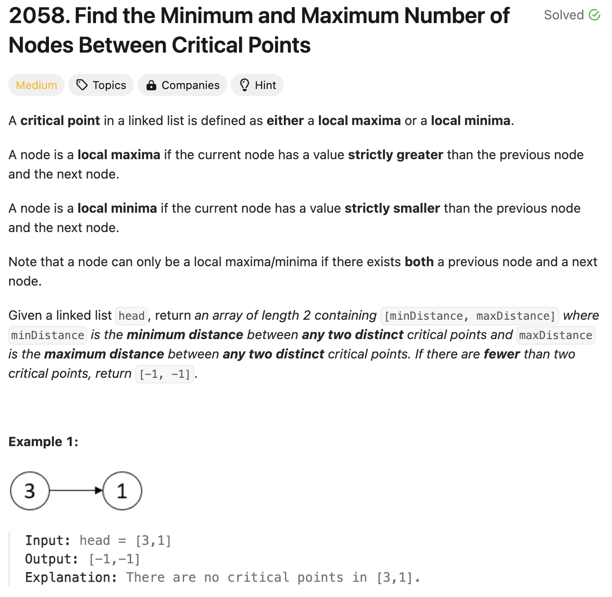
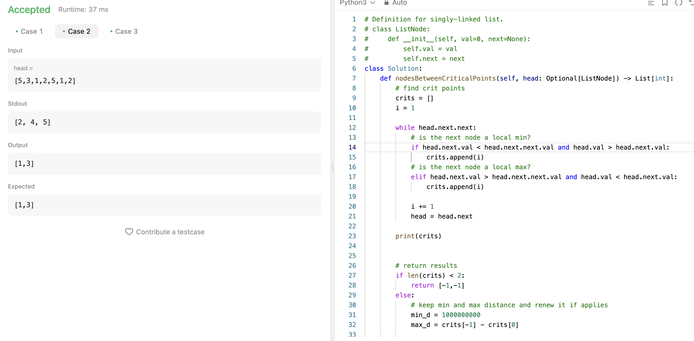

# 문제 설명
로컬 최소값과 로컬 최대값 사이의 최대 거리와 최소 거리를 찾는 문제이다.



## 풀이 및 해설


- 이 문제를 풀기 위해서는 주어진 Linked List에서 로컬 최소값과 로컬 최대값을 찾아야 한다.
    - 해당 값들을 찾아서 인덱스를 저장한다.
- 이후, 찾은 인덱스를 이용하여 최대 거리와 최소 거리를 찾는다.
    - 최대 거리는 인덱스의 차이 중 가장 큰 값이다. 인덱스를 순서대로 정렬하고 마지막 값과 첫번째 값을 빼면 된다.
    - 최소 거리는 인덱스의 차이 중 가장 작은 값이다. 인덱스를 순서대로 정렬하고 인덱스의 차이를 구한 후, 가장 작은 값을 찾으면 된다.


## 풀이
```python
# Definition for singly-linked list.
# class ListNode:
#     def __init__(self, val=0, next=None):
#         self.val = val
#         self.next = next
class Solution:
    def nodesBetweenCriticalPoints(self, head: Optional[ListNode]) -> List[int]:
        # find crit points
        crits = []
        i = 1

        while head.next.next:
            # is the next node a local min?
            if head.next.val < head.next.next.val and head.val > head.next.val:
                crits.append(i)
            # is the next node a local max?
            elif head.next.val > head.next.next.val and head.val < head.next.val:
                crits.append(i)
            
            i += 1
            head = head.next

        # return results
        if len(crits) < 2:
            return [-1,-1]
        else:
            # keep min and max distance and renew it if applies
            min_d = 1000000000
            max_d = crits[-1] - crits[0]

            for i in range(len(crits)-1):
                min_d = min(min_d, crits[i+1] - crits[i])
            return [min_d, max_d]
```

## Complexity Analysis


### 시간 복잡도
- while loop: O(n) ; n은 노드의 개수
- for loop: O(n) ; n은 critical 노드가 저장된 배열의 길이

따라서, O(n)이다.

### 공간 복잡도
- crits 배열: O(n) ; n은 critical 노드의 개수

따라서, O(n)이다.

## Constraint Analysis
```
Constraints:
The number of nodes in the list is in the range [2, 10^5].
1 <= Node.val <= 10^5
```

# References
- [2058. Find the Minimum and Maximum Number of Nodes Between Critical Points](https://leetcode.com/problems/find-the-minimum-and-maximum-number-of-nodes-between-critical-points/)
