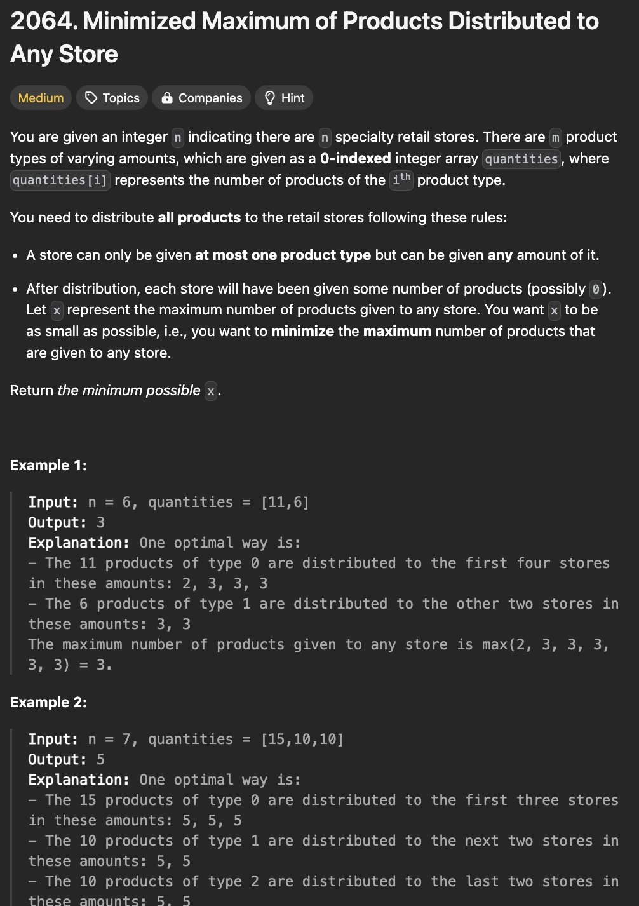
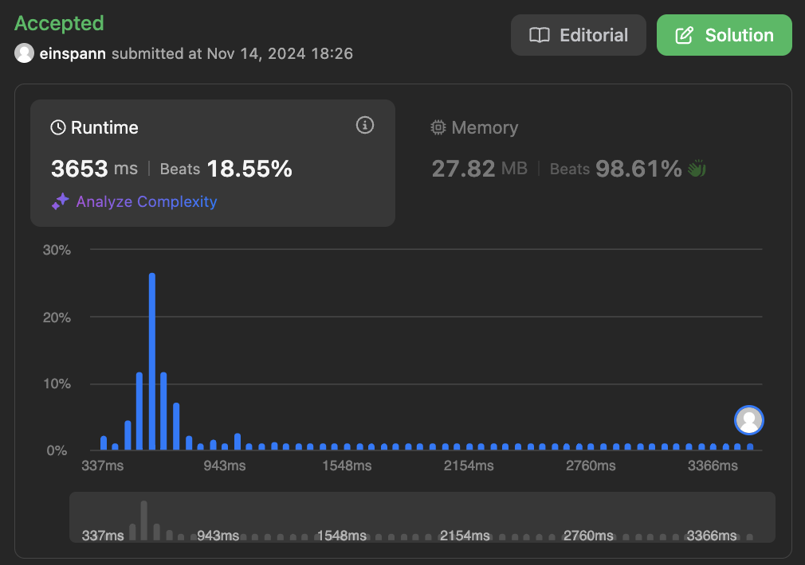

# 문제 설명
이 문제는 가게의 숫자 n개와 상품의 개수 배열이 주어질 때, 상품을 가게에 분배할 때, 최대한 균등하게 분배할 수 있는 최대 상품의 개수를 구하는 문제이다.



## 풀이 및 해설

## 풀이
```python
class Solution:
    def canDistribute(self, x: int, quantities: List[int], n: int) -> bool:
        j = 0
        remaining = quantities[j]

        for i in range(n):
            if remaining <= x:
                j += 1
                if j == len(quantities):
                    return True
                else:
                    remaining = quantities[j]
            else:
                remaining -= x
        
        return False
    

    def minimizedMaximum(self, n:int, quantities: List[int]) -> int:
        left = 0
        right = max(quantities)
        while left < right:
            middle = (left+right) // 2
            if self.canDistribute(middle, quantities, n):
                right = middle
            else:
                left = middle + 1
        
        return left
```
- `canDistribute` 함수는 상품을 가게에 분배할 때, 최대한 균등하게 분배할 수 있는 최대 상품의 개수를 구하는 함수이다.
  - `x`는 상품의 개수이다.
  - `quantities`는 상품의 개수 배열이다.
  - `n`은 가게의 개수이다.
  - `j`는 quantities의 인덱스를 가리키는 포인터이다.
  - `remaining`은 현재 가게에 남은 상품의 개수이다.
  - `i`는 가게의 개수를 나타낸다.
  - `remaining`이 `x`보다 작거나 같으면, 다음 가게로 넘어간다.
  - `remaining`이 `x`보다 크면, `x`만큼 상품을 가게에 분배한다.
  - 모든 가게에 상품을 분배할 수 있으면, `True`를 반환한다.
  - 그렇지 않으면, `False`를 반환한다.

- `minimizedMaximum` 함수는 이진 탐색을 이용하여 최대 상품의 개수를 구하는 함수이다.
  - `left`는 최소 상품의 개수이다.
  - `right`는 최대 상품의 개수이다.
  - `middle`은 중간 상품의 개수이다.
  - `canDistribute` 함수를 이용하여 상품을 분배할 수 있는지 확인한다.
  - 분배할 수 있으면, `right`를 `middle`로 설정한다.
  - 분배할 수 없으면, `left`를 `middle+1`로 설정한다.
  - `left`가 `right`보다 작을 때까지 반복한다.

## Complexity Analysis


### 시간 복잡도
- canDistribute 함수의 시간 복잡도는 O(n)이다.
- minimizedMaximum 함수의 시간 복잡도는 O(nlogn)이다.

따라서, 총 시간 복잡도는 O(nlogn)이다.

### 공간 복잡도
- canDistribute 함수의 공간 복잡도는 O(1)이다.
- minimizedMaximum 함수의 공간 복잡도는 O(1)이다.

## Constraint Analysis
```
Constraints:
m == quantities.length
1 <= m <= n <= 10^5
1 <= quantities[i] <= 10^5
```

# References
- [2064. Minimized Maximum of Products Distributed to Any Store](https://leetcode.com/problems/minimized-maximum-of-products-distributed-to-any-store/)