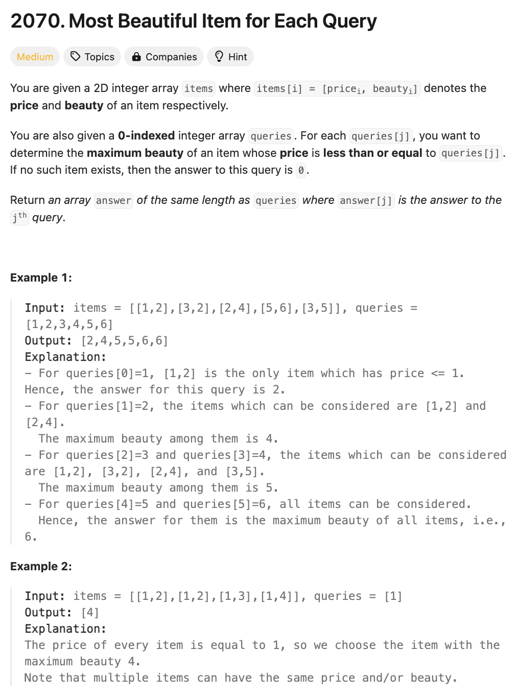

# 문제 설명
이 문제는 2D 배열이 [price, beauty]로 주어진다. 또한, queries 배열도 주어진다. 이때, query의 가격보다 작은 가장 높은 beauty를 가진 아이템들을 찾아 반환하는 문제이다.



## 풀이 및 해설
1. items 배열을 price를 기준으로 오름차순 정렬한다. 이때, beauty는 내림차순으로 정렬한다. 그렇게 하기 위해선 lambda 정규식을 사용하여 (key=lambda x: (x[0], -x[1]))로 정렬한다.
2. prices 배열과 max_beauties 배열을 선언한다. 
3. items 배열을 순회하면서 price가 prices 배열의 마지막 값보다 크다면 prices 배열에 추가하고, current_max_beauty와 beauty 중 큰 값을 max_beauties 배열에 추가한다.
4. queries 배열을 순회하면서 bisect.bisect_right(prices, q) - 1을 통해 가격이 q보다 작은 가장 높은 beauty를 가진 아이템을 찾는다. 만약, 해당 아이템이 없다면 0을 반환한다.
5. 결과를 반환한다.

## 풀이
```python
def maximumBeauty(self, items: List[List[int]], queries: List[int]) -> List[int]:
    items.sort(key=lambda x: (x[0], -x[1]))
    
    prices = []
    max_beauties = []
    current_max_beauty = 0

    for price, beauty in items:
        if not prices or price > prices[-1]:
            prices.append(price)
            current_max_beauty = max(current_max_beauty, beauty)
            max_beauties.append(current_max_beauty)

    result = []
    for q in queries:
        idx = bisect.bisect_right(prices, q) - 1
        result.append(max_beauties[idx] if idx>=0 else 0)
    
    return result
```

## Complexity Analysis


### 시간 복잡도
- 시간 복잡도: O(NlogN + QlogN)
    - N: items 배열의 길이
    - Q: queries 배열의 길이
    - items 배열을 정렬하는 데 O(NlogN)이 걸리고, queries 배열을 순회하면서 가격이 q보다 작은 가장 높은 beauty를 가진 아이템을 찾는 데 O(QlogN)이 걸린다.
    - 따라서, 총 시간 복잡도는 O(NlogN + QlogN)이다.

### 공간 복잡도
- 공간 복잡도: O(N)
    - prices 배열과 max_beauties 배열을 사용하므로 O(N)이다.

## Constraint Analysis
```
Constraints:
1 <= items.length, queries.length <= 10^5
items[i].length == 2
1 <= pricei, beautyi, queries[j] <= 10^9
```

# References
- [2070. Most Beautiful Item for Each Query](https://leetcode.com/problems/most-beautiful-item-for-each-query/)