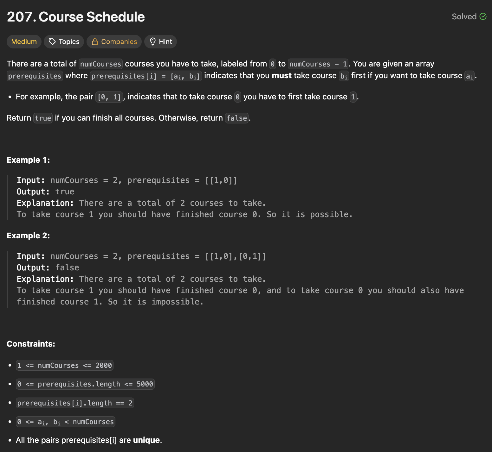

# 문제 설명
이 문제에서는 numCourses개의 강의가 주어지고, 각 강의의 선수과목이 주어질 때 모든 강의를 수강할 수 있는지 여부를 반환합니다.



## 풀이 및 해설
딱 보니까 이제 왜 그래프 문제인지 알 것 같다. 뭔가 노드가 존재하고 간선이 존재하는 경우에 대해서, path를 찾을 수 있는 유형의 문제면 보통 backtracking, DFS, 등으로 접근해볼 수 있을 것 같다.
- 1) 그래프 생성
    - 선수과목을 간선으로, 강의를 노드로 하는 방향 그래프를 생성한다.
- 2) DFS 백트래킹 구현
  - set을 두개 사용한다: visited, recursion_stack
    - visited: 이미 방문한 노드들을 저장
    - recursion_stack: 현재 재귀 호출 스택에 있는 노드들을 저장
- 3) 그래프에서 순환 루프나 경로가 존재하지 않는지 확인
    - 각 강의에 대해 DFS를 수행하여 순환 루프가 있는지 확인한다.
    - 만약 순환 루프가 발견되면 False를 반환하고, 모든 강의를 성공적으로 탐색하면 True를 반환한다.

## 풀이
```python
class Solution:
    def canFinish(self, numCourses: int, prerequisites: List[List[int]]) -> bool:
        # 1) create graph
        graph = defaultdict(list)
        for prereq,course in prerequisites:
            graph[prereq].append(course)
            
        visited = set()
        recursion_stack = set()
        
        # 2) implement DFS backtracking
        def dfs(course):
            if course in recursion_stack:
                return False
            if course in visited:
                return True
            
            recursion_stack.add(course)
            for neighbor in graph[course]:
                if not dfs(neighbor):
                    return False
            recursion_stack.remove(course)
            visited.add(course)
            return True
                

        # 3) check if any circular loops or path DNE exist in graph
        for course in range(numCourses):
            if not dfs(course):
                return False
        
        return True
```

## Complexity Analysis


### 시간 복잡도
- 그래프 생성: O(P) (P는 선수과목의 수)
- DFS 탐색: O(V + E) (V는 강의 수, E는 간선 수)
- 전체 시간 복잡도: O(P + V + E)

### 공간 복잡도
- 그래프 저장: O(V + E)
- 재귀 호출 스택: O(V)
- 전체 공간 복잡도: O(V + E)

## Constraint Analysis
```
Constraints:
1 <= numCourses <= 2000
0 <= prerequisites.length <= 5000
prerequisites[i].length == 2
0 <= ai, bi < numCourses
All the pairs prerequisites[i] are unique.
```

# References
- [207. Course Schedule - LeetCode](https://leetcode.com/problems/course-schedule/)