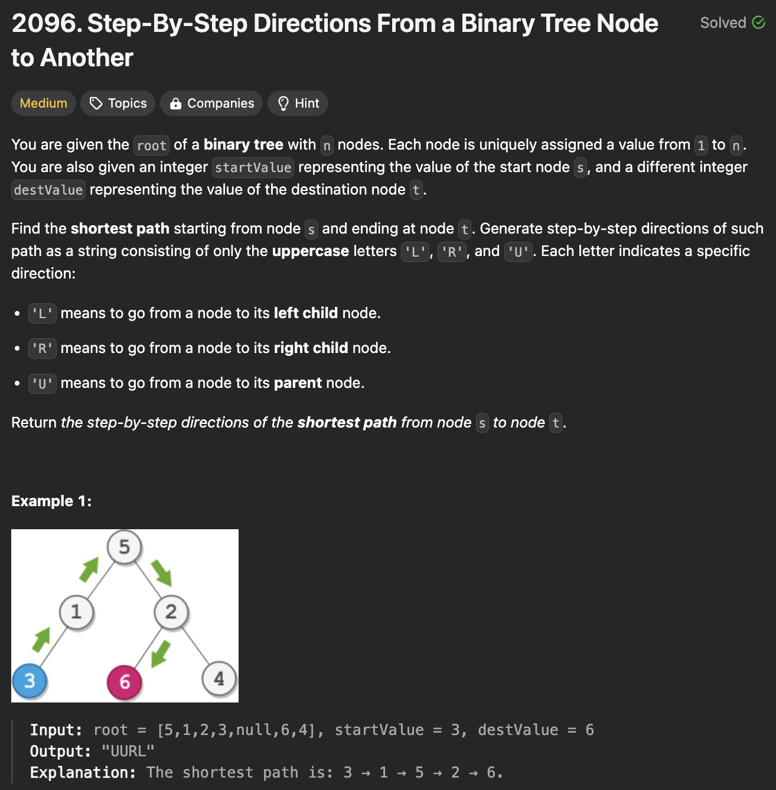
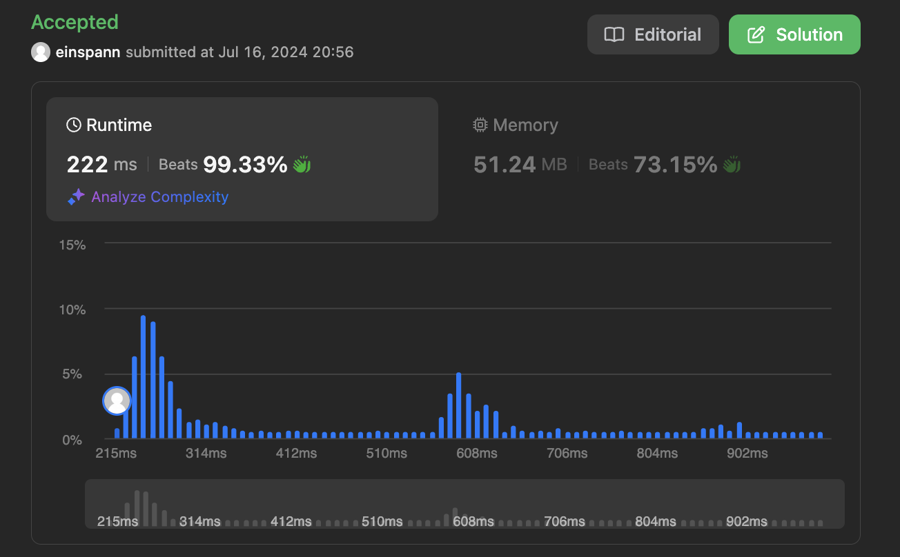

# 문제 설명
이진 트리에서 두개의 노드 간의 가장 짧은 경로를 찾는 문제다.



## 풀이 및 해설  
두 노드 간의 가장 짧은 경로를 찾기 위해 다음과 같은 방법을 사용한다.  
1. 먼저 두 노드 간의 경로를 찾는다.
2. 그 다음, 두 노드 간의 가장 가까운 공통 조상을 찾는다.
3. 마지막으로, 경로를 구성한다.

## 풀이
```python
def getDirections(self, root: Optional[TreeNode], startValue: int, destValue: int) -> str:
        def find_path(node, value, path):
            if not node:
                return False
            if node.val == value:
                return True
            
            if find_path(node.left, value, path):
                path.append('L')
                return True
            if find_path(node.right, value, path):
                path.append('R')
                return True
            
            return False
        
        # 1. find paths from root to both the start and the end node

        start_path = []
        end_path = []

        find_path(root, startValue, start_path)
        find_path(root, destValue, end_path)

        start_path.reverse()
        end_path.reverse()

        # 2. find lowest common ancestor between start and end node
        i = 0
        while i < len(start_path) and i < len(end_path) and start_path[i] == end_path[i]:
            i += 1
        
        # 3. construct path
        result = 'U' * (len(start_path) - i) + ''.join(end_path[i:])

        return result
```
- 먼저, 두 노드들과 루트 노드 간의 경로를 찾기 위해 `find_path` 함수를 사용한다.
- `find_path` 함수는 노드와 루트 노드의 경로를 찾는다.
    - 만약 노드가 없다면, `False`를 반환한다.
    - 만약 노드의 값이 목표 값과 같다면, `True`를 반환한다.
    - 만약 왼쪽 자식 노드에서 목표 값을 찾았다면, `L`을 추가하고 `True`를 반환한다.
    - 만약 오른쪽 자식 노드에서 목표 값을 찾았다면, `R`을 추가하고 `True`를 반환한다.
    - 그렇지 않다면, `False`를 반환한다.

- 루트로부터 찾았기 때문에 순서를 반대로 바꿔준다.
- 두 노드 간의 가장 가까운 공통 조상을 찾기 위해 두 경로를 비교한다.
- 공통 조상을 찾았다면, 공통 조상부터 목표 노드까지의 경로를 구성한다.
- 마지막으로, 경로를 반환한다.

## Complexity Analysis


### 시간 복잡도
- O(N) : 노드의 개수만큼 탐색한다. 최악의 경우, 모든 노드를 탐색해야 한다.

### 공간 복잡도
- O(h) : 재귀 호출을 사용하기 때문에 스택에 최대 높이 h만큼 저장된다.

## Constraint Analysis
```
Constraints:
The number of nodes in the tree is n.
2 <= n <= 10^5
1 <= Node.val <= n
All the values in the tree are unique.
1 <= startValue, destValue <= n
startValue != destValue
```

# References
- [2096. Step-By-Step Directions From a Binary Tree Node to Another](https://leetcode.com/problems/step-by-step-directions-from-a-binary-tree-node-to-another/)