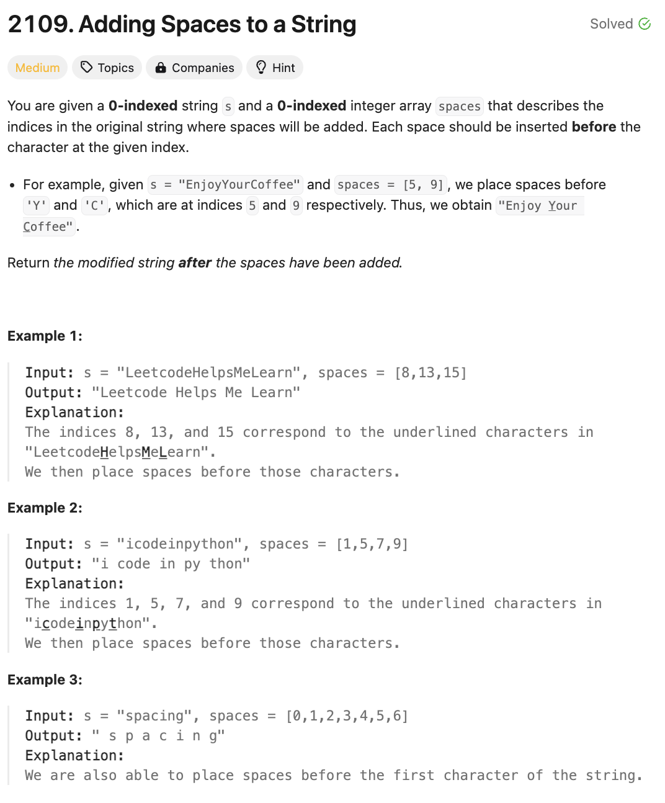

# 문제 설명
이 문제는 문자열 s와 공백을 추가할 위치가 주어졌을 때, 공백을 추가한 문자열을 반환하는 문제이다.

Medium치고는 쉽고 재밌는 문제다.



## 풀이 및 해설

## 풀이
```python
class Solution:
    def addSpaces(self, s: str, spaces: List[int]) -> str:
        n = len(s)
        m = len(spaces)
        arr = []
        space_pointer = 0

        for i in range(n):
            if space_pointer < m and i == spaces[space_pointer]:
                arr.append(" ")
                space_pointer += 1
            arr.append(s[i])
        
        return "".join(arr)
```

## Complexity Analysis


### 시간 복잡도
- O(N) : N은 문자열 s의 길이이다.

### 공간 복잡도
- O(N) : N은 문자열 s의 길이이다.

## Constraint Analysis
```
Constraints:
1 <= s.length <= 3 * 10^5
s consists only of lowercase and uppercase English letters.
1 <= spaces.length <= 3 * 10^5
0 <= spaces[i] <= s.length - 1
All the values of spaces are strictly increasing.
```

# References
- [2109. Adding Spaces to a String](https://leetcode.com/problems/adding-spaces-to-a-string/)