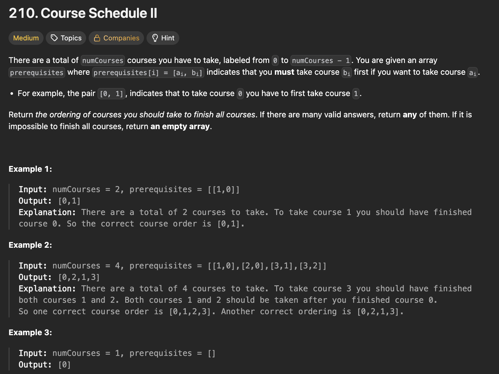

# 문제 설명
이 문제에서는 numCourses개의 강의가 주어지고, 각 강의의 선수과목이 주어질 때 모든 강의를 수강할 수 있는 순서를 반환합니다.



## 풀이 및 해설
딱 보니까 이제 왜 그래프 문제인지 알 것 같다. 뭔가 노드가 존재하고 간선이 존재하는 경우에 대해서, path를 찾을 수 있는 유형의 문제면 보통 backtracking, DFS, 등으로 접근해볼 수 있을 것 같다.
- 1) 그래프 생성
    - 선수과목을 간선으로, 강의를 노드로 하는 방향 그래프를 생성한다.
- 2) DFS 백트래킹 구현
  - visited 리스트를 사용한다:
    - 0: 방문하지 않음
    - 1: 방문 중
    - 2: 방문 완료
- 3) 그래프에서 순환 루프나 경로가 존재하지 않는지 확인
    - 각 강의에 대해 DFS를 수행하여 순환 루프가 있는지 확인한다.
    - 만약 순환 루프가 발견되면 빈 리스트를 반환하고, 모든 강의를 성공적으로 탐색하면 수강 순서를 반환한다.

## 풀이
```python
class Solution:
    def findOrder(self, numCourses: int, prerequisites: List[List[int]]) -> List[int]:
        # 1) create graph
        graph = defaultdict(list)
        for course,prereq in prerequisites:
            graph[prereq].append(course)
        
        visited = [0] * numCourses
        order = []
        
        # 2) DFS backtracking
        def dfs(course):
            if visited[course] == 1:
                return False
            if visited[course] == 2:
                return True
            
            visited[course] = 1
            for neighbor in graph[course]:
                if not dfs(neighbor):
                    return False
            visited[course] = 2
            order.append(course)
            return True
        
        # 3) find path
        for course in range(numCourses):
            if visited[course] == 0:
                if not dfs(course):
                    return []
        
        return order[::-1]
```

## Complexity Analysis


### 시간 복잡도
- 그래프 생성: O(E)
- DFS 탐색: O(V + E)
- 전체 시간 복잡도: O(V + E)
- 여기서 V는 강의 수(numCourses), E는 선수과목(prerequisites)의 수입니다.

### 공간 복잡도
- 그래프 저장: O(E)
- 재귀 호출 스택: O(V)
- 전체 공간 복잡도: O(V + E)

## Constraint Analysis
```
Constraints:
1 <= numCourses <= 2000
0 <= prerequisites.length <= numCourses * (numCourses - 1)
prerequisites[i].length == 2
0 <= ai, bi < numCourses
ai != bi
All the pairs [ai, bi] are distinct.
```

# References
- [210. Course Schedule II - LeetCode](https://leetcode.com/problems/course-schedule-ii/)