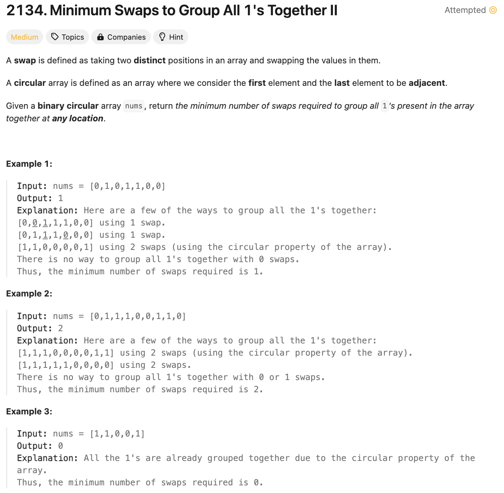
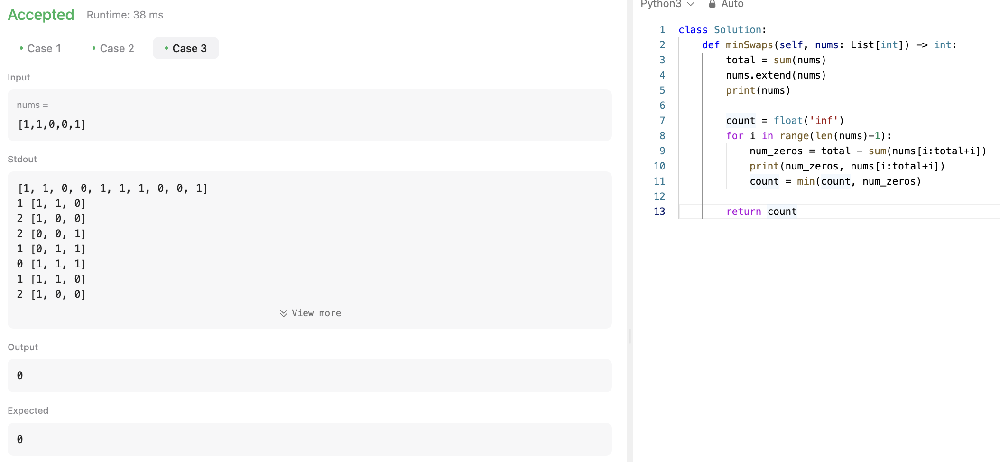
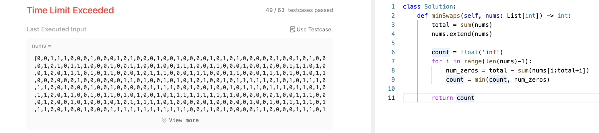
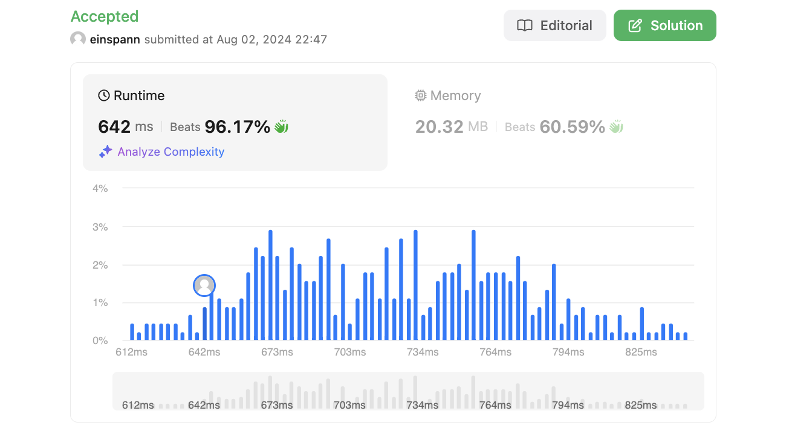

# 문제 설명
1로 이루어진 배열에서 1을 모두 모으기 위한 최소 스왑 횟수를 구하는 문제이다.




## 1차 시도


### 코드
```python
def minSwaps(self, nums: List[int]) -> int:
        total = sum(nums)
        nums.extend(nums)
        
        count = float('inf')
        for i in range(len(nums)-1):
            num_zeros = total - sum(nums[i:total+i])
            count = min(count, num_zeros)
        
        return count
```
- total은 1의 개수를 저장하고, nums 배열을 2배로 확장한다.
- count는 무한대로 초기화하고, for loop으로 nums 배열을 반복한다.
    - num_zeros는 total에서 nums[i:total+i]의 합을 뺀 값으로, 0의 개수를 저장한다.
    - count에 num_zeros와 count 중 작은 값을 저장한다.
- count를 반환한다.



아마 매번 sum을 계산하느라 시간초과가 발생한 것 같다. 이를 해결하기 위해 sliding window를 사용하여 문제를 해결할 수 있을 것 같다.

## 풀이

```python
def minSwaps(self, nums: List[int]) -> int:
        total_ones = sum(nums)
        n = len(nums)

        if total_ones == 0 or total_ones == n:
            return 0
        
        # extend array to rid the circular property
        nums.extend(nums)

        # create first window
        ones_in_window = sum(nums[:total_ones])
        max_ones = ones_in_window

        # slide the window
        for i in range(1, n):
            # remove first element of prev window
            ones_in_window -= nums[i-1]

            # add the next element of the window
            ones_in_window += nums[i-1+total_ones]

            # update max_ones
            max_ones = max(max_ones, ones_in_window)
        
        return total_ones - max_ones
```
- total_ones은 1의 개수를 저장하고, n은 nums 배열의 길이를 저장한다.
- total_ones가 0이거나 n과 같으면 0을 반환한다.
- nums 배열을 2배로 확장한다.
- nums[:total_ones]의 합을 구하여 ones_in_window에 저장하고, max_ones에 저장한다.
- for loop으로 1부터 n까지 반복한다.
    - 이전 window의 첫번째 요소를 제거한다.
    - 다음 window의 요소를 추가한다.
    - max_ones를 업데이트한다.
- total_ones에서 max_ones를 뺀 값을 반환한다.

## Complexity Analysis


### 시간 복잡도
- O(n) : nums 배열을 2배로 확장하고, sliding window를 사용하여 O(n)의 시간 복잡도를 가진다.

### 공간 복잡도
- O(1) : 추가적인 공간을 사용하지 않아 O(1)의 공간 복잡도를 가진다.

## Constraint Analysis
```
Constraints:
1 <= nums.length <= 10^5
nums[i] is either 0 or 1.
```

# References
- [2134. Minimum Swaps to Group All 1's Together II](https://leetcode.com/problems/minimum-swaps-to-group-all-1s-together-ii/)