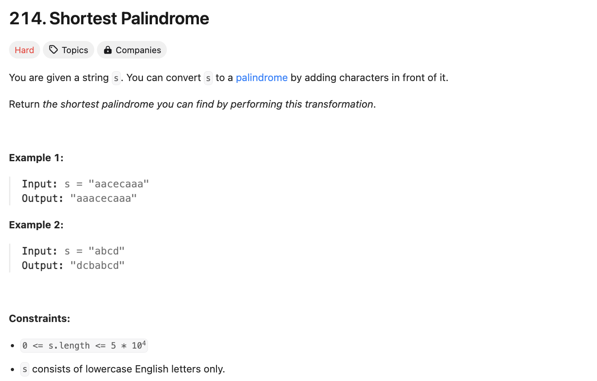

# 문제 설명



## 풀이 및 해설
보니까 예전에 풀었던 문제다.
과거에는 str을 뒤집어서 앞에 붙힌 뒤, suffix와 prefix를 비교해서 가장 긴 prefix를 찾아서 그 길이만큼 뒤집은 str에서 잘라내서 앞에 붙히는 방식으로 풀었었다.

## 풀이
```python
class Solution:
    def shortestPalindrome(self, s: str) -> str:
        if not s:
            return s

        # Reverse the string
        rev_s = s[::-1]

        # Concatenate the string with its reverse
        concat = s + "#" + rev_s

        # Compute the longest proper prefix that is also a suffix
        prefix = [0] * len(concat)
        j = 0
        for i in range(1, len(concat)):
            while j > 0 and concat[i] != concat[j]:
                j = prefix[j - 1]
            if concat[i] == concat[j]:
                j += 1
            prefix[i] = j

        # Construct the shortest palindrome
        return rev_s[:len(s) - prefix[-1]] + s
```

## Complexity Analysis


### 시간 복잡도
과거의 시간복잡도는 O(n)이었다. 
이미 O(n)이기 때문에 충분히 빠르다.
분석해보면 다음과 같다:
- str 반전: O(n)
- str 연결: O(n)
- prefix 배열 생성 (KMP): O(n)
- 결과 생성: O(n)

### 공간 복잡도
- str 반전: O(n)
- str 연결: O(2n+1) = O(n)
- prefix 배열 생성 (KMP): O(n)

## Constraint Analysis
```
Constraints:
0 <= s.length <= 5 * 10^4
s consists of lowercase English letters only.
```

# References
- [214. Shortest Palindrome](https://leetcode.com/problems/shortest-palindrome/)