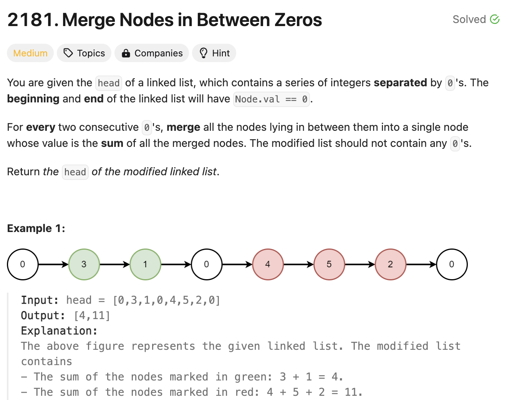

# 문제 설명
Linked List가 주어졌을때, 0과 0 사이에 있는 값들을 더해서 반환하는 문제다.

 

## 풀이 및 해설

## 풀이
```python
# Definition for singly-linked list.
# class ListNode:
#     def __init__(self, val=0, next=None):
#         self.val = val
#         self.next = next
class Solution:
    def mergeNodes(self, head: Optional[ListNode]) -> Optional[ListNode]:
        if not head or not head.next:
            return []

        dummy = ListNode(0)
        curr = dummy
        summ = 0

        
        while head and head.next:
            summ += head.next.val
            if head.next.val == 0:
                curr.next = ListNode(summ)
                curr = curr.next
                summ = 0
            head = head.next
        
        return dummy.next
```
- 애초에 head가 없거나 head.next가 없다면 빈 리스트를 반환한다.
- dummy를 만들어서 curr을 dummy로 설정하고, summ을 0으로 초기화한다.
- head와 head.next가 존재하는 동안, head.next의 값을 summ에 더한다.
- 만약 head.next의 값이 0이라면, curr.next에 summ을 넣고, curr을 curr.next로 설정하고, summ을 0으로 초기화한다.
- head를 head.next로 설정한다.
- dummy.next를 반환한다.

## Complexity Analysis


### 시간 복잡도
- head Linked List를 순회하는데 최대 O(N)이 걸린다.

### 공간 복잡도
- dummy Linked List를 만들어서 반환하는데 O(N)이 필요하다.

## Constraint Analysis
```
Constraints:
The number of nodes in the list is in the range [3, 2 * 10^5].
0 <= Node.val <= 1000
There are no two consecutive nodes with Node.val == 0.
The beginning and end of the linked list have Node.val == 0.
```

# References
- [LeetCode](https://leetcode.com/problems/merge-nodes-in-between-zeros/)