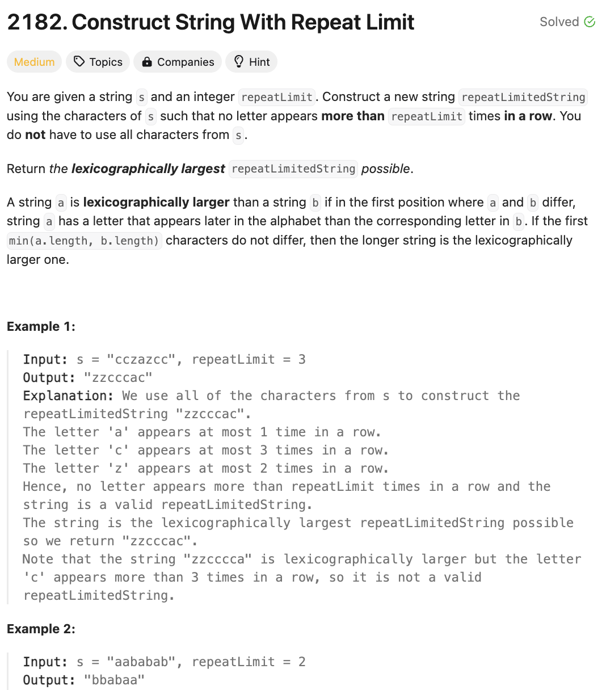

# 문제 설명
이 문제는 문자열 `s`와 정수 `repeatLimit`가 주어지면, `s`의 문자를 `repeatLimit`만큼 반복하여 만들 수 있는 가장 긴 lexicographic 문자열을 만드는 문제이다.



## 풀이 및 해설
크게는 다음 흐름을 따라갔습니다.

- while more than two characters have counts larger than 1
- use as many large characters as possible (up to repeatLimit)
- append them to a string
- remove the added count to the counter

## 풀이
```python
from collections import Counter

class Solution:
    def repeatLimitedString(self, s: str, repeatLimit: int) -> str:
        pq = [(-ord(char), cnt) for char,cnt in Counter(s).items()]
        heapify(pq)
        print(pq)

        result = []

        while pq:
            char, cnt = heappop(pq)
            if result and result[-1] == char:
                if not pq: break
                next_char,next_cnt = heappop(pq)
                result.append(next_char)
                if next_cnt-1: heappush(pq, (next_char, next_cnt-1))
                heappush(pq, (char, cnt))
            else:
                m = min(cnt, repeatLimit)
                result.extend([char] * m)
                if cnt-m: heappush(pq, (char, cnt-m))
        return ''.join(chr(-x) for x in result)
```

## Complexity Analysis


### 시간 복잡도
- Counter: O(n)
- pq: O(klogk)
- while loop: O(n)
- pop and push: O(logk)
- Total: O(nlogk)

### 공간 복잡도
- O(n+k)

## Constraint Analysis
```
Constraints:
1 <= repeatLimit <= s.length <= 10^5
s consists of lowercase English letters.
```

# References
- [2182. Construct String With Repeat Limit](https://leetcode.com/problems/construct-string-with-repeat-limit/)