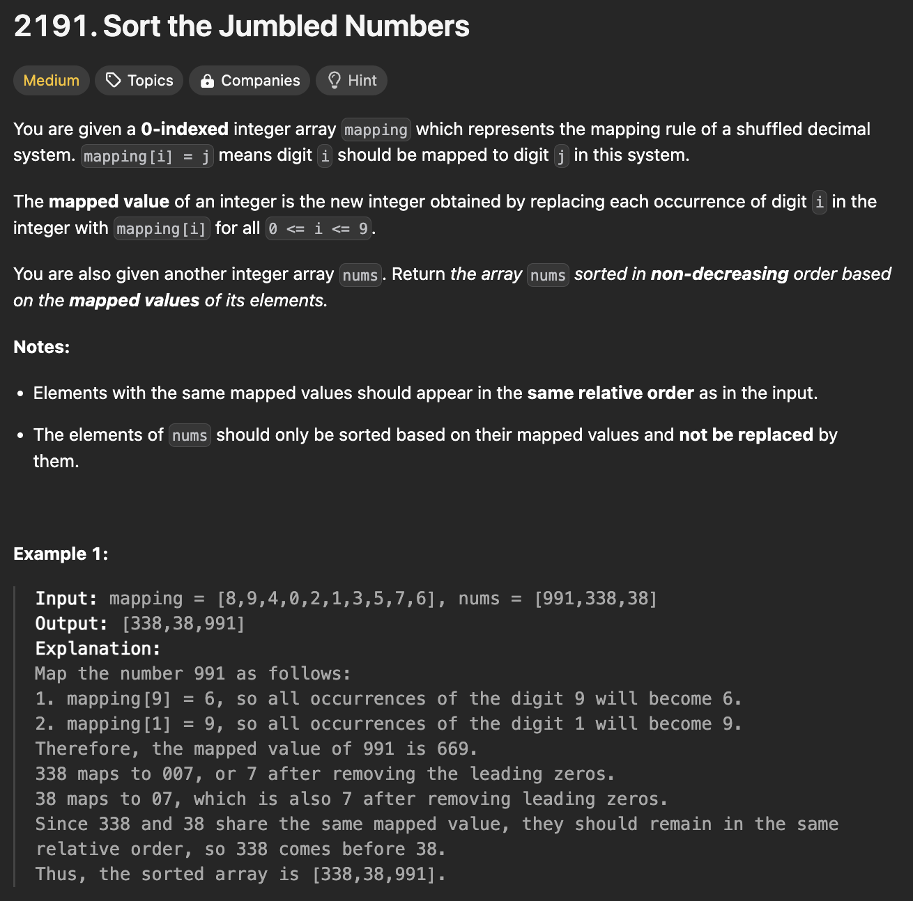

# 문제 설명
매핑을 알려주는 배열과, 숫자 배열이 주어졌을 때, 매핑 된 숫자 순서에 따라 정렬된 배열을 반환하는 문제다.



## 풀이 및 해설

## 풀이
```python
def sortJumbled(self, mapping: List[int], nums: List[int]) -> List[int]:
        # create new sorted order after mapping order
        mapped_nums = []

        for num in nums:
            new_num = ""
            for v in str(num):
                new_num += str(mapping[int(v)])
            
            # create tuples for mapping
            mapped_nums.append((num, int(new_num)))
        
        # sort according to mapped_nums order
        mapped_nums.sort(key=lambda x: x[1])

        sorted_nums = [num for num, _ in mapped_nums]

        return sorted_nums
```
- 배열의 숫자들을 매핑에 따라 변환해준다.
- 해당 변환된 숫자들과, 기존 숫자들을 합친 튜플 리스트를 만든다.
- x[1]인 변환된 숫자 기준으로 정렬한다.
- x[0]만 반환한다.

## Complexity Analysis


### 시간 복잡도
- O(nlogn); sorting에 소요되는 시간.

### 공간 복잡도
- O(n); mapping list에 쓰이는 추가적인 공간.

## Constraint Analysis
```
Constraints:
mapping.length == 10
0 <= mapping[i] <= 9
All the values of mapping[i] are unique.
1 <= nums.length <= 3 * 10^4
0 <= nums[i] < 10^9
```

# References
- [Leet](https://leetcode.com/problems/sort-the-jumbled-numbers)